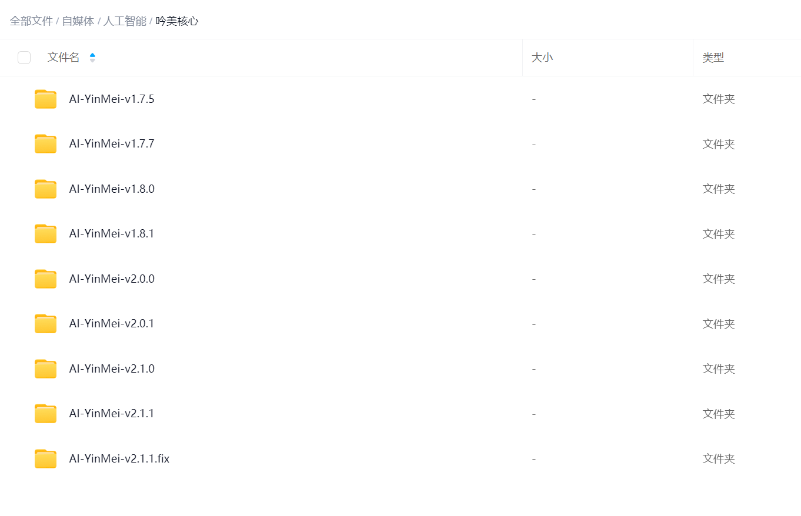
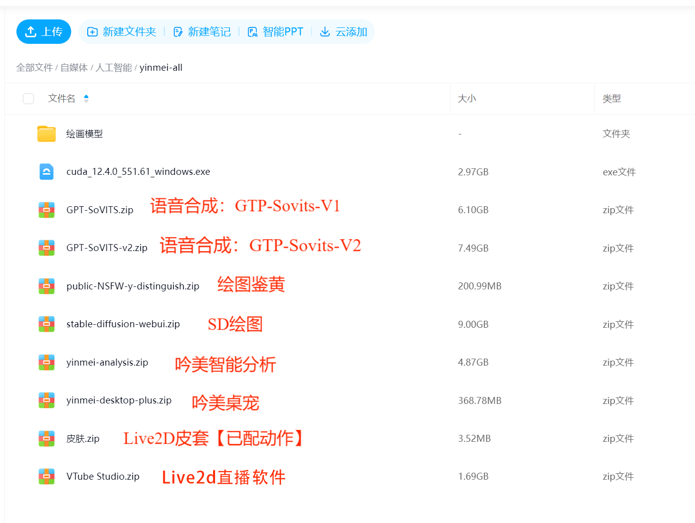

## AI Yinmei Information
- **AI Name：**Yinmei
- **Developer：**Winlone
- **Bilibili Channel：**Programmer's Retirement Life https://space.bilibili.com/46130941
- **Live Stream：**http://live.bilibili.com/3033646
- **Ai Yinmei Tutorial Collection：**https://www.bilibili.com/opus/1015233825290059779
- **Technical QQ Group：**27831318
- **Fan Group：**264534845
- **Version：**2.4.0
- **Open Source：**https://github.com/worm128/AI-YinMei
<iframe src="//player.bilibili.com/player.html?isOutside=true&aid=114471733300844&bvid=BV1kh5TzLEv6&cid=29853159399&p=1" scrolling="no" border="0" frameborder="no" framespacing="0" allowfullscreen="true" width="600px" height="600px"></iframe>

## Project Download
- **Yinmei Integration Package Download Address：**  
Baidu Netdisk Group: Please add the group number in "Baidu Netdisk -> Messages"
Baidu Netdisk Group 1: 930109408 (Full)
Baidu Netdisk Group 2: 939447713 (Full)
Baidu Netdisk Group 3: 945900295
Baidu Netdisk Group 4: 969208563
- **Quark：**  
Quark Group 1: 1231405830
Quark Group 2: 428937868
- **Functional Integration Package Downloads (6)：**Artificial Intelligence -> yinmei-all
Desktop Pet 2.0 yinmei-desktop-plus, TTS Speech Synthesis GPT-SoVITS-Versions 1.0 and 2.0, Pornography Detection public-NSFW-y-distinguish, Painting stable-diffusion-webui, Live2D Skin
- **Yinmei Core [Version Iteration]：**Artificial Intelligence -> Yinmei Core
Yinmei Development Documentation: Artificial Intelligence -> Yinmei Development Documentation

## Integration Package Contents
Path: Artificial Intelligence -> Yinmei Core. Select a core version to download, usually the latest version.

Path: Artificial Intelligence -> yinmei-all  

## Function Overview
- **Long-term Memory:** Yinmei Core, yinmei-analysis
- **Short-term Memory:** Yinmei Core, MongoDB
- **Intent Analysis:** Yinmei Core, yinmei-analysis
- **Points:** Yinmei Core, MongoDB
- **Diffused Thinking:** Yinmei Core, yinmei-analysis, neo4j
- **Chatting:** Yinmei Core, Selection: Alibaba Bailian, Zhipu Qingyan, Tencent Hunyuan, Baidu Cloud Service, DeepSeek, OneApi, Xinference, FastGPT
- **Knowledge Base:** Yinmei Core, FastGPT (plug-in compatible, language model that doesn't use FastGPT), Xinference, m3e
- **Voice:** Yinmei Core, GPT-SoVITS1.zip, GPT-SoVITS-v2.zip
- **Singing:** Yinmei Core, yinmei-music.zip, NeteaseCloudMusicApi.zip
- **Painting:** Yinmei Core, stable-diffusion-webui.zip, public-NSFW-y-distinguish.zip [optional]
- **Image Search:** Yinmei Core, public-NSFW-y-distinguish.zip [optional]
- **Search:** Yinmei Core, VPN [optional]
- **Skins:** Yinmei Core, Yinmei Table Pet [optional], vtube studio [optional]
- **Dancing:** Yinmei Core, OBS, local video
- **Emojis:** Yinmei Core, Yinmei Table Pet [optional], vtube studio [optional]
- **Banmu:** Yinmei Core, Bilibili, QQ Bot: napcat
- **Automated Lottery:** Yinmei Core, MongoDB
- **MCP + Custom Code:** Yinmei Core, MongoDB

## Command Description
**1. Basic Commands:**  
1.1 Add "\" (e.g., "\I'm chatting in the live broadcast room") so the AI won't reply to user content

**2. Singing Function:**  

2.1 Enter "sing" + song title, and Yinmei will learn to sing based on the song title you entered. You can also enter open-ended questions like "Yinmei, recommend me the best anime song," and Yinmei will intelligently select a song for you to sing.

2.2 To change songs, enter "Cut Song" to skip the current song and start learning the next one.

2.3 Enter "Stop Learning Song," and Yinmei will terminate the current song and move on to the next one.

**3. Drawing Function:** 

3.1 Enter "draw" + picture title, and Yinmei will draw in real time based on the drawing prompt you enter.

3.2 You can also enter open-ended questions like "Yinmei, draw me the ugliest little turtle egg," and Yinmei will intelligently generate drawing prompts for you to draw.

**4. Video Playback:**  

4.1 Enter "video + dance name". Dances are as follows:

Video files must be locally configured.

Secretary Dance, Subject Three, Girl Group Dance, Social Dance

Guagua Dance, Ma Baoguo, Anime, Sese

Cai Xukun, Gangnam Style, Chipi, Yinmei

Directly entering "video" will create a random dance.

4.2 To stop the dance, enter "Stop Video."

**5. Emoji:**  

Enter "emoji + name." "emoji + random" will create a random emoji. You can guess the emoji yourself, for example, "crying, laughing, sticking out tongue."

**6. Scene Switching:**  

6.1 Enter "Switch + Scene Name": Pink Room, Shrine, Coastal Flower Shop, Flower Room, Morning Room.

6.2 The system intelligently determines the time to switch between morning and evening scenes.

**7. Dress-Up:**  

Enter "Outfit + Outfit Name": Plain Clothes, Wings of Love, Youthful Cat Girl, Glasses Cat Girl.

**8. Image Search:**  
Enter "search image + keyword"

**9. Information Search Function:**  
Enter "search + keyword"

## Technical Architecture
