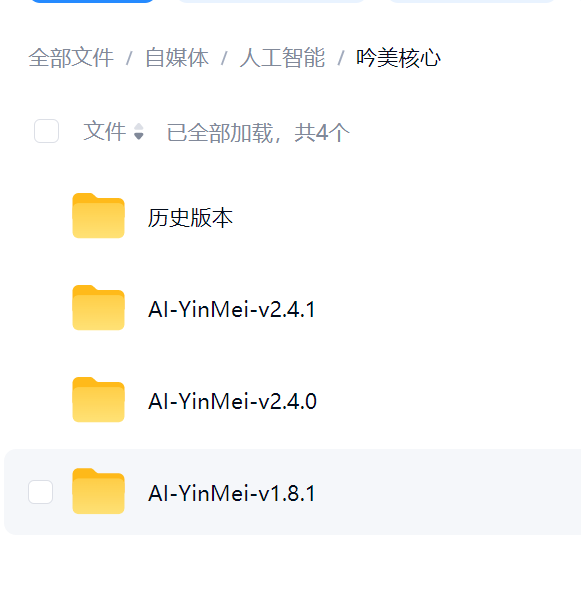
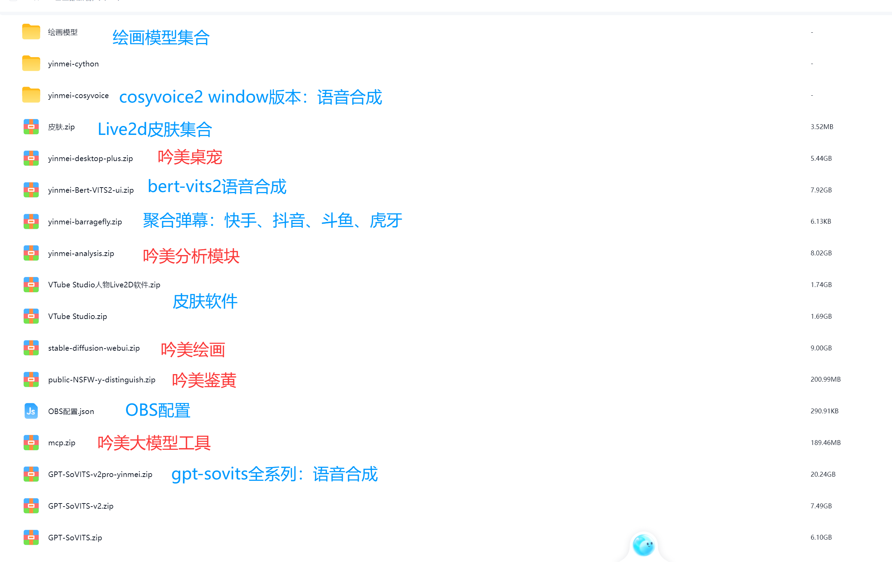
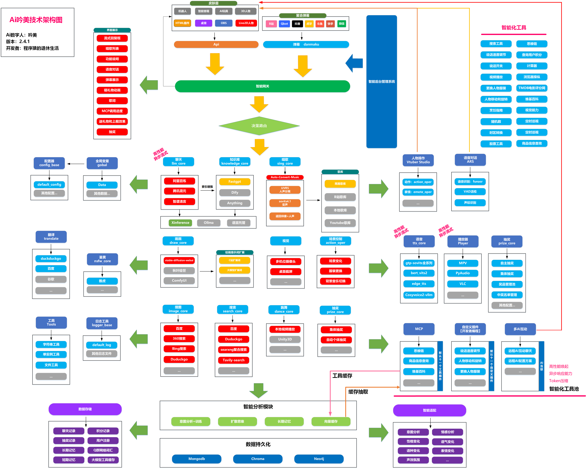

## AI Yinmei Information
- **AI Name：**Yinmei
- **Developer：**Winlone
- **Bilibili Channel：**Programmer's Retirement Life https://space.bilibili.com/46130941
- **Live Stream：**http://live.bilibili.com/3033646
- **Ai Yinmei Tutorial Collection：**https://www.bilibili.com/opus/1015233825290059779
- **Technical QQ Group：**27831318
- **Fan Group：**264534845
- **Version：**2.4.0
- **Open Source：**https://github.com/worm128/AI-YinMei
<iframe src="//player.bilibili.com/player.html?isOutside=true&aid=114471733300844&bvid=BV1kh5TzLEv6&cid=29853159399&p=1" scrolling="no" border="0" frameborder="no" framespacing="0" allowfullscreen="true" width="600px" height="600px"></iframe>

## Project Download
- **Yinmei Integration Package Download Address：**  
Baidu Netdisk Group: Please add the group number in "Baidu Netdisk -> Messages"
Baidu Netdisk Group 1: 930109408 (Full)
Baidu Netdisk Group 2: 939447713 (Full)
Baidu Netdisk Group 3: 945900295
Baidu Netdisk Group 4: 969208563
- **Quark：**  
Quark Group 1: 1231405830
Quark Group 2: 428937868
- **Functional Integration Package Downloads (6)：**Artificial Intelligence -> yinmei-all
Desktop Pet 2.0 yinmei-desktop-plus, TTS Speech Synthesis GPT-SoVITS-Versions 1.0 and 2.0, Pornography Detection public-NSFW-y-distinguish, Painting stable-diffusion-webui, Live2D Skin
- **Yinmei Core [Version Iteration]：**Artificial Intelligence -> Yinmei Core
Yinmei Development Documentation: Artificial Intelligence -> Yinmei Development Documentation

## Integration Package Contents
Path: Artificial Intelligence -> Yinmei Core. Select a core version to download, usually the latest version.

Path: Artificial Intelligence -> yinmei-all  

## Function Overview
- **Aggregated Bullet Comments:** Aggregates live stream bullet comments, supporting the display of bullet comments from 9 major sources including Bilibili development platform, Napcat [QQ robot], Barragefly [Douyin, Huya, Kuaishou, Douyu], WeChat live stream, desktop pets, and background chat dialogues.
- **Intent Analysis:** Intent analysis with a 10ms response time can be used to train corpora to increase intent classification. Currently, it uses a multi-head attention mechanism, which can simultaneously analyze intent classification and sentiment classification.
- **Large Model Tools:** Supports MCP tools and custom-written code tools. Tools include: camera observation, timed patrol, visual capabilities, image search, greeting functionality, Wikipedia, TMDB movie rating website, browser manipulation, calculator, user points query, advanced search, thought chain, product information query, stock tools, time zone conversion, random number generation, cooking guide, changing character clothing, character movement and rotation, video search and playback, speech synthesis switch, speech speed adjustment, AI video, AI singing, AI painting, search tools, and 27 other tools.
- **Lottery:** The lottery is divided into self-service lotteries and streamer lotteries. Self-service lotteries are initiated by users entering "lottery" in the chat, while streamer lotteries are conducted by the streamer who clicks the lottery button to draw prizes from all online users in the live stream. Features include a list of lottery prizes and lottery records.
- **Long-term memory:** Intelligently recalls memories from different time periods based on time pronouns. It selectively recalls memories, avoiding impacting the main workflow speed by activating memories every time. The number of times a memory is recalled, its similarity, etc., can be set.
- **Short-term memory:** Recorded in the large model context memory of the MongoDB database, all chat records are fully persisted.
- **Points:** Each user earns points for chatting, liking, sending gifts, and registering. Singing, drawing, playing videos, switching songs, and participating in raffles will deduct points. Points configuration options are available.
- **Diffusion Thinking:** Using the graph relation database neo4j to construct word relationships, you can export q-group data for thinking relationship training, and the analyzed graph will be displayed in neo4j.
- **Chat:** Supports all cloud service providers and local services that meet the OpenAI specification, with 100% coverage of large LLM models. LLM is streamed for high-performance dialogue.
- **Voice Support:** Supports Cosyvoice2, Bert-Vits2, the entire GPT-Sovits series, and Edge-TTS. OpenAI-compliant TTS is supported by 80% of TTS cloud providers on the market. Cosyvoice2 has been significantly modified and tweaked for tone and emotion, and VLLM acceleration has been implemented, making it stronger and faster than other speech synthesizers on the market. Voice is streamed for high-performance TTS.
- **Vision:** Supports OpenAI-compliant data models and visual models from most cloud vendors.
- **Camera:** Supports multi-camera monitoring and analysis
- **Computer Control:** Supports the computer to autonomously control the keyboard and mouse based on screen analysis.
- **Live Streaming UI Plugins:** Supports 18 UI plugins to assist with live streaming.
- **Knowledge Base:** Currently using FastGPT knowledge base capabilities for knowledge management and loading.
- **Singing:** It can cover songs in any language. It takes about 150 to 200 seconds to learn a song. The singing model can train its own tone.
- **Painting:** Supports downloading any painting model from civitai.com for drawing.
- **Image Search:** Use Baidu search to search for images.
- **Search:** Use the search aggregation platform searchng, which includes search engines such as Google, Bing, duckduckgo, Wikipedia, startpage, and brave. Requires a VPN.
- **Characters:** Supports the self-developed Yinmei desktop pet and Vtube Studio [available for download on Steam or the product's cloud drive]. The Yinmei desktop pet comes with a built-in microphone, powerful noise reduction, VAD, and AEC capabilities, and is overlaid with a voiceprint system, ensuring real-time conversations without accidental touches.
- **Emojis:** There are emoji schemes that can control character expressions, supporting the playback of character expressions + sound effects + video, supporting loop playback and random playback, and keyword-triggered emojis.
- **Videos:** Can play any video within a local folder, and supports videos stored in subfolders. Supports pulling and playing videos from Bilibili.
- **NSFW:** Supports image content moderation, can filter illegal characters in comments, provides AI responses to illegal characters, and draws prompts for illegal words.
- **Other:** Supports off-peak tasks, supports welcome messages upon entering a room, supports intelligent installation of Docker services, supports server monitoring, and supports data statistics.

## Command Description
**1. Basic Commands:**  
1.1 Add "\" (e.g., "\I'm chatting in the live broadcast room") so the AI won't reply to user content

**2. Singing Function:**  

2.1 Enter "sing" + song title, and Yinmei will learn to sing based on the song title you entered. You can also enter open-ended questions like "Yinmei, recommend me the best anime song," and Yinmei will intelligently select a song for you to sing.

2.2 To change songs, enter "Cut Song" to skip the current song and start learning the next one.

2.3 Enter "Stop Learning Song," and Yinmei will terminate the current song and move on to the next one.

**3. Drawing Function:** 

3.1 Enter "draw" + picture title, and Yinmei will draw in real time based on the drawing prompt you enter.

3.2 You can also enter open-ended questions like "Yinmei, draw me the ugliest little turtle egg," and Yinmei will intelligently generate drawing prompts for you to draw.

**4. Video Playback:**  

4.1 Enter "video + dance name". Dances are as follows:

Video files must be locally configured.

Secretary Dance, Subject Three, Girl Group Dance, Social Dance

Guagua Dance, Ma Baoguo, Anime, Sese

Cai Xukun, Gangnam Style, Chipi, Yinmei

Directly entering "video" will create a random dance.

4.2 To stop the dance, enter "Stop Video."

**5. Emoji:**  

Enter "emoji + name." "emoji + random" will create a random emoji. You can guess the emoji yourself, for example, "crying, laughing, sticking out tongue."

**6. Scene Switching:**  

6.1 Enter "Switch + Scene Name": Pink Room, Shrine, Coastal Flower Shop, Flower Room, Morning Room.

6.2 The system intelligently determines the time to switch between morning and evening scenes.

**7. Dress-Up:**  

Enter "Outfit + Outfit Name": Plain Clothes, Wings of Love, Youthful Cat Girl, Glasses Cat Girl.

**8. Image Search:**  
Enter "search image + keyword"

**9. Information Search Function:**  
Enter "search + keyword"

## Technical Architecture
