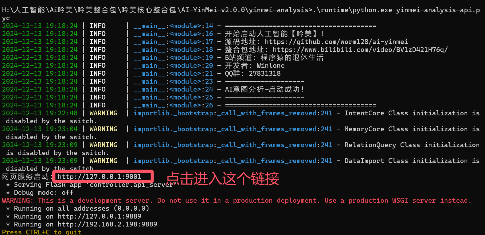

## 1. Startup Method
### 1. Download the package
Download Path: yinmei-all folder in [Network Drive](/link?id=Project Downloads)
Application Package: yinmei-analysis.zip

### 2. Install CUDA
**Current Version:**
```cmd
NVIDIA: CUDA 12.4
Current Project: PyTorch 2.4.0+cu124
```
**Compatibility Note:** The current installed version only supports CUDA 12.4. If you have a 50 series graphics card and require a higher version of CUDA, please uninstall PyTorch and install it.
CUDA Development Kit Download [Version 12.4]: https://developer.nvidia.com/cuda-12-4-1-download-archive
CUDA Historical Versions: https://developer.nvidia.com/cuda-toolkit-archive
**Reinstall PyTorch:** Please choose whether to install PyTorch using cu128, cu124, or cu126. For details, see [https://pytorch.org/get-started/locally/].
Open cmd in the project root directory and execute the following command:

Uninstall
.\runtime\python.exe -m pip uninstall torch torchvision torchaudio

Install the corresponding CUDA 12.8
.\runtime\python.exe -m pip install torch torchvision torchaudio --index-url https://download.pytorch.org/whl/cu128

Driver version [NVIDIA driver]: nvidia-smi -l 1
CUDA program [cudatoolkit development package]: nvcc -V

### 3. Startup method
Double-click to start "yinmei-analysis-api.exe" or "start.bat"

## 2. Divergent thinking
### 1. Install the Neo4j graph database.
This installation should be based on a Docker installation on Windows.
```json
docker run -d --name=yinmei-neo4j --publish=7474:7474 --publish=7687:7687 `
-v /j/ai/ai-code/yinmei-neo4j/data:/data -v /j/ai/ai-code/yinmei-neo4j/logs:/logs `
-v /j/ai/ai-code/yinmei-neo4j/import:/var/lib/neo4j/import -v /j/ai/ai-code/yinmei-neo4j/plugins:/plugins `
-v /j/ai/ai-code/yinmei-neo4j/metrics:/metrics -v /j/ai/ai-code/yinmei-neo4j/conf:/var/lib/neo4j/conf `
neo4j
```
Port 7687: This is the port for connecting to the external database.
Port 7474: This is used to provide the web-based graphical user interface (Browser Interface), namely the Neo4j Browser.
/data: Database directory. This path should be changed to your own physical path: "/j/ai/ai-code/yinmei-neo4j/data."
/import: Data import and export directory. This path should be changed to your own physical path: "/j/ai/ai-code/yinmei-neo4j/import."
/plugins: Plugin directory. This path should be changed to your own physical path: "/j/ai/ai-code/yinmei-neo4j/plugins."
/conf: Project configuration. This path should be changed to your own physical path: "/j/ai/ai-code/yinmei-neo4j/conf."
After the container starts

Backend login:
Address: http://localhost:7474/browser/

The default database name is neo4j. You can customize it, but doing so is not recommended.


### 2. Configuring the neo4j Link for the Yinmei Analysis Module
#### 2.1 Starting the application: yinmei-analysis

Address: http://127.0.0.1:9001/

#### 2.2 In the Yinmei backend

Neo4j address: bolt://localhost:7687 #Note that Bolt is a binary protocol, which offers the best performance and is recommended.
Neo4j database name: neo4j
Username and Password: Default account: neo4j, password: neo4j

### 3. Importing the Vocabulary
#### 3.1 Corpus Preparation
Download link for the old version of QQ: https://im.qq.com/pcqq/index.shtml

Exporting Corpus


#### 3.2 Corpus Cleaning
Cleaning the QQ Dataset:
Using Notepad++

Open all txt files to be cleaned

Click Find and Replace to perform the replacement.

Select the target file to replace all open txt files.


**Regular expression cleaning:**
```regexp
^2024-.*$
^2025-.*$
\[.+\]
\[Emoji\]
\[Image\]
\[\] //Replace useless []
^[?|.|。 |？ |,|，|…|！ |!|@]+\s*$ // Replace a line containing only punctuation
^.*This message type is not currently supported. Please use mobile QQ to view it.*$
^.*New version of mobile QQ.*$
^.*Already a group member.*$
^.*Downgrade your QQ version.*$
^.*Joined this group.*$
^.*Withdrew a message.*$
^.*Welcome to this group.*$
^Good morning!$
@(\S)+\s //Match @username. Use notepad
@(\S.* )+ //Add a replacement username. Use with caution, as it may match Chinese characters at the end. Use notepad
^[0-9]$ //Single line of numbers
.*Nuclear.*Yuan/.Year //Alibaba Cloud Advertising
^\n\r //Replace newlines with blanks
^\n //Replace newlines with blanks
^\r // Press Enter to replace with nothing
http[s]?://(?:[a-zA-Z]|[0-9]|[$-_@.&+]|[!*(),]|(?:%[0-9a-fA-F][0-9a-fA-F]))+ // Identify the URL, using Notepad++
```

Save all files


#### 3.3 Configuring the Large Model
This uses the OpenAI standard interface. The example here uses the local One API interface.
Token:

Service Address: http://192.168.2.58:9997/v1/ #This is the interface for your One API deployment. Usually, just modify the IP and port. The OpenAI standard always has a v1 path at the end.
Model Name: Qwen2.5-14B-Instruct-GPTQ-Int8

#### 3.4 Configure the above parameters in the large model


#### 3.5 Open the Relationship Graph Library


**File Processing Path:**
Multiple files can be inserted, and all files can be processed sequentially.


**Number of Lines per Block:**
Setting this to 10 means that LLM relation vocabulary extraction will be performed on 10 blocks of text.


**Then click the Import button:**


**You can interrupt the import:**


### 4. Lexicon Query
Yinmei Core Configuration: Relationship Lexicon

When a user asks for jokes in a chat, Yinmei extracts the lexicon and obtains the "Hell Jokes" corpus.


### 5. Neo4j Command Syntax
Query 25 rows of data
```sql
MATCH (n) RETURN n LIMIT 25
```

Fuzzy Search Node
```sql
MATCH (a)-[r]->(b)
WHERE a.name =~ '.*Year.*'
RETURN r,startNode(r) AS start_node, endNode(r) AS end_node
```
```sql
MATCH (a)-[r]->(b)
WHERE a.name =~ '.*来.*' or b.name =~ '.*来.*'
RETURN r,startNode(r) AS start_node, endNode(r) AS end_node
```

Delete all data
```sql
MATCH(n)
DETACH DELETE n
```