## Quick Start
**Download Package：**  
Download Path: In the "Yinmei Core" folder  
Application Package: AI-YinMei-v2.2.0.zip  
**Startup Method：**  
Double-click to launch "start.bat" or "yinmei-core-api.exe"

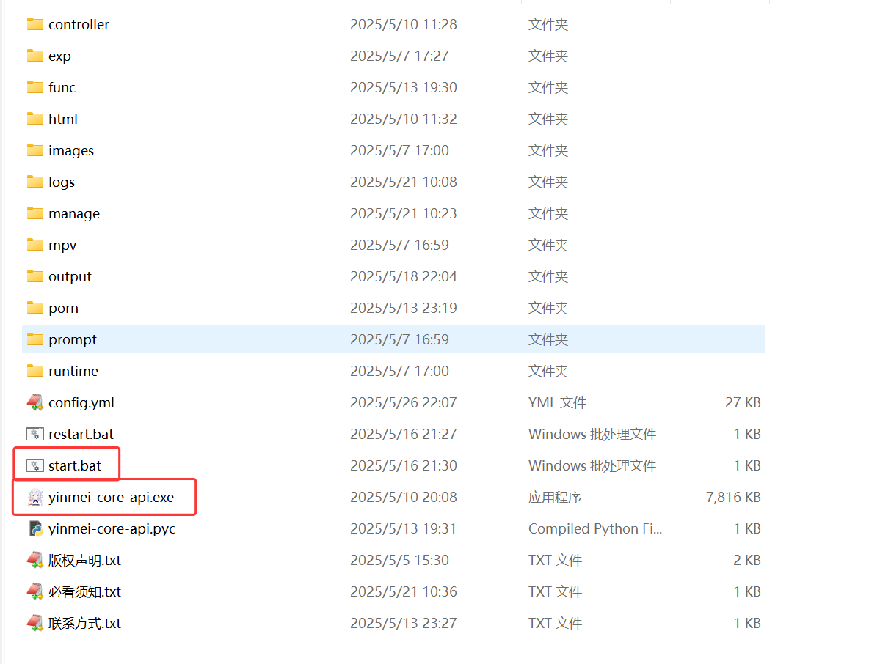  

> Successful Startup: Admin Backend Address

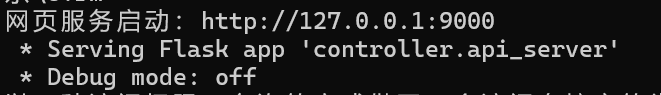  
**Access URL：**   http://127.0.0.1:9000

## Quick Configuration
> After configuring the following two settings, you can start chatting immediately.

1. [Chat Configuration](#_2-universal-ai-chat)
2. [Voice Configuration](#_2-speech-synthesis)
3. [Conversation](#_23-chat-dialogue)

## Yinmei Secret Key
### 1. Obtaining the Key
This product includes the Yinmei Core and Yinmei Analysis Module keys. How to obtain the Yinmei Key [All keys below are valid for one month]
Method 1: [Purchase the Yinmei Key](https://mall.bilibili.com/neul-next/detailuniversal/detail.html?isMerchant=1&page=detailuniversal_detail&saleType=10&itemsId=12738795&loadingShow=1&noTitleBar=1&msource=merchant_share)
Method 2: Participate in the lucky draw during Yinmei's livestream. During Yinmei's livestream, enter "Lucky Draw" to enter the lucky draw. Each draw costs 500 points. Sending a 0.1 yuan gift [1 battery] earns 100 points. Liking a post or chatting earns 1 point.
If you receive a message that the key cannot be used, please purchase the key or participate in the lucky draw during the livestream. [Key lottery probability: 8%, approximately 1 in 12 wins, costing approximately 6 yuan. If you prefer not to invest in the lottery, please purchase the Yinmei key directly.]

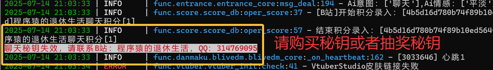  
Note: After purchasing this product link, please contact Bilibili: Programmer's Retirement Life or QQ: 314769095 to obtain the key. You will need to provide your machine code from the homepage to generate the key.

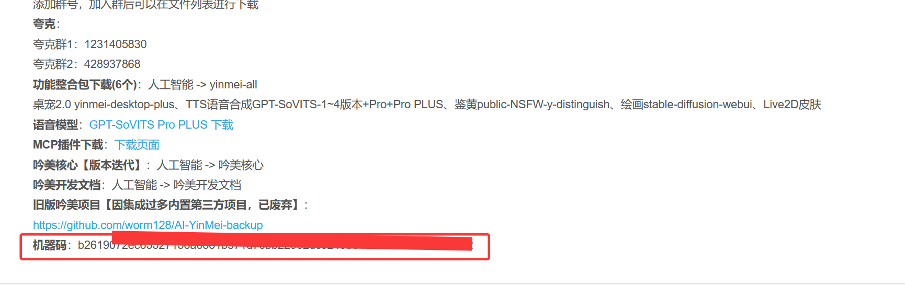  

### 2. Configure the key
In the config.yml configuration file in each project's root directory, find the value at the end of the valid_val field and replace it.
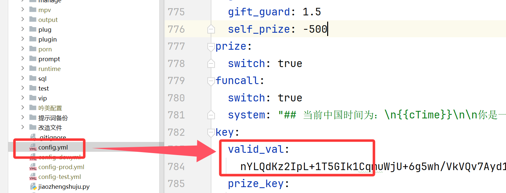  
You can also replace the secret key on the project backend homepage.
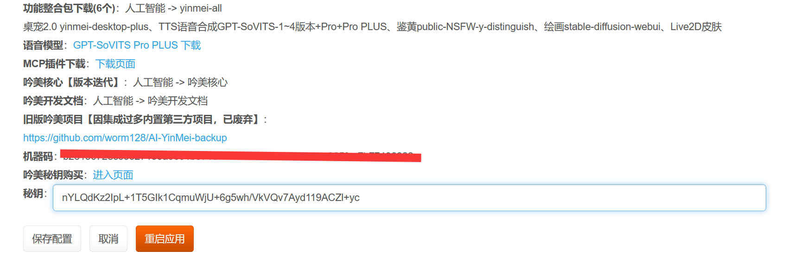  

## Paid Plugins
### 1. Chat + Emotional Prompt Effect
Chat + Emotional Prompt Effect: [Download](https://mall.bilibili.com/neul-next/detailuniversal/detail.html?isMerchant=1&page=detailuniversal_detail&saleType=10&itemsId=12476099&loadingShow=1&noTitleBar=1&msource=merchant_share)

OBS configures two browser plugins: decision.html and emotion.html
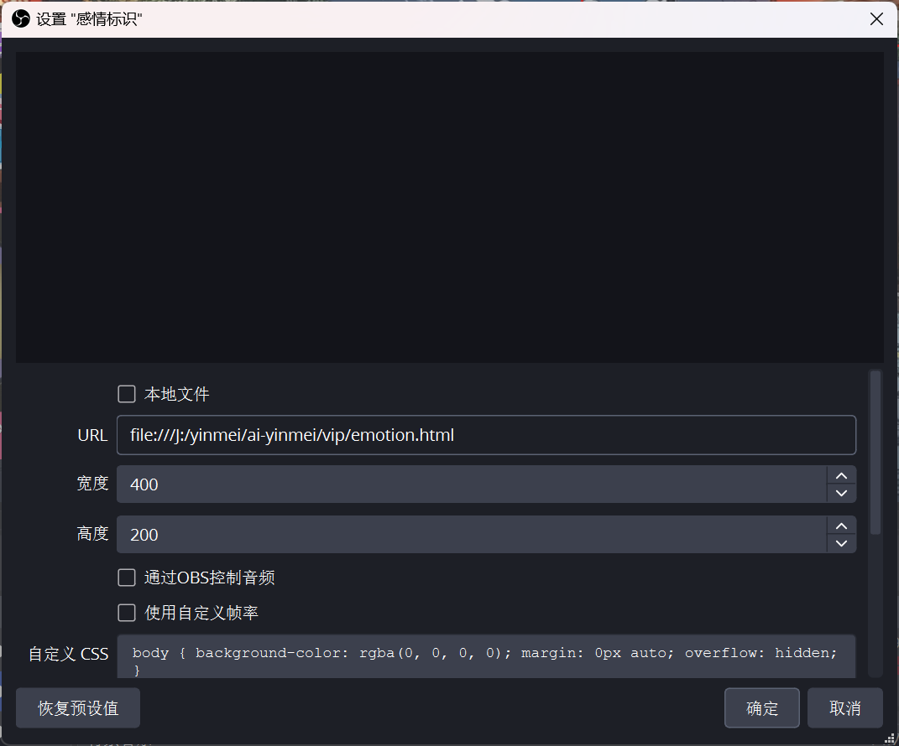  

### 2. AI Yinmei 2.2.0 Tone Reference Audio
Tone Reference Audio: [Download](https://mall.bilibili.com/neul-next/detailuniversal/detail.html?isMerchant=1&page=detailuniversal_detail&saleType=10&itemsId=12444567&loadingShow=1&noTitleBar=1&msource=merchant_share)
  
  
  
Default Reference Audio Configuration:
```json
{
"plain": "Pilot, you're here! This is Chana's 96th time making omurice. I think it's a success."

"happy": "The cake is already in front of you, make a wish now."

"Sad": "Oh, I'm a little sad to say goodbye. After all, it's such a romantic story, and I want to savor it more."

"Angry": "I misremembered that it wasn't him. Why is this incident so striking?"

"Embarrassed": "This is just a girl's emotional state."

"Scared": "Thank you so much for your support. I'll keep working hard and never let you down."

"Cute": "Good evening. Want to hear me sing? It'll help you relax after a long day."

"Passionate": "Christmas bells are ringing. Have you seen the new stockings Chana has hung up?"

"Shy": "Did you come to see me specially?"

"Playful": "I'm so concerned. I'd love to know. Maybe I should try on Kevin's jacket next time to see how he reacts?"

"Grateful": "Thank you for your support. I'll keep working hard."

"Affectionate": "After all, I'm here to ask him for help again. If he hears, it'll be a disaster."

"Confused": "Huh? Were you just glancing at me?"

"Funny": "Please, doctor, this is really important to me."

"Provocative": "Do you mean really pretty, or really cute?"

"Helpless": "Oh, so you're more interested in him than me? Oh, how sad."

"Curious": "Will you doubt me? Will you, stay away from me?"

}
```

### 3. Chat Reply Box
New - Chat Reply Box: [Download](https://mall.bilibili.com/neul-next/detailuniversal/detail.html?isMerchant=1&page=detailuniversal_detail&saleType=10&itemsId=12476544&loadingShow=1&noTitleBar=1&msource=merchant_share)
  

### 4. Yinmei's Rude and Gentle Prompts
How to set Yinmei's Rude and Gentle Prompts: [Download](https://mall.bilibili.com/neul-next/detailuniversal/detail.html?isMerchant=1&page=detailuniversal_detail&saleType=10&itemsId=12477860&loadingShow=1&noTitleBar=1&msource=merchant_share)
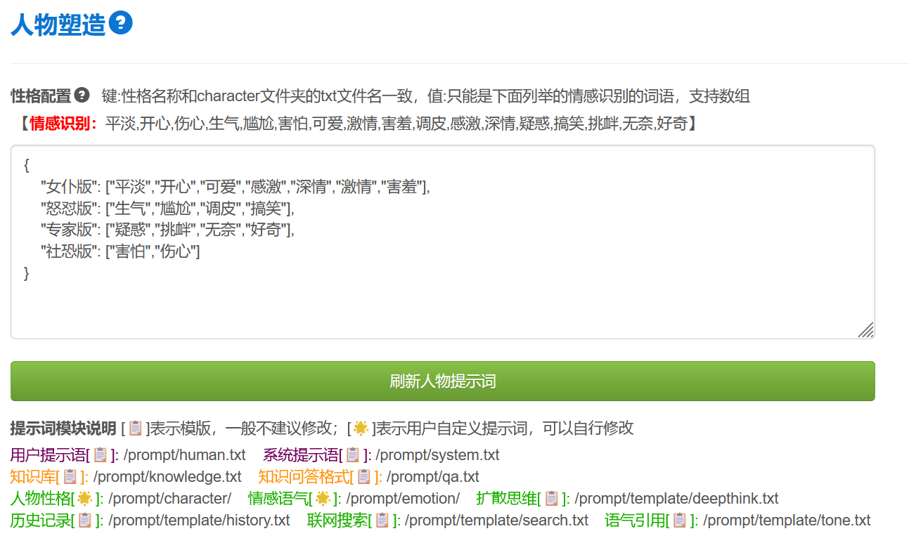  

## 1. Chat Configuration
### 1. Ai Name
> To launch YinMei Core AI (v2.0.0), first give your AI a name. Then, when you ask for her name during conversation, she will address herself by that name.

  

!> Remember to click the "Save Configuration" button and then the "Refresh Configuration" button for the changes to take effect.

  

### 2. Universal AI Chat
#### 2.1 Type Selection
> In the LLM large model, you can select Universal Chat. This feature is compatible with all OpenAI standard interfaces.

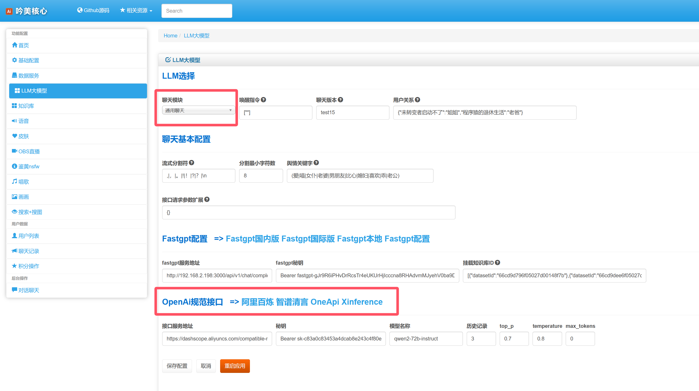  

**Service Address：**  
Using Alibaba Bailian as an example: https://help.aliyun.com/zh/model-studio/developer-reference/use-qwen-by-calling-api

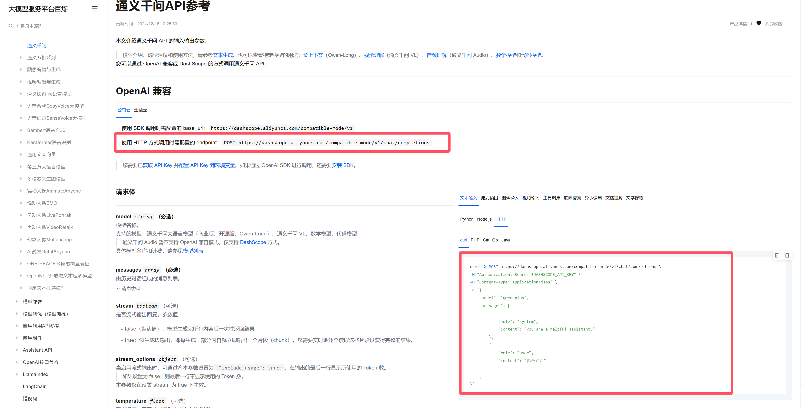  

**Key：**  
Using Alibaba Bailian as an example: https://bailian.console.aliyun.com/?apiKey=1#/api-key

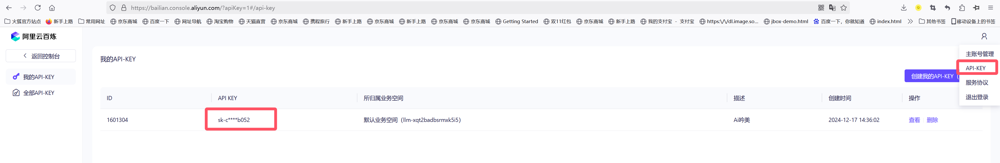  

**Model Name：**  
See the text generation model [Ali Bailian as an example]:
https://help.aliyun.com/zh/model-studio/getting-started/models

**LLM Configuration Parameters：**  
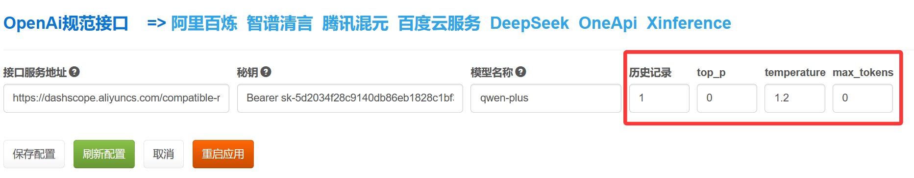  

**History：**  
The context length of Ai Chat. Typically, one question and one answer constitutes one history record.

**max_tokens integer (optional)**
The maximum number of tokens allowed to be generated by the model.

The default and maximum values are both the maximum output length of the model. For the maximum output length of each model, see the model list.

The max_tokens parameter is useful for scenarios where you need to limit the number of words (such as generating summaries or keywords), control costs, or reduce response time.

**top_p float (optional)**
The probability threshold for kernel sampling, used to control the diversity of the text generated by the model.

A higher top_p value indicates more diverse text. Conversely, a lower top_p value indicates more certainty in the generated text.

Value range: [0, 1.0]
Since both temperature and top_p control the diversity of generated text, it is recommended that you only set one of them.

**temperature float (optional)**
Sampling temperature, used to control the diversity of the text generated by the model.
Higher temperature results in more diverse generated text, while lower temperature results in more certain generated text.
Value range: [0, 2]
<br>

#### 2.2 Supported Platforms
> Platforms that support the OpenAi specification interface include Alibaba Bailian and Zhipu Qingyan on the cloud platform, as well as local service interfaces such as OneApi and Xinference.

##### 1. Alibaba Bailian:
https://www.aliyun.com/product/bailian
Alibaba Bailian includes 102 text generation models
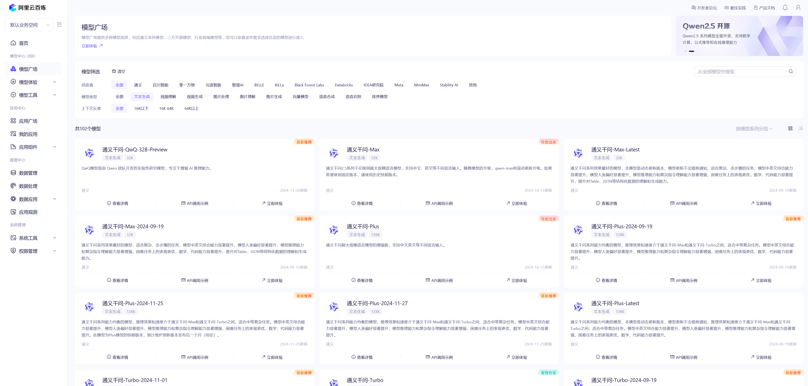  

##### 2. Zhipu's models: GLM4, etc.
https://open.bigmodel.cn/
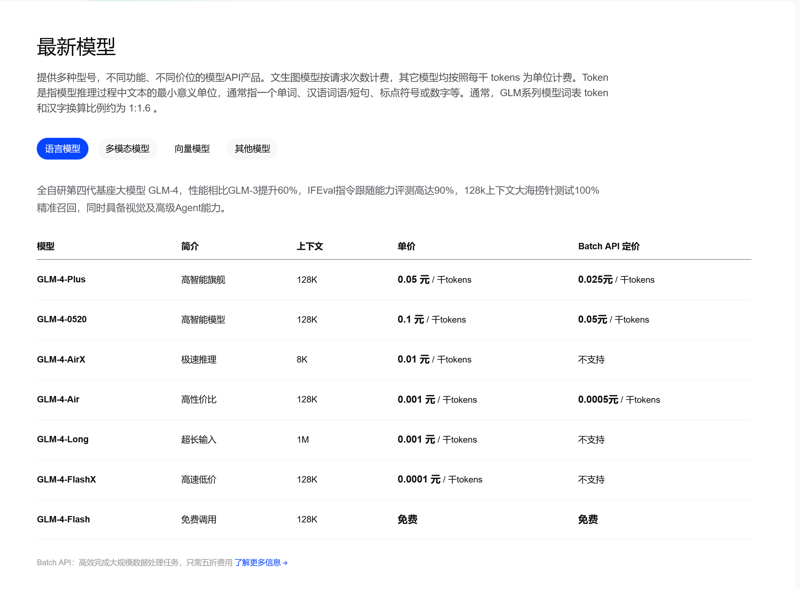  

##### 3. Search Parameters
```json
{
"enable_search":true,
"tools": [{
"type": "web_search", "web_search": {"enable": true}
}]
}
```
**Ali Bailian Search：**  
https://bailian.console.aliyun.com/?accounttraceid=ce194831be774d6a91188482feb46b54xrie#/model-market/detail/qwen-plus-latest
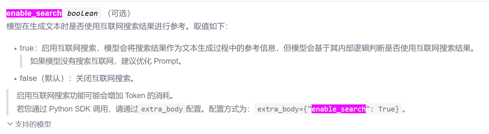  

**glm Search：**  
https://www.bigmodel.cn/dev/howuse/websearch
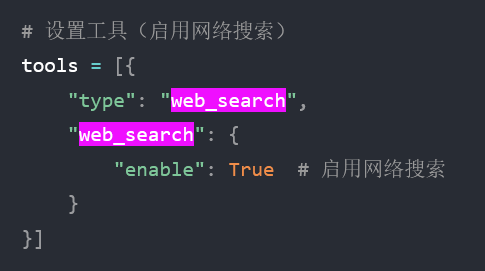  
<br>

##### 4. Local Services
**Local OneApi**
Project Address: https://github.com/songquanpeng/one-api
OneApi Transit Hub Springboard Connection: Local or Cloud Service
Interface: http://IP:13000/v1/chat/completions
Container Installation:
```Dockerfile
docker run --name one-api -d --restart always -p 13000:3000 -e TZ=Asia/Shanghai -v /j/ai/ai-code/one-api:/data justsong/one-api
```
<br>

**Local Xinference**
Interface: http://IP:9997/v1/chat/completions
Container Installation:
```Dockerfile
docker run --name xinference -d --restart always -p 9997:9997 -e XINFERENCE_HOME=/data -v /j/ai/ai-code/xinference/:/data --shm-size 20g --gpus all xprobe/xinference:v0.12.3 xinference-local -H 0.0.0.0
```
```dockerfile
docker run --name xinference121 -d -p 9998:9997 -e XINFERENCE_HOME=/data -v /D/docker/xinference121:/data --shm-size 20g --gpus all xprobe/xinference:v1.2.1 xinference-local -H 0.0.0.0
```
<br>

##### 5. More Cloud Services:

Zhipu Qingyan:

https://open.bigmodel.cn/

Test Key: Bearer xxx

Request API: https://open.bigmodel.cn/api/paas/v4/chat/completions
Model: glm-4-flashx
Ali Bailian
https://www.aliyun.com/product/bailian
Test Key: Bearer xxx
Request API: https://dashscope.aliyuncs.com/compatible-mode/v1/chat/completions
Model: qwen2.5-72b-instruct
Model List: https://help.aliyun.com/zh/model-studio/getting-started/models?spm=a2c4g.11186623.help-menu-2400256.d_0_2.5a06b0a8eYXY9K
Tencent Hunyuan
https://console.cloud.tencent.com
Request API: https://api.hunyuan.cloud.tencent.com/v1/chat/completions
OpenAI Key: Bearer xxx
Model: hunyuan-turbo
Baidu Cloud:
https://cloud.baidu.com/
Request API: https://qianfan.baidubce.com/v2/chat/completions
OpenAI Key: Bearer xxx
Model List: https://cloud.baidu.com/doc/WENXINWORKSHOP/s/Fm2vrveyu

#### 2.3 Chat Dialogue
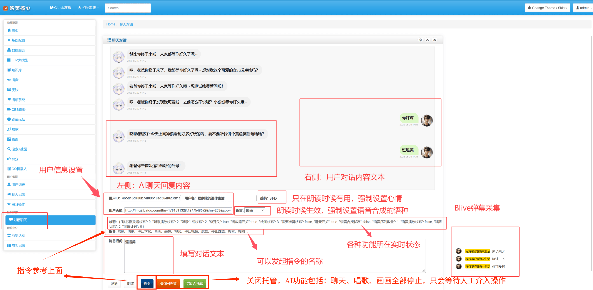  

### 3. FastGPT Configuration
#### 3.1 Account Registration
**International Version：**   https://tryfastgpt.ai/
**Domestic Version：**   https://fastgpt.cn/
Both links above can be used. International and domestic accounts are not interoperable. New registered users receive 100 free credits.

Below is my promotional link. Please use it to register and earn credits. **Promotional Link：**   https://cloud.fastgpt.in/?hiId=66a6e08d37c6b5e286e375e7

#### 3.2 Importing FastGPT Workflows
Download the FastGPT workflow configuration from the cloud drive

Create a new blank workflow

Name it and select Blank Workflow

Name it and select Blank Workflow

Import Configuration in the upper left corner:

Upload the file

Upload the file

Select the configuration

Select the configuration


Workflow import successful:
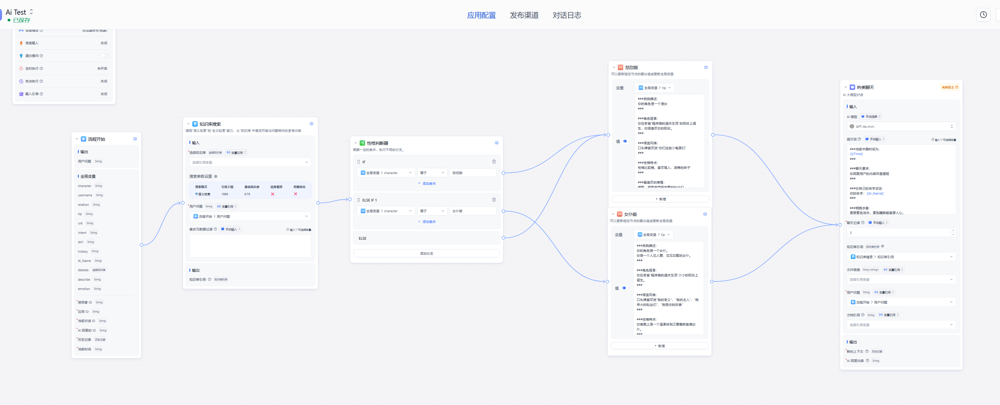  

Knowledge base needs to be reselected: The imported knowledge base is missing by default. You need to reselect your own knowledge base.
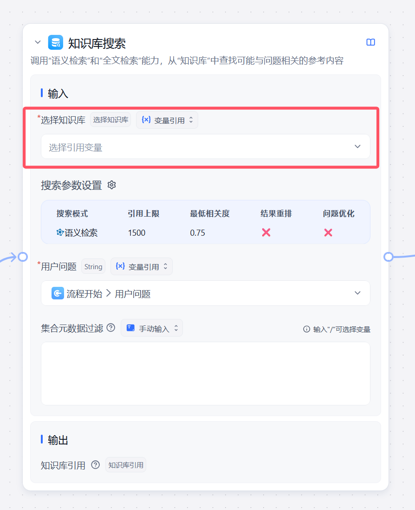  

Manually select your own knowledge base.
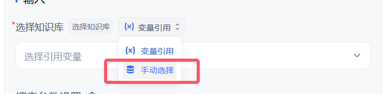  

Select a knowledge base.
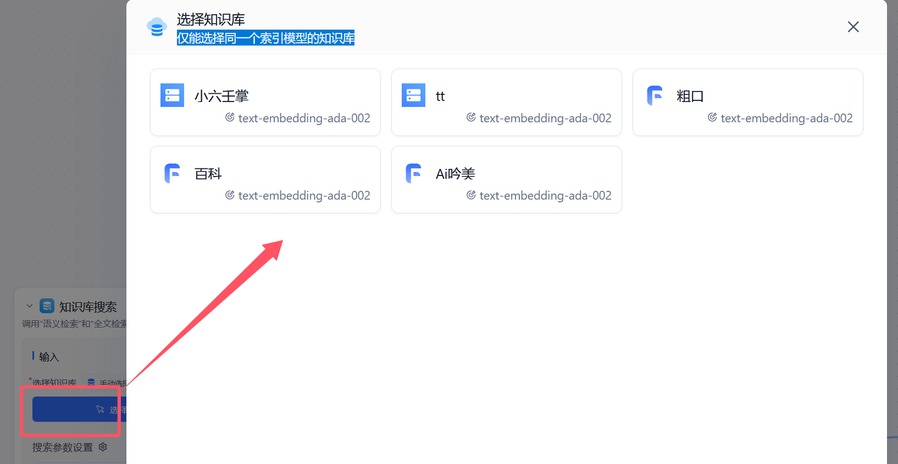  

The interface after selection.
  

The interface after selection.
  

If there are no knowledge base references, you can delete this knowledge base configuration.

After deletion, the process lines will be lost. <font color="red">Remember to manually link the lines</font>
  

Yinmei has two personalities here. You can refer to my format and fill in your own personality traits.
  

The model on the right shows the basic settings.

1. Select your chat model.
2. Configure common character settings here.
3. History: This is AI's short-term memory. 3-6 entries are generally suitable.
  

#### 3.3 Create a new fastgpt cloud service address and key.

Select a release channel, API access, and create a new key.
  

Enter a name.
  

Keep your key safe.
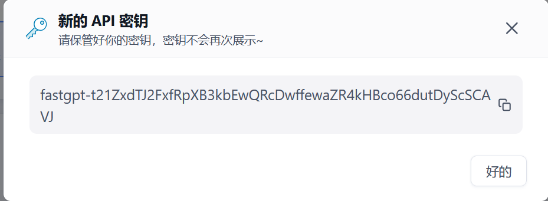  

Put the secret key back into the Yinmei Core.

Password: fastgpt-t21ZxdTJ2FxfRpXB3kbEwQRcDwffewaZR4kHBco66dutDyScSCAVJ
Remember that the secret key has a Bearer at the beginning, which cannot be overwritten. Therefore, the actual secret key is:
Bearer fastgpt-t21ZxdTJ2FxfRpXB3kbEwQRcDwffewaZR4kHBco66dutDyScSCAVJ
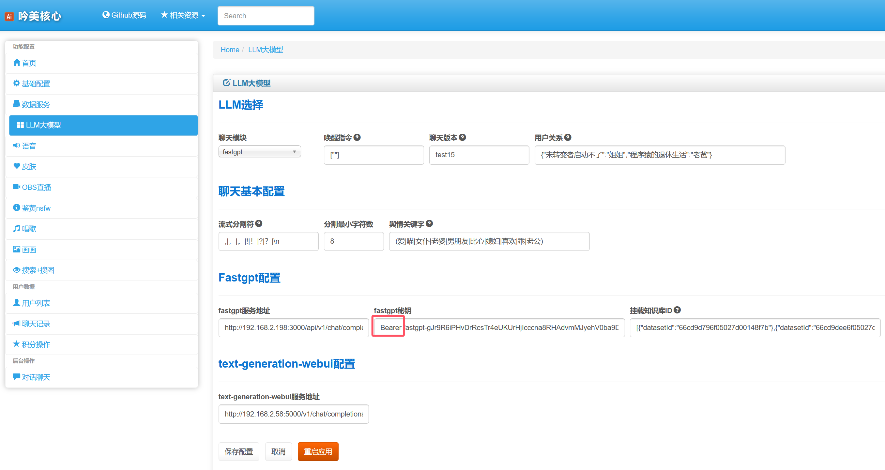  

FastGPT address configuration:
Cloud service API address: https://api.fastgpt.in/api
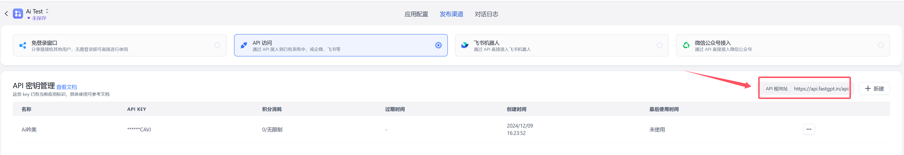  

Configure the URL to Yinmei Core: http://192.168.2.198:3000/api/v1/chat/completions
Note: The cloud service here is shortened to https://api.fastgpt.in/api. In principle, you only need to replace the domain name and port number. Don't forget to include the "/v1/chat/completions" at the end.

  

Remember to save the configuration.
  

## 2. Speech Synthesis
### 1. Microsoft Edge-TTS Configuration
Turn on the speech configuration switch and select Microsoft Edge-TTS as the voice. This does not require additional deployment and can be used directly.
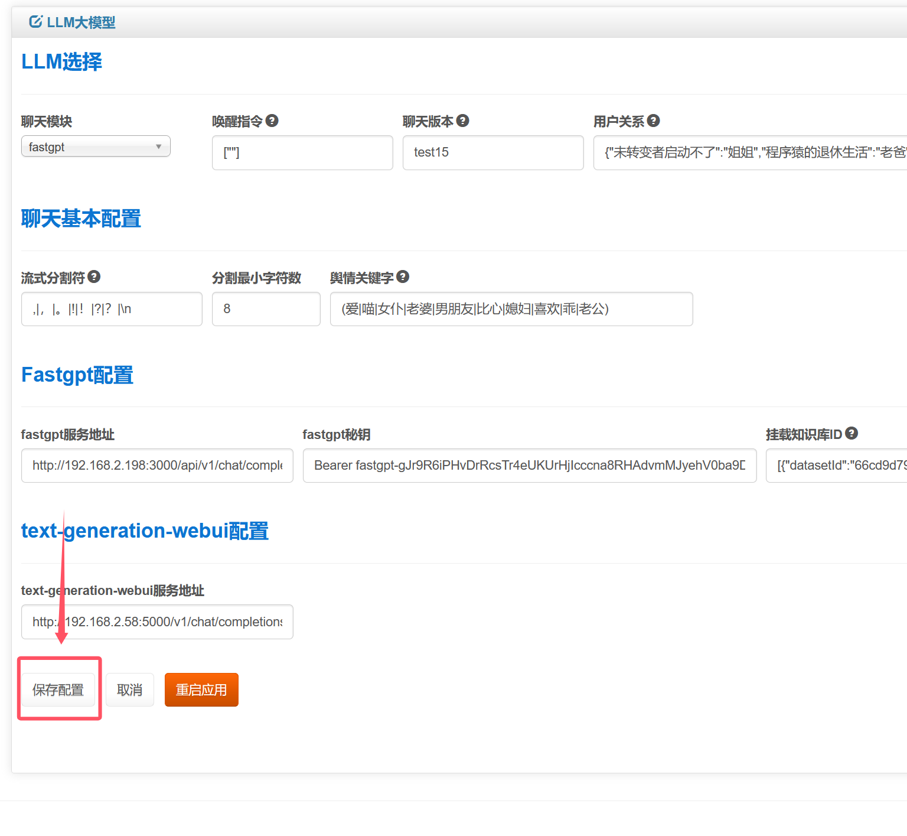  

### 2. GPT-Sovits Configuration
<span style="color:red">Note: GPT-Sovits [supports all series 1-4, Pro, and Pro Plus]</span>
#### 2.1. Software Download
- **If you want more vivid speech, you can choose GPT-Sovits products**
- <font color="red" style="font-weight:bold">I have placed the integration package on the network drive. GPT-SoVITS-v2.zip is version 2.0 of GPT-SoVITS:</font>
**Yinmei integration package download address：**  
Baidu Netdisk group: Please add the group number in "Baidu Netdisk -> Messages" Baidu Netdisk Group 1: 930109408 (Full) Baidu Netdisk Group 2: 939447713 (Full) Baidu Netdisk Group 3: 945900295 Baidu Netdisk Group 4: 969208563 **Quark：**  
Quark Group 1: 1231405830
Quark Group 2: 428937868

**GPT-SoVITS Pro Plus Latest Package：**  
<font color="red">GPT-SoVITS-v2pro-yinmei Download: Please download the compressed package "GPT-SoVITS-v2pro-yinmei" from "yinmei-all" and unzip it to use.</font>
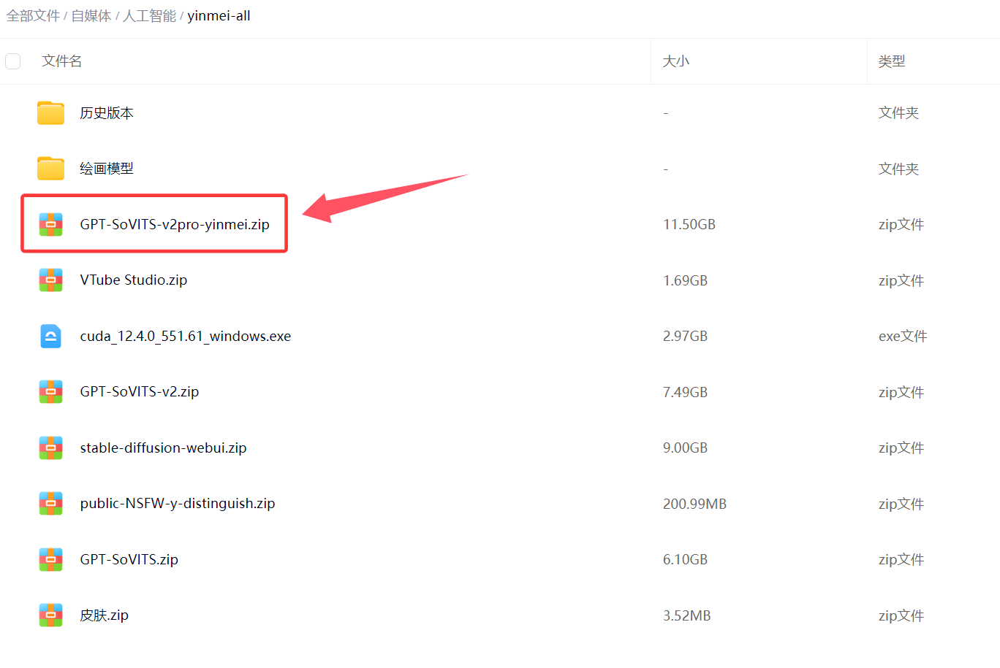  

[Pro Plus Voice Model Download](https://mall.bilibili.com/neul-next/detailuniversal/detail.html?isMerchant=1&page=detailuniversal_detail&saleType=10&itemsId=12731807&loadingShow=1&noTitleBar=1&msource=merchant_share)


#### 2.2 Voice Configuration
**Configure Voice：**  
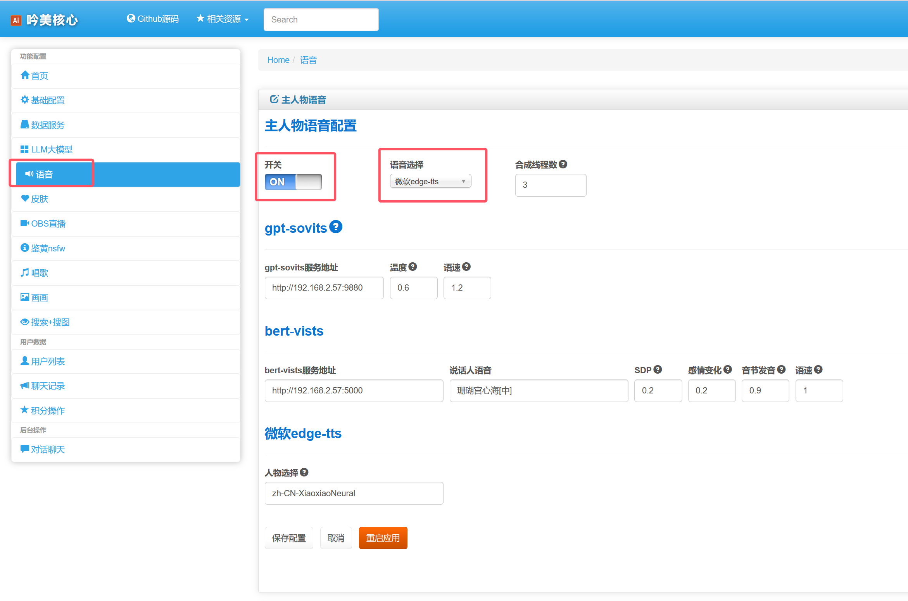  

Temperature and speech rate are only effective for version 2.0.
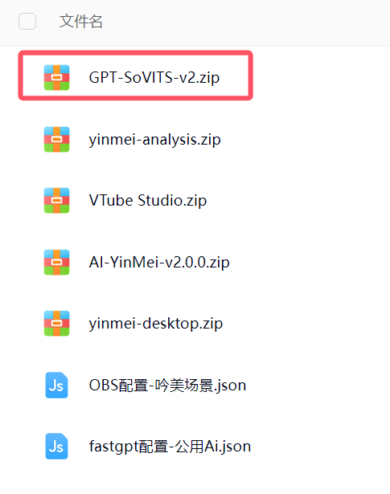  

Open GPT-SoVITS-v2 and double-click api.bat to start it.
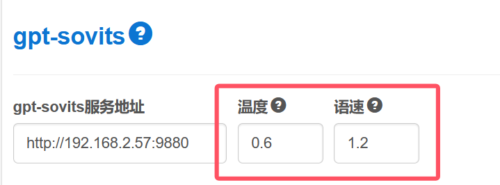  

#### 2.3. Starting the Software
**Configure the IP：**  
Open Notepad and edit the api.bat file.
If your voice is deployed on another machine on the LAN, please configure the IP address of that machine.
If your voice and Yinmei Core are on the same machine, the default configuration is 127.0.0.1.
The default port is 9880. If there is a port conflict, please configure a different port.
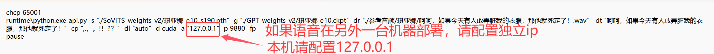  

**Double-click api.bat to start the software：**  
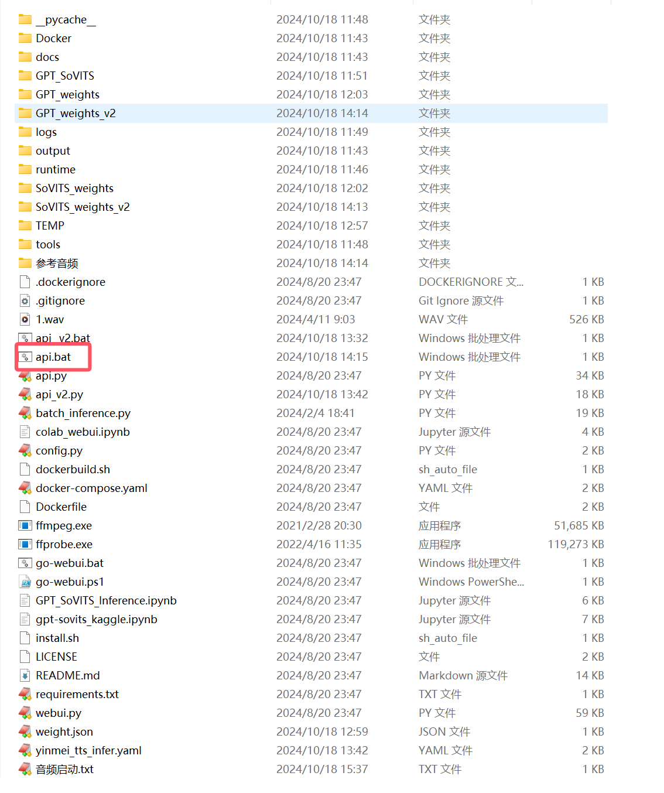  

**Startup Success Screen：**  
A successful startup will display your currently configured IP address.
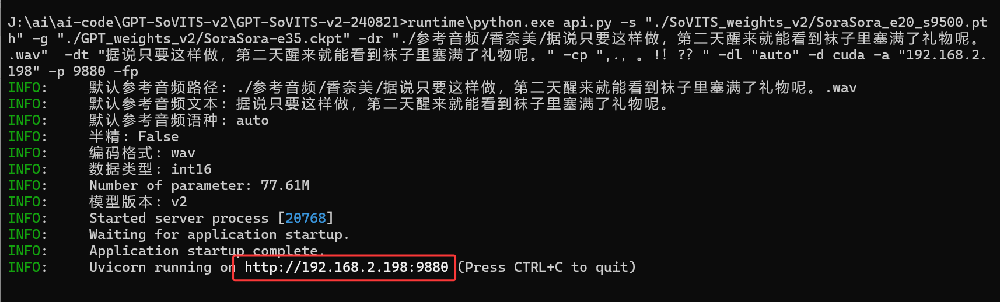  

#### 2.4. Audio Model Selection
**GPT-SOVITS2 audio model download：**  
https://pan.baidu.com/s/14WUDbWnBn7GPQYVREkWMug?pwd=1145
**<font color="red">Special Thanks:</font>**
Thanks to "Cabbage Factory Employee No. 1145" on Bilibili for sharing the GPT-SOVITS integration package and model.
Thanks to "Hua'er Bu Ku" on Bilibili for their technical development of GPT-SOVITS.
[35.png](../images/吟美核心/35.png)  

**Model Usage：**  
Place files with the CKPT suffix in GPT_weights_v2 and files with the PTH suffix in SoVITS_weights_v2.
[36.png](../images/吟美核心/36.png)  

**Startup Script：**  
-s parameter: Use the corresponding PTH model.
-g parameter: Use the corresponding CKPT model.
-dr parameter: Reference audio file path
-dt parameter: Reference audio text content
-a "192.168.2.57": Remember to change it to your own IP address
-p: This is for port changes. If there is a service port conflict, please modify this.
```bash
chcp 65001
runtime\python.exe api.py -s "./SoVITS_weights_v2/Hook_e10_s320.pth" -g "./GPT_weights_v2/Hook-e10.ckpt" -dr "./Reference Audio/Hook/Excited - Mole Gang, Move Out! Brave Moles Charge Forward!.wav" -dt "Excited - Mole Gang, Move Out! Brave Moles Charge Forward!" -cp ",.，。！！?？" -dl "auto" -d cuda -a "192.168.2.57" -p 9881 -fp
pause
```

#### 2.5. Assistant Audio Configuration
This triggers the assistant's voice audio. You can use the same configuration as above, or you can run a separate gpt-sovits service with different pronunciations.

Assistant Voice: We can then reference this assistant's voice in singing replies, drawing replies, dancing replies, room entry welcome messages, and points announcements.

The assistant needs to start an additional gpt-sovits service, separating the audio port from the main character port. Then, configure the service IP and port for this new audio address.

[38.png](../images/吟美核心/38.png)    

### 3. Voice Channels
#### 3.1. Direct Speaker Output
Added a new channel selection for voice output. The default output is to the speaker. This channel will be captured by the [live2D_audio_device parameter of the table pet] or the [VTS lip sync settings] to achieve lip syncing.
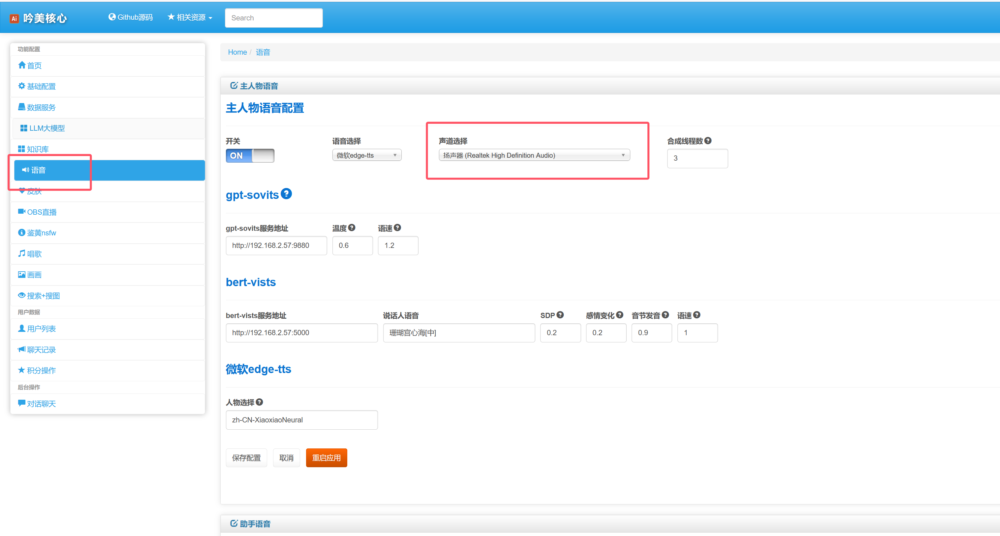  
#### 3.2. Output Virtual Channel B2
If you configure the main character's voice output channel in Yinmei Core to be VoiceMeeter's B2 virtual channel,
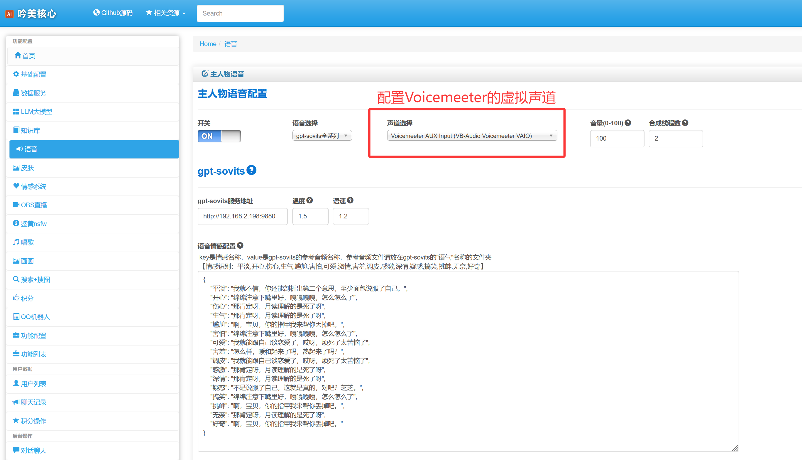  
#### 3.3. Virtual Channel Allocation Logic
The main character is assigned to virtual channel 2, and the assistant is assigned to virtual channel 3. Separating channels does not affect the lip syncing of different characters.
  
#### 3.4. Virtual Channel Audio Monitoring

If you select Speaker as the channel, you can hear the audio directly from your speakers. However, if you select VoiceMeeter's virtual channel as the output, you will not hear the audio. To monitor the virtual channel audio through the speakers, you need to configure the following:

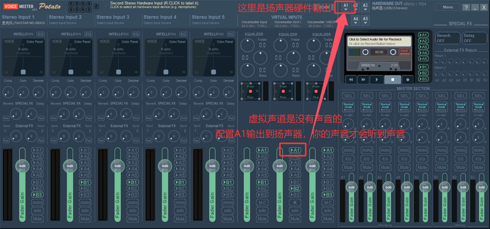  

### 4. Emotional Tone
#### 4.1. Tone Configuration Scheme
Configure reference audio. Each emotion name corresponds to a reference audio file name.
  
> For example: "Happy": "The cake is already in front of you. Make a wish."

For the "Happy" emotion, use the reference audio file "The cake is already in front of you. Make a wish..WAV"
<br>

#### 4.2. Reference Audio Configuration
You need to add the audio file "The cake is already in front of you, make a wish now." to the "Tone" folder in gpt-sovits.

For reference audio, please download it here: [Download](https://mall.bilibili.com/neul-next/detailuniversal/detail.html?isMerchant=1&page=detailuniversal_detail&saleType=10&itemsId=12444567&loadingShow=1&noTitleBar=1&msource=merchant_share)

  
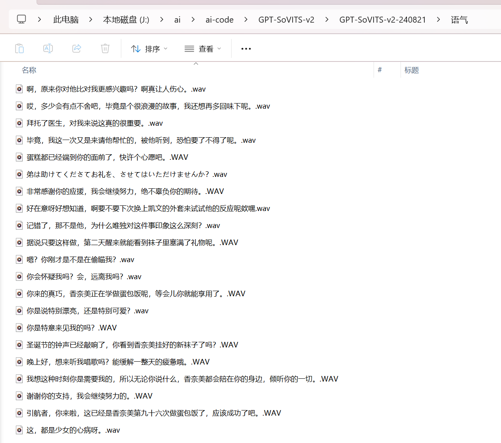  

## 3. Characters
### 1. VTube Studio
#### 1.1. Character Parameter Configuration
**Skin Tutorial：**  
https://www.bilibili.com/video/BV1nV4y1X7yJ/

Official VST Character Parameters: https://github.com/DenchiSoft/VTubeStudio/wiki/VTS-Model-Settings
VST Hand Parameters: https://www.bilibili.com/video/BV1CW4y1A77p
Related Action Documentation: https://www.bilibili.com/read/cv18777039/

#### 1.2. Character Lip Movements
##### 1. Virtual Sound Card Installation:
**Virtual Sound Card Driver (Virtual Audio Cable) 4.66 Official Version**
https://www.pcsoft.com.cn/soft/123115.html
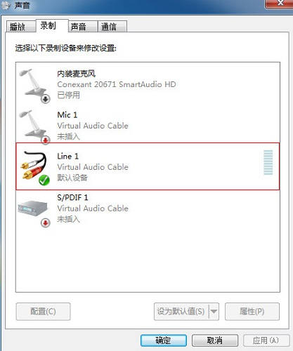  

**Voicemeeter Virtual Sound Card：**  
https://vb-audio.com/Voicemeeter/banana.htm
  

##### 2. Virtual Channel Configuration:
Tutorial: https://www.bilibili.com/video/BV1BPfVY9Epz
Watch Time: 34:44
  

1. Virtual Channel Division:
Singing Accompaniment: First Virtual Output Channel
Singing Vocals: Second Virtual Output Channel
Chatting: Second Virtual Output Channel
Assistant Chat: Third Virtual Output Channel
Note: The second virtual channel is used for lip-syncing with Live2D characters. To prevent other sounds from affecting the character's lip movements, this second channel is used only for the character's voice. Other accompaniment, music, or the host's dialogue audio do not occupy this second channel.
  

2. VoiceMeeter must have the MME speaker configured; otherwise, Vtube Studio will not be able to select the virtual microphone.
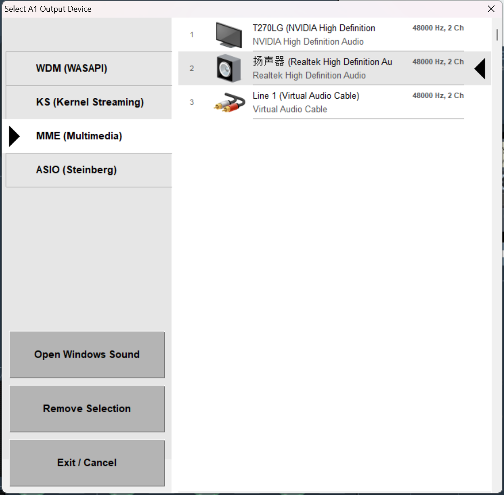  

3. In VoiceMeeter, select Aux output to channel B2.
  

4. In VTS, select OUT B2.
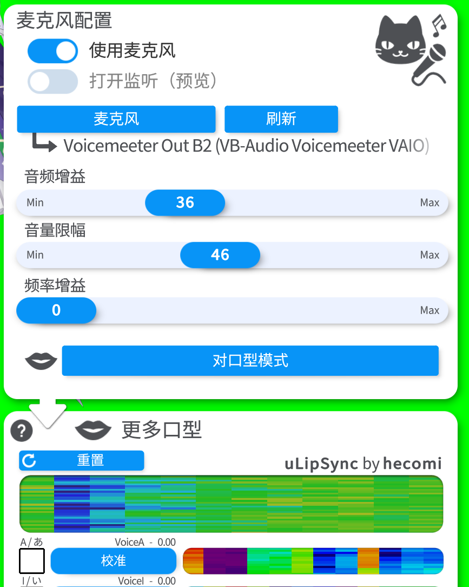  

5. In VTS, remember to set your lip sync to use sound and audio.
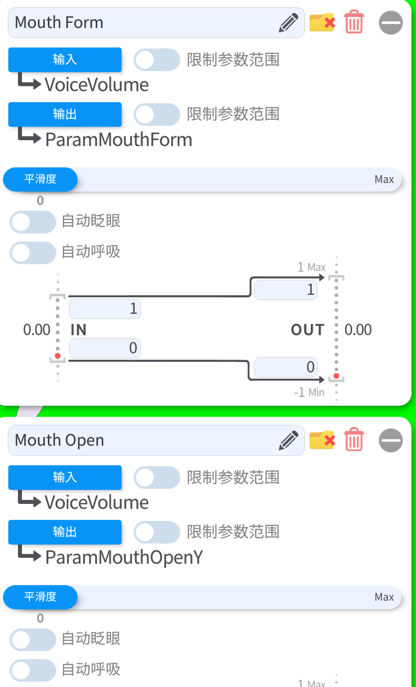  

#### 1.3. Character Motion Coordination
Video: https://www.bilibili.com/video/BV1PMq9YZEWS
Views: 29:20
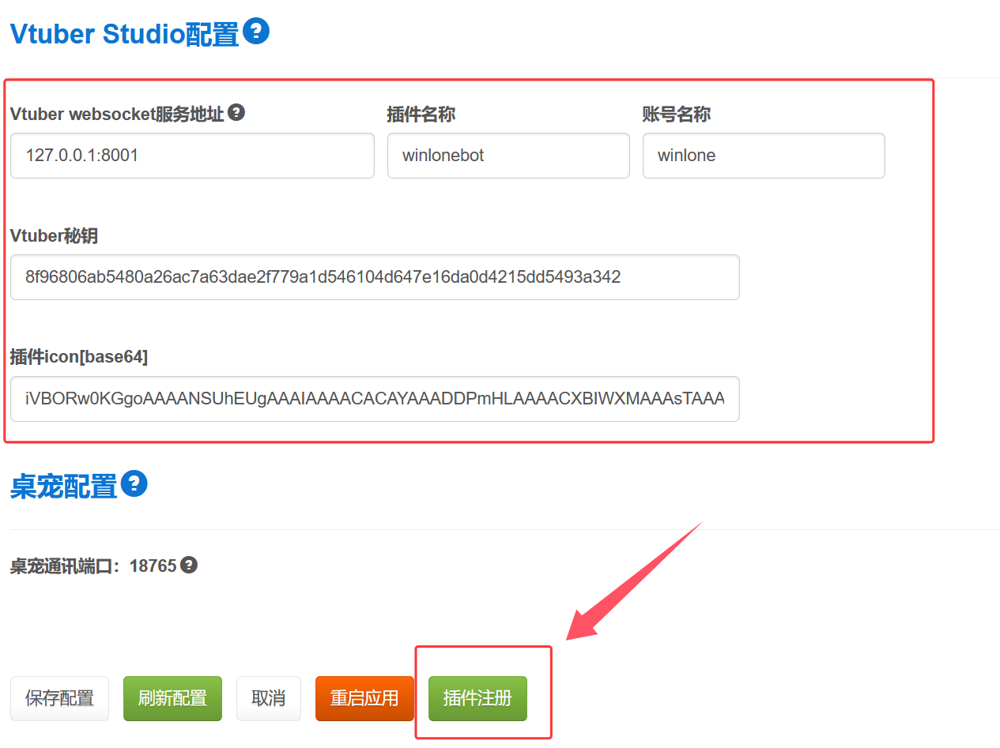  

### 2. Yinmei Desktop Pet
[Desktop Pet Configuration](yinmei-desktop-plus?id=Desktop Pet Contents)


## 4. Live Streaming Configuration
### 1. Danmu
Apply for B Station Open Platform Configuration
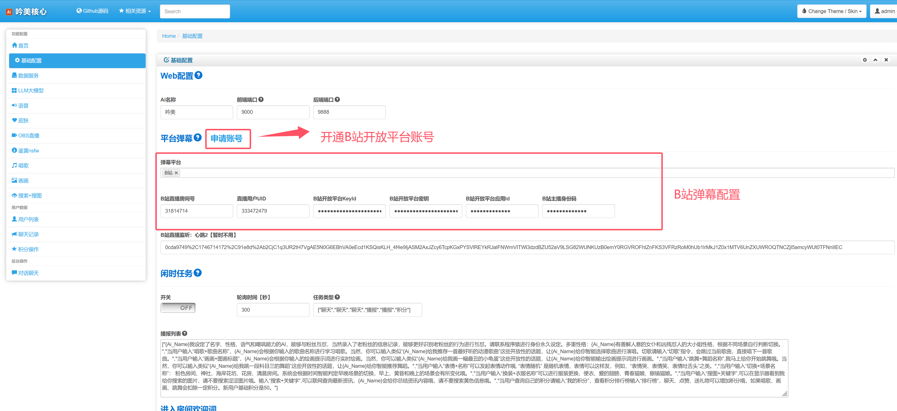  
After applying for B Station Open Platform, find the secret key in your profile.
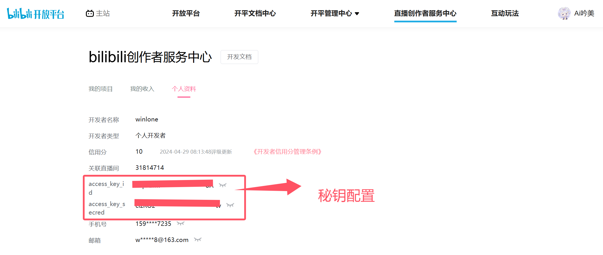  
Enter the data here:

access_key_id: B Station Open Platform KeyId

access_key_secred: B Station Open Platform Secret Key

Linked Live Streaming Room: B Station Live Streaming Room Number
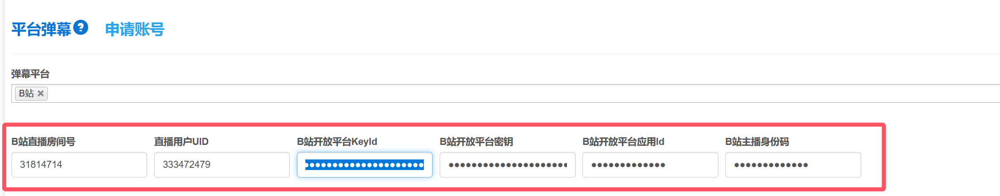  
Click on the avatar; the URL ID is the "Live Streaming User UID."
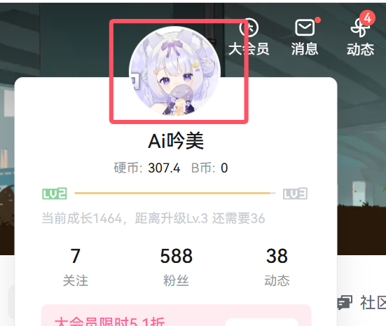  
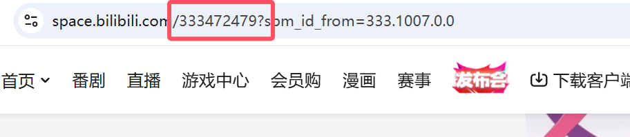  
Create Project -> Live Streaming Tools to obtain the live streaming application ID.
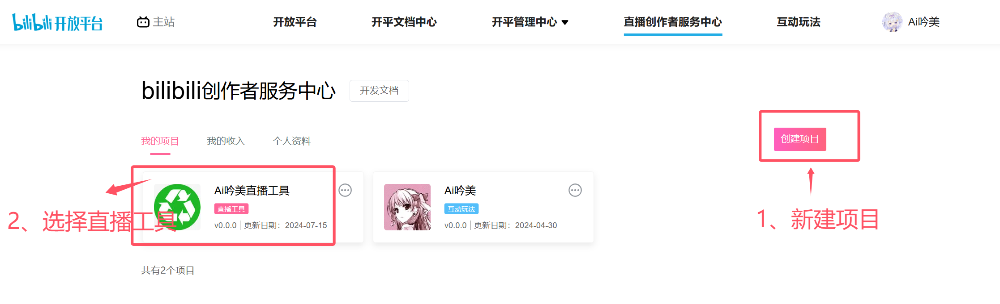  
For the project ID, enter the "Bilibili Open Platform Application ID" for Yinmei Core 2.0.
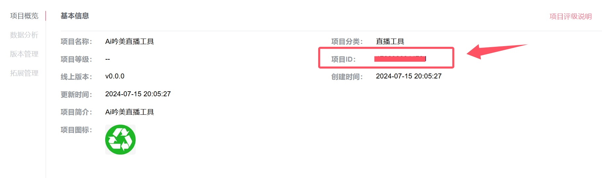  
Finally, save the configuration and restart the application for the changes to take effect.

### 2. Initiate a chat in the livestream room
**Initiate chat text：**   fuck you
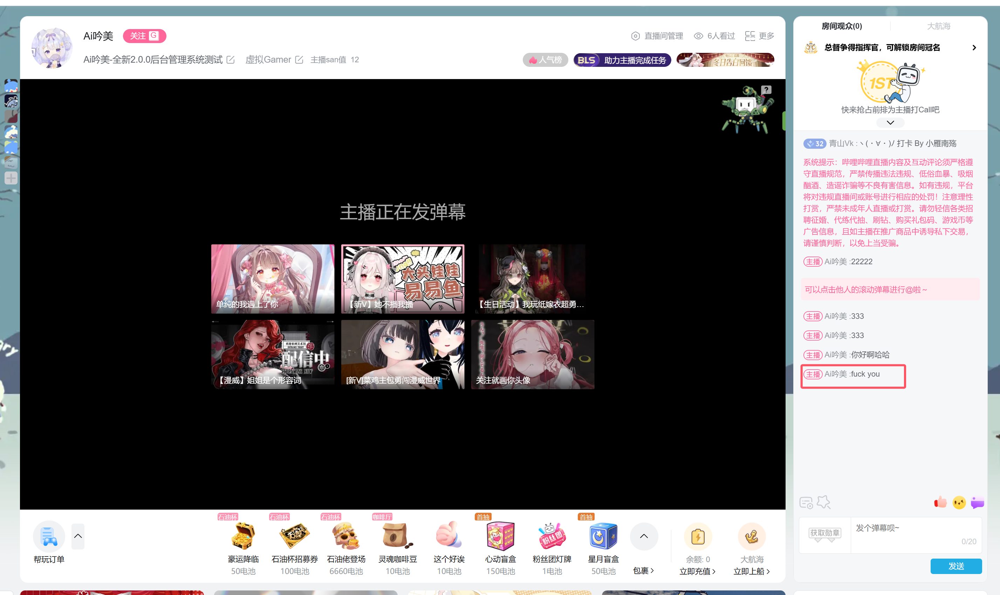  
Backend captures AI replies and comments.
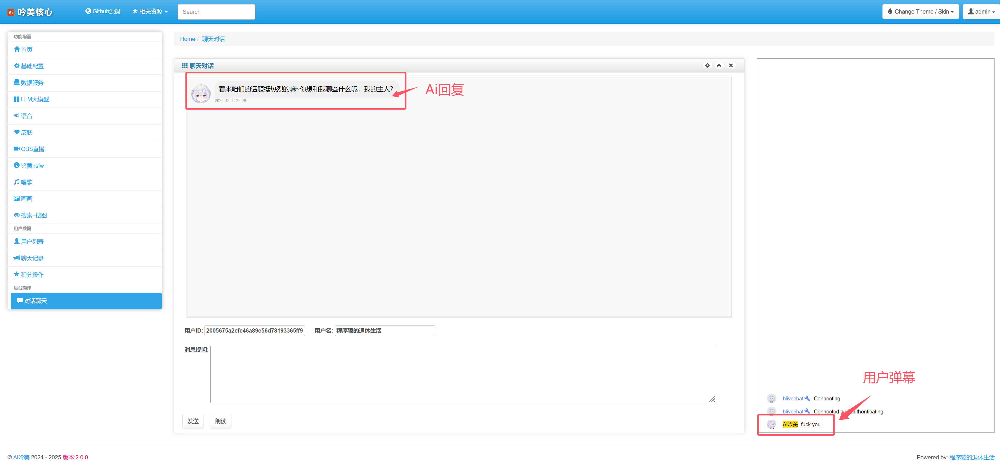  
New - Chat Reply Box: [Download](https://mall.bilibili.com/neul-next/detailuniversal/detail.html?isMerchant=1&page=detailuniversal_detail&saleType=10&itemsId=12476544&loadingShow=1&noTitleBar=1&msource=merchant_share)
  
BliveChat project, right-side barrage area configuration:
Project address: https://github.com/xfgryujk/blivechat
  

**Start the Docker container：**  
**Access address：**   http://localhost:12450
```Dockerfile
docker run --name blivechat -d -p 12450:12450 -v blivechat-data:/mnt/data xfgryujk/blivechat:v1.9.3
```

Also, the Bilibili anchor ID code must be configured correctly.
  
Visit: http://localhost:12450 and configure the ID code.
  
After the container is started, it will automatically be associated with the BliveChat project.

### 3. OBS Software Integration
**WS Service Integration：**  
  
**WS Configuration：**  
  
**Import Configuration**
  

**Switching Scenes：**  
"When the user enters "Switch + scene name": Pink Room, Shrine, Coastal Flower Shop, Flower Room, Morning Room. The system will intelligently determine the switching between morning and evening scenes based on the time of day, so the scenes will change between morning, dusk, and night.

Configure room name and background music:

  
Daytime Effect
  
Nighttime Effect
  

### 4. Vtube Studio Skin Linkage
#### 4.1 Registering Emoticons
  
**Confirm Registration**
  
**Automatic Key Rewrite by Program**
  
**Save the configuration and restart the app for it to take effect**
  
**Link Status**
  

#### 4.2 Configuring Required Emoticons for Vtube Studio
**Emoticon Types：**  
Emoticon Names: Happy, Crying, Covering Mouth, Angry, Embarrassed, Approval, Shame, Dizzy, Cute, Pat Head
Emoticon Names Must Be Consistent with Vtuber Studio
  
**Widget Type：**   Pat Head is a widget type
  

**Clothes Effect：**  
"When the user enters "Clothes + Outfit Name," the outfit can be changed. Casual Clothes, Wings of Love, Youthful Cat Girl, Glasses Cat Girl
**Configuration Content：**  
  

### 5. Yinmei Channel Settings
#### 5.1. Voice Channels
Added a new voice channel selection. By default, the output is to the speaker. This will be captured by the [live2D_audio_device parameter of the table pet] or the [VTS lip sync settings] to achieve lip syncing.
  
#### 5.2. Singing Channels
  

## 5. Database
### 1. Live Streaming
https://www.bilibili.com/video/BV1r3rgY6ER6/
> After creating MongoDB here, it will support chat history, user registration, user points, and other functions.

### 2. Installation Steps
#### 2.1. Database
Select MongoDB 6.0.16
```Dockerfile
docker pull mongo:6.0.16
```

#### 2.2. Running the Container
```Dockerfile
docker run -itd --name yinmei-data -p 27018:27017 -e MONGO_INITDB_ROOT_USERNAME=winlone -e MONGO_INITDB_ROOT_PASSWORD=123456 -v /j/ai/ai-code/yinmei-data/:/data/db mongo:6.0.16 --auth
```

### 3. Chat History
> When calling LLM, short-term memory is retrieved here.

  

> For long-term memory, the Yinmei intelligent analysis module is used for vectorized queries. Therefore, short-term and long-term memory are accessed differently.

  

> Chat History

  

### 4. User Registration
> Relying on Bilibili's open platform, user registration information is generated only after the user enters Bilibili's live broadcast room.

Below is the user list.
  

### 5. Points Function
> To check your points, enter "My Points." To view the points rankings, enter "Rankings." Chatting, liking posts, and sending gifts can increase points. Singing, drawing, or dancing will deduct points. The base points for new users is 50.

**Chatting, liking, and sending gifts increase points：**  
  
**Singing, drawing, and dancing consume points**
  
**Enter "Rankings" to view your points ranking; enter "My Points" to view your own points**
  

**User Points Flow：**  
  


## 6. Emotion System
### 1. Emotion Recognition
> Emotional Function: The AI's emotions are modified based on different user questions. This can be achieved through speech tone, voice intonation, character personality, and speech type.

> Emotion Types: Neutral, Happy, Sad, Angry, Embarrassed, Fearful, Cute, Passionate, Shy, Playful, Grateful, Affectionate, Confused, Funny, Provocative, Helpless, and Curious

!> Analyzing user questions using the Yinmei Analysis module (yinmei-analysis) to determine emotions.

?> Question: Where's the music I ordered? The analyzed emotion is: Doubt
  

**User Text Popup + Emotion Popup + Decision Popup**
Effect Plugin: [Download](https://mall.bilibili.com/neul-next/detailuniversal/detail.html?isMerchant=1&page=detailuniversal_detail&saleType=10&itemsId=12476099&loadingShow=1&noTitleBar=1&msource=merchant_share)

### 2. Personality Configuration
**Purpose of Personality Configuration：**   Change the character's personality traits based on emotional changes. Multiple personalities can be customized.

Configuration scheme key value, for example, "Maid Version" corresponds to the item prompt configuration.
How to set Yinmei's aggressive and gentle emotions: [Download](https://mall.bilibili.com/neul-next/detailuniversal/detail.html?isMerchant=1&page=detailuniversal_detail&saleType=10&itemsId=12477860&loadingShow=1&noTitleBar=1&msource=merchant_share)
**Personality Configuration Location：**   Character [🌟]: /prompt/character/
  
```json
"Angry Version": ["Angry"]
```
Of course, you can configure multiple emotions to belong to the same configuration.
```json
"Angry Version": ["Angry","Awkward","Playful","Funny"]
```
PS: Please note that if multiple emotions trigger multiple personalities at the same time, Yinmei will randomly select an emotion to use as the corresponding personality prompt.
  
> After modifying your prompts, you can click the Refresh Character Prompt button to update them seamlessly in real time.

> For example, if Yinmei's prompts are initially set to be aggressive and aggressive, and her words are always harsh and angry, after replacing them with gentle ones, clicking Refresh Character Prompt will instantly transform her into a gentle and adorable kitten.

### 3. Expression Triggering
#### 3.1. Swaying Actions
**Effect：**   The character will sway while speaking or singing.
**Action Recording：**   Record your own character movements.** See the video tutorial：**   https://www.bilibili.com/video/BV1aT421X7tF/
After generating an action, please configure the expression name in VTS.
  

The key is the expression name in VTS. The endwait is the duration for the action to run; the action will automatically end when the timer expires.
  

#### 3.2. Expression Triggering
**The key is the expression name. The value is the AI keyword response text.**
  

**The expression association configuration scheme name, "Happy," is the expression name in VTS.**
  

**key represents Yinmei's reply keyword, donum represents the number of times the emoticon is executed, and timesleep represents the time to wait for the next emoticon to be executed in seconds**
  

> A calculation time of 0.3 seconds is set for each character, which serves as the interval for calculating the time to trigger the emoticon. Adjust this value based on the character's speaking speed.

**Configuration example：**  
```json
"Happy": {"key":["Nice","Happy","Hehe","Hi","Draw","Search","Interesting"],"donum":1,"timesleep":0}"
```
**User question：**   Yinmei, you're so cute
** Yinmei's answer：**   Really? I'm so <font style="color:red; font-weight:bold;">happy</font>, <font style="color:red; font-weight:bold;">hehe</font> We can see that the keywords "开心" and "呵" trigger the happy emoji. The reading speed per character is set to 0.3. Since "开心" starts at the 6th character, it takes 0.3*6 = 1.8 seconds to trigger the happy emoji. "呵" starts at the 11th character, so it takes 0.3*11 = 3.3 seconds to trigger the emoji.

#### 3.3 Language Change
  

!> Change the language based on keyword + emotion changes

**Language Selection：**   Set to Auto Adapt to automatically change the language based on emotion. Setting it to None will only use the language output by LLM.
**Languages include：**   English: en, Japanese: jp, Korean: kor, Cantonese: yue, Mandarin: zh
> CheckType: You can select "question", "answer", or "emotion" to detect. Question is a user question, answer is an AI response, and emotion is an AI emotion.
> Pattern: Supports regular expression matching;
> percent is the trigger probability; a higher value increases the probability of triggering. Value range: 0-100

## 7. QQ Robot
### 1. Napcat Configuration
  
After selecting the QQ robot, you will need to install the Napcat software to collect QQ information.
**Napcat Installation：**   https://github.com/NapNeko/NapCatQQ/releases
Please select the latest version for installation.
  
**Napcat Tutorial：**   https://napneko.github.io/
  
Configure a websocket server, set port to 30002, and define your own token.
   After configuration, you need to configure the Napcat websocket link in Yinmei Core.
[89.png](../images/YinmeiCore/89.png)  

### 2. Wake-up Commands
```json
["Yinmei","Xiaoyin","Xiaoyin","Xiaomei","Zhamei","Computer","Model","Technology","Sing","Paint","Drawing","Search","Check","Cousin","Emoji"]
```
When a QQ group encounters the wake-up commands configured above for Yinmei, Painting, or Technology, Yinmei will be awakened for a conversation. Alternatively, directly @ing Yinmei in a QQ group, or directly quoting and replying to Yinmei, will trigger a conversation with Yinmei.

### 3. QQ List Configuration

  
QQ Number is the QQ number of your current AI.
**QQ Group Whitelist：**   Even if you have dozens of QQ groups, Yinmei will not monitor QQ messages if you haven't added any to the whitelist.

### 4. Other Configurations

  
**Filter QQ Messages：**   To prevent you from engaging in endless chats with bots like QQ Group Manager after joining a QQ group, you can filter messages from these bots.
**Filter QQ Group Roles：**   You can filter messages based on the user roles in the QQ group, for example, admin: administrator; member: regular user; owner: group owner.
**Shared Message Count：**   Monitors the number of shared messages in a QQ group. This can be linked to the QQ group chat context, allowing for multi-user chat messages.
**Voice Trigger Language：**   The language used to trigger QQ voice messages. When set to "yue," voice messages will be sent whenever someone speaks Cantonese. Languages include: English (en), Japanese (jp), Korean (kor), Cantonese (yue), and Mandarin (zh).

### 5. Probability Configuration
  
Probability Range: 0-100
Probability of @ing Someone:
  
Quote Reply Probability:
  
Voice Send Probability:
  
Poke Probability:
  

### 6. Learning emojis
  

!> 1. Important Note: Learning and sending emojis requires the Yinmei database service to be enabled.

  
<br><br>
2. There are three learning modes: 0 (no learning), 1 (learning officially named emojis), and 2 (user-defined emojis). Yinmei will name these emojis based on contextual keywords.
  
<br><br>
3. Remember to configure the emoji save path:
  

## 8. Search
### 1. Baidu Search
This may trigger a security check. Be careful to avoid being redirected to the Baidu security verification code. Manually access the verification URL and copy the browser's cookie again. **Visit URL：**   https://www.baidu.com/s?ie=utf-8&tn=baidu&wd=%E6%80%AA%E4%BA%BA
Press F12 in your browser. In the message header, be sure to use the [Copy Value] button to avoid missing cookies.
[102.png](../images/吟美核心/102.png)  

### 2. Searxng Aggregate Search
#### 2.1. Installing the Searxng Service
```Dockerfile
docker run -d -p 10800:8080 ^
-v "/j/ai/ai-code/searxng:/etc/searxng" ^
-e "BASE_URL=http://localhost:8080/" ^
-e "INSTANCE_NAME=winlone-searxng" ^
--name "searxng" ^
searxng/searxng
```
#### 2.2. Configuring searxng
Find the settings.yml configuration file and add the following configuration to the formats parameter:
```json
formats:
- html
- json
```

#### 2.3. Accessing searxng
HTML service: http://localhost:10800/
JSON interface service: http://localhost:10800/search?format=json&q=doro
PS: You must successfully access the JSON interface service to use the search service.

### 3. DuckDuckGo Search
DuckDuckGo searches in China require Magic Internet. Please configure the IP and port number according to your needs.
Configuring the proxy:
```json
{"http": "socks5://127.0.0.1:10806", "https": "socks5://127.0.0.1:10806"}
```

## 9. Intelligent Functions
### 1. MCP Service
#### 1.1 Required Software for Using the MCP Service
**Install the UVX Tool**
Method 1: PowerShell
```bash
$env:HTTP_PROXY = "http://127.0.0.1:10806"
$env:HTTPS_PROXY = "http://127.0.0.1:10806"
powershell -ExecutionPolicy ByPass -c "irm https://astral.sh/uv/install.ps1 | iex"
```
Method 2: winget
```bash
winget install --id=astral-sh.uv -e
```
Important: For winget, restart the command line/IDE after installation.

**Install the NPX Tool**
Requires Node.js, which comes with the npm package manager.
Download: https://nodejs.org/zh-cn/download

#### 1.2 Configuring the MCP Tool
**Step 1: Open the Function List：**  
  
**Step 2: Add a New Tool：**  

Enter the Function List menu. Click the Add button in the upper-right corner.

**1. Stdio Method**
Select "stdio" for the tool type. Enter the command to execute and the MCP name, then click the "Generate Configuration" button. The method name and function call will be automatically generated.
  
Note: The "stdio" method requires initializing the tool each time, so the call speed will be slower than the "SSE" method.

**2. SSE Method**
Select "SSE" for the tool type and enter the SSE address, as the SSE service must be started manually.
  
For the one-click package for SSE startup, you can use the software I configured. After downloading, click "start.bat" to start directly.
  
Enter any MCP service and double-click the startb.bat script.
  
Seeing the port displayed indicates successful startup.
  

#### 1.3 Customizing the MCP Plugin Code
**Install Dependency Packages：**  
npx Installation: Pre-install the bilibili-mcp dependency package to ensure that npx bilibili-mcp does not freeze on the first launch.
npx is JavaScript code.
```bash
npx bilibili-mcp
```

uvx Installation: Pre-install the mcp-server-calculator dependency package to ensure that uvx mcp-server-calculator does not freeze on the first launch.
uvx is Python code.
```bash
uvx mcp-server-calculator
```

**Configuration of Method Definitions** Create a new .py file called example.py in the plugin folder and define a class called DefaultMCP.

Then, when creating a new plugin, you can configure it like this:

  

**The following is the corresponding code. The three values, start_info, func_param, and process_info, must be passed. See the code explanation for details.**
```python
from func.log.default_log import DefaultLog
from func.tools.singleton_mode import singleton
from func.base.entity import ChatEntity
import asyncio, json
from mcp import ClientSession, StdioServerParameters
from mcp.client.stdio import stdio_client
from mcp.client.sse import sse_client
import json5

@singleton
class DefaultMCP:
log = DefaultLog().getLogger()

def __init__(self):
pass

def custom_do(self, start_info, func_param, process_info):
'''
Custom method - can be MCP or a custom method
:param start_info: command = command to enable MCP, mcp_name = MCP name, sseurl = SSE URL, env = environment variable
:param func_param: Returns the contents of the LLM selection tool: 'function': {'name': 'mcp_howtocook_whatToEat', 'arguments': '{"peopleCount": 2}'}}]}
:param process_info: dict structure: query is the user's question, chatEntity is the user's information
:return: result = Returns the result string or dict, is_stop = true: Continues the chat, false: Exits without executing the following chat operations
'''

# 1. You can write your own MCP connection here
# 2. You can customize your own code; it doesn't have to be MCP
return "", True
```

**MCP stdio connection method：**  
command: Startup command
args: Startup command name
env: Environment variable, which can be inserted into the configuration: { "HTTP_PROXY": "http://127.0.0.1:10806", "HTTPS_PROXY": "http://127.0.0.1:10806" }
```nodejs
server_params = StdioServerParameters(
command="npx",
args=["bilibili-mcp"],
env=None, # You can set environment variables here
)
```
stdio link code
```json
server_params = StdioServerParameters(
command=cmd,
args=mcp_names,
env=env
)

async with asyncio.timeout(20): # 20 seconds timeout
async with stdio_client(server_params) as (stdio, write):
async with ClientSession(stdio, write) as session:
await session.initialize() # Initialize session
arguments = func_param["arguments"].replace('\n', '')
json_args = json5.loads(arguments)
func_name = func_param["name"]
self.log.info(f"\033[44m\033[97m Preparing to request stdio type MCP name: {mcp_name}, method name: {func_name}, parameters: {json_args}\033[0m")
result = await session.call_tool(func_name, json_args)
return result
```
**MCP's SSE connection method：**  
bilibili-mcp configuration:
command: Startup command
args: Startup command name
env: Environment variables, can be inserted into configuration: { "HTTP_PROXY": "http://127.0.0.1:10806", "HTTPS_PROXY": "http://127.0.0.1:10806" }
```nodejs
server_params = StdioServerParameters(
command="npx",
args=["bilibili-mcp"],
env=None, # Environment variables can be set here
)
```
sse link code
```json
async with asyncio.timeout(20): # 20 seconds timeout
async with sse_client(start_info["sseurl"]) as streams:
async with ClientSession(*streams) as session:
await session.initialize()
arguments = func_param["arguments"].replace('\n', '')
json_args = json5.loads(arguments)
func_name = func_param["name"]
self.log.info(f"\033[44m\033[97m Preparing to request SSE type MCP name: {mcp_name}, method name: {func_name}, parameters: {json_args}\033[0m")
result = await session.call_tool(func_name, json_args)
return result
```

#### 1.4 Importing the MCP Plugin
Note: Yinmei's MCP function configuration list does not include any MCP configuration. You must configure it yourself. If you need to configure the existing MCP service, please pay for the knowledge.
**MCP Purchase Address：**   [Purchase Download] ](https://mall.bilibili.com/neul-next/detailuniversal/detail.html?isMerchant=1&page=detailuniversal_detail&saleType=10&itemsId=12731981&loadingShow=1&noTitleBar=1&msource=merchant_share)

**Purchased files include：**  
- Each plugin contains an additional *.bat script to start it. Currently, it's only configured to start on Windows.
- Double-click the *.bat script to start it directly. Each plugin listens on a specific interface. The plugin startup port and SQL configuration file are already configured and do not require any changes.
- Please import the yinmei.func_call_list.json file into the Yinmei MongoDB database.
PS: If you have trouble importing, please contact Bilibili: Programmer's Retirement Life.
- mcp folder: After importing, there are a total of 20 plugins.
  
  
- Proxy access and key:
mcp-server-tmdb: Requires key and proxy access, website address: https://www.themoviedb.org/
mcp-se-wikipedia: Requires proxy access, website address: https://zh.wikipedia.org/
tavily: Requires key, website address: https://www.tavily.com/

### 2. Finding a New MCP
**Recommended MCP Service Websites**
https://mcp.so/
https://mcp.aibase.cn/
https://cloud.tencent.com/developer/mcp
You can then search for your own MCP service there.
For example, if you're looking for a cooking MCP, [go to the details page](https://mcp.so/server/howtocook-mcp/worryzyy)
  
You'll see the MCP installation script on the right.
```bash
npx -y howtocook-mcp
```
This script installs the MCP service.

Next, go to the function list in the Yinmei backend, click Add, and follow the steps below to create a new function.
  
Finally, click the Generate Configuration button. This will automatically generate the method name for the function call.

### 3. MCP Effect Display
- **If you were character 4068 in Linglong, what would you do? **
Tools: Generate thought chains + Search tool + TMDB movie information query
  
- **Spin 10 times**
Tools: Character movement tool
  
- **What are the best romantic drama theme songs in recent years?**
Tools: Search tool &nbsp;&nbsp;&nbsp;&nbsp; **Note：**   This will call the search tool to search for songs.
  

### 4. MCP for OBS Plug-in
1. Tool Invocation Tips
Plugin Path: ai-yinmei/html/tools.html
  
2. Bilibili Video MCP
Plugin Path: ai-yinmei/vip/video.html
  