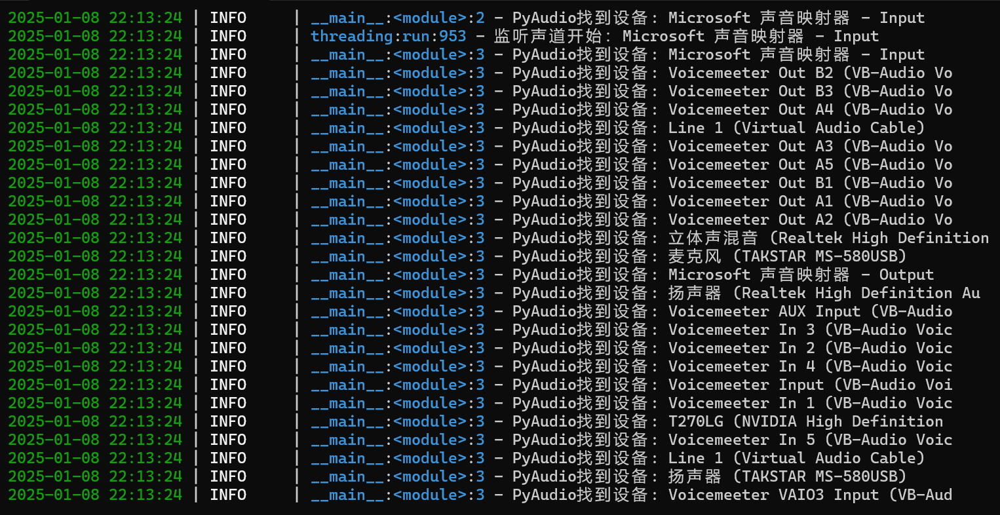

## 1. Launch Method
### 1. Download the package
Download Path: yinmei-all folder in [Netdisk](/link?id=Project Downloads)
Application Package: yinmei-desktop-plus.zip


### 2. Install CUDA
**Current Version:**
```cmd
NVIDIA: CUDA 12.4
Current Project: PyTorch 2.4.0+cu124
```
**Compatibility Note:** The current installed version only supports CUDA 12.4. If you have a 50 series graphics card and require a higher version of CUDA, please uninstall PyTorch and install it yourself.
CUDA Development Kit Download [Version 12.4]: https://developer.nvidia.com/cuda-12-4-1-download-archive
CUDA Historical Versions: https://developer.nvidia.com/cuda-toolkit-archive **Reinstall PyTorch:**
Please choose whether to install PyTorch using cu128, cu124, or cu126. For details, see [https://pytorch.org/get-started/locally/].
Open cmd in the project root directory and execute the following command:
```cmd
Uninstall
.\runtime\python.exe -m pip uninstall torch torchvision torchaudio

Install the corresponding CUDA 12.8
.\runtime\python.exe -m pip install torch torchvision torchaudio --index-url https://download.pytorch.org/whl/cu128
```

Driver version [NVIDIA driver]: nvidia-smi -l 1
CUDA program [cudatoolkit development package]: nvcc -V

### 3. Startup method
Starting Desktop Pet: Launch Desktop Pet.bat or yinmei-desktop-plus.exe
To view audio settings: Double-click "Query Audio Device.bat"

## 2. Desktop Pet Configuration
[Configure config.yml]
**Lip Sync:**live2D_audio_device parameter, defaults to output to speakers (Realtek High Definition, please configure it yourself)
**Microphone:**mic_audio_device parameter, defaults to output to Voicemeeter Out B3, please configure it yourself
**About Audio Configuration:**Double-click the query audio device.bat file to view the channel device list

**live2D Character Selection:**model_path parameter, change the character model path to "./Resources/v3/Hiyori/Hiyori.model3.json"
**Character Animation:**I've only configured the v2 version of Epsilon and the v3 version of Hiyori. Other characters haven't yet been configured with animations and expressions. Feel free to configure them yourself. For reference, add the name parameter for Epsilon and Hiyori. Note capitalization.

## 3. Voice Conversation
Enable the voice button: Voice relies on the funasr speech recognition system.
[3.png](../images/yinmei-desktop-plus/3.png)
**Requires the funasr server to be installed**
**Server:**
Requires configuration based on [Alibaba funasr](https://github.com/alibaba-damo-academy/FunASR/). Installing a container is recommended.
Refer to the [Server Deployment Documentation](https://github.com/alibaba-damo-academy/FunASR/blob/main/runtime/docs/SDK_advanced_guide_online_zh.md):
```Dockerfile
docker run -p 10095:10095 --name funasr -it --privileged=true -v /j/ai/ai-code/funasr/models:/workspace/models registry.cn-hangzhou.aliyuncs.com/funasr_repo/funasr:funasr-runtime-sdk-online-cpu-0.1.12
```

**Start the FunASR service: **
[Requires execution inside the funasr container]
Enter the container and execute the following command:
```bash
cd FunASR/runtime
nohup bash run_server_2pass.sh \
--download-model-dir /workspace/models \
--vad-dir damo/speech_fsmn_vad_zh-cn-16k-common-onnx \
--model-dir damo/speech_paraformer-large-vad-punc_asr_nat-zh-cn-16k-common-vocab8404-onnx \
--online-model-dir damo/speech_paraformer-large_asr_nat-zh-cn-16k-common-vocab8404-online-onnx \
--punc-dir damo/punc_ct-transformer_zh-cn-common-vad_realtime-vocab272727-onnx \
--lm-dir damo/speech_ngram_lm_zh-cn-ai-wesp-fst \
--itn-dir thuduj12/fst_itn_zh \
--certfile 0 \
--hotword /workspace/models/hotwords.txt > log.txt 2>&1 &

# If you want to disable SSL, add the parameter: --certfile 0
# If you want to deploy using a timestamp or NN hotword model, set --model-dir to the corresponding model:
# damo/speech_paraformer-large-vad-punc_asr_nat-zh-cn-16k-common-vocab8404-onnx (timestamp)
# damo/speech_paraformer-large-contextual_asr_nat-zh-cn-16k-common-vocab8404-onnx (nn hotwords)
# If you want to load hotwords on the server, please configure them in the host file ./funasr-runtime-resources/models/hotwords.txt (the Docker mapping address is /workspace/models/hotwords.txt):
# One hotword per line, format (hotword weight): Alibaba 20 (Note: There is no theoretical limit to the number of hotwords, but to balance performance and effectiveness, we recommend a hotword length of no more than 10, a number of no more than 1KB, and a weight of 1 to 100)
```

## 4. Channel Selection


## 5. Desktop Pet Expressions
### 1. Using Live2D V3
**Hiyori as an example:**
Configure the motions and expressions in the character Hiyori.model3.json
1. Motions:
Node: FileReferences -> Motions -> TapBody
The motion name is defined in the Name parameter [note capitalization, N is capitalized]. The motion name is the name of the trigger character.
```json
{
"Name": "Agree",
"File": "motions/Hiyori_m02.motion3.json",
"FadeInTime": 0.5,
"FadeOutTime": 0.5,
"Sound": "",
"Text": ""
}
```

2. Expressions:
Node: FileReferences -> Expressions The action name is defined in the Name parameter [note capitalization, N is uppercase]. The emoticon name is the name of the triggered character.
```json
{
"Name": "Still",
"File": "expressions/Still.exp3.json"
}
```

When the emoticon name is "Put Down the Microphone," you can set the release emoticon.

When remove=true is enabled, removeName="Sing" will release the "Sing" emoticon.
```json
{
"Name": "Put Down the Microphone",
"File": "expressions/Put Down the Microphone.exp3.json",
"remove": true,
"removeName": "Sing"
}
```

### 2. V2 Live2D
**Epsilon Example:**
Configure the action + emoticon in the character Epsilon.model.json
1. Action:

Node: motions -> tap_body
The action name is defined in the name parameter [note capitalization, n is lowercase]. The action name is the name of the triggered character.
```json
{
"name": "Happy",
"file": "motions/Epsilon_m_04.mtn"
}
```

2. Expressions:

Node: expressions

The action name is defined in the name parameter [note uppercase and lowercase, n is lowercase]. The expression name is the name of the trigger character.
```json
{
"name": "Still",
"file": "expressions/Still.exp3.json"
}
```