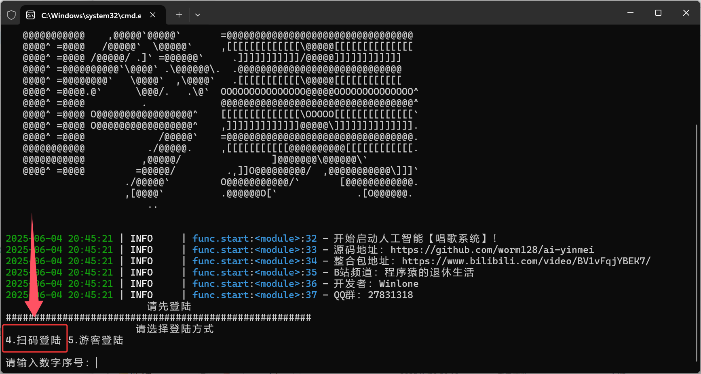
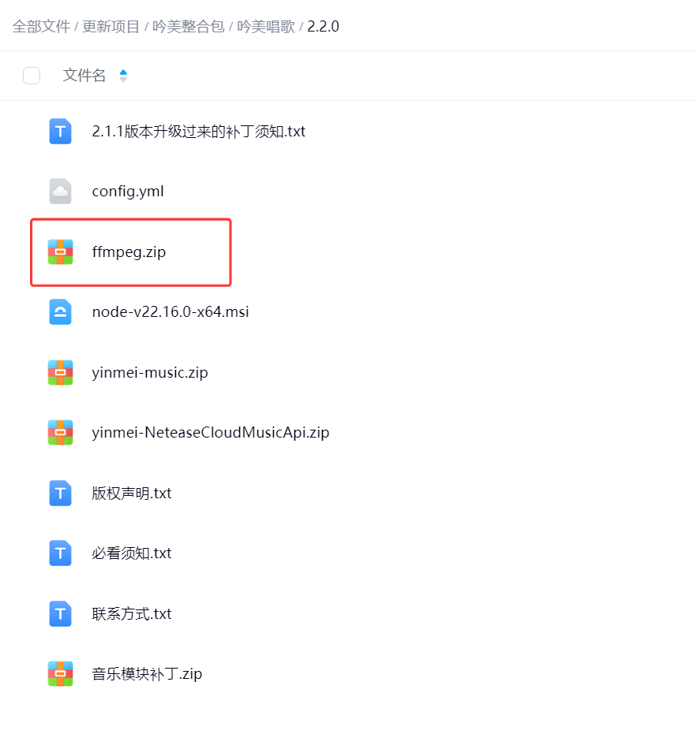
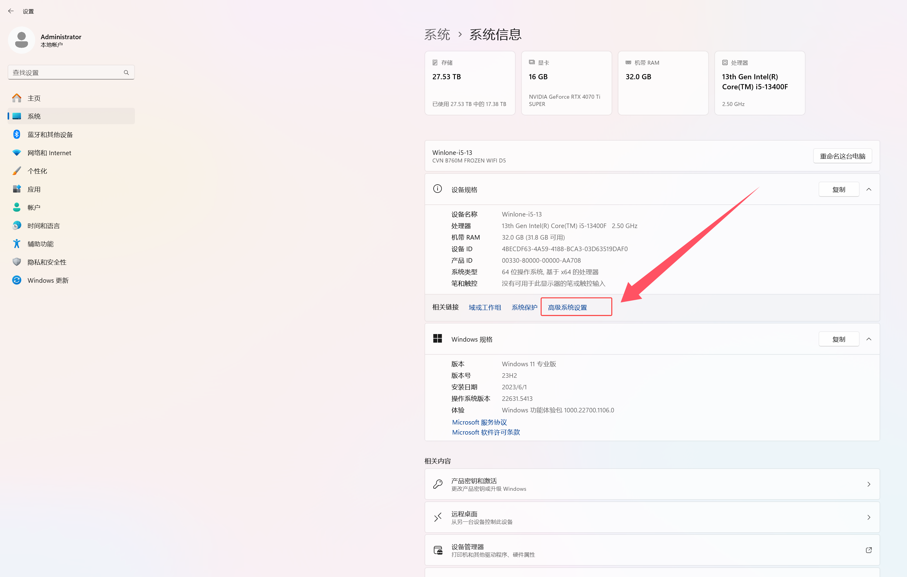
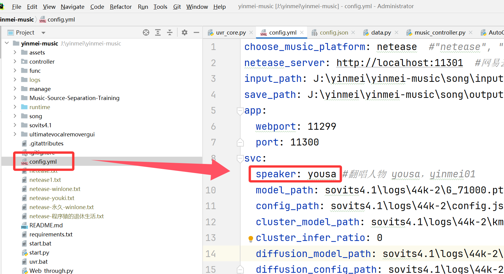

## 1. Getting Started
### 1. Download the package
Download Path: After logging into [Yinmei Live Room](http://live.bilibili.com/3033646), ask the programmer's retirement life [QQ: 314769095] to obtain it.

### 2. Installing CUDA
**Current Version:**
```cmd
NVIDIA: CUDA 12.4
Current Project: PyTorch 2.4.0+cu124
```
**Compatibility Note:** The current installed version only supports CUDA 12.4. If you have a 50 series graphics card and require a higher version of CUDA, please uninstall PyTorch and install it yourself.
CUDA Development Kit Download [Version 12.4]: https://developer.nvidia.com/cuda-12-4-1-download-archive
CUDA Historical Versions: https://developer.nvidia.com/cuda-toolkit-archive
**Reinstall PyTorch:** Please choose whether to install PyTorch using cu128, cu124, or cu126. For details, see [https://pytorch.org/get-started/locally/].
Open cmd in the project root directory and execute the following command:

Uninstall
.\runtime\python.exe -m pip uninstall torch torchvision torchaudio

Install the corresponding CUDA 12.8:
.\runtime\python.exe -m pip install torch torchvision torchaudio --index-url https://download.pytorch.org/whl/cu128

Driver version [NVIDIA driver]: nvidia-smi -l 1
CUDA program [cudatoolkit development package]: nvcc -V

### 3. yinmei-NeteaseCloudMusicApi
Purpose: NetEase Music channel
Requires Node.js to be installed:

Double-click to start "start.bat"


### 4. yinmei-music
Purpose: Yinmei singing
Double-click to launch "yinmei-music-api.exe" or "start.bat"
If you are not logged in to NetEase Music, you will be prompted to log in. Enter 4 to scan the QR code to log in.



## 2. Login Configuration
After scanning the QR code while singing, the QR/check callback interface may not retrieve the cookie. Please check your browser and copy the MUSIC_U and NMTID values to the netease.txt file in the root directory of the yinmei-music project.

netease.txt content format: The NMTID parameter is missing, so changing the machine key is unavailable.
```json
{"MUSIC_U": "xxx", "NMTID": "xxxxx"}
```
Scan the QR code to log in: http://localhost:11301/login/qrlogin.html

Scan the QR code and log in successfully. A netease.txt file will be generated in the yinmei-music project root directory.

## 3. Song Directory
input_path: H:\yinmei-music\input #Original song download path
save_path: H:\yinmei-music\output #Song cover output path

## 4. FFmpeg Decoder Configuration
Note: Without the FFmpeg decoder, MP3 audio files will not be recognized.
Download Method:
[Official Download](https://ffmpeg.org/download.html#build-windows)
Download from Singer Cloud Drive:

Add FFmpeg to the environment variables:

 Check if FFmpeg is working:
```cmd
ffmpeg -version
```

## 5. Switching the Singing Model
You must have a corresponding character name in your trained model.


Then, in the project root directory, configure the singing character name for it to take effect.
