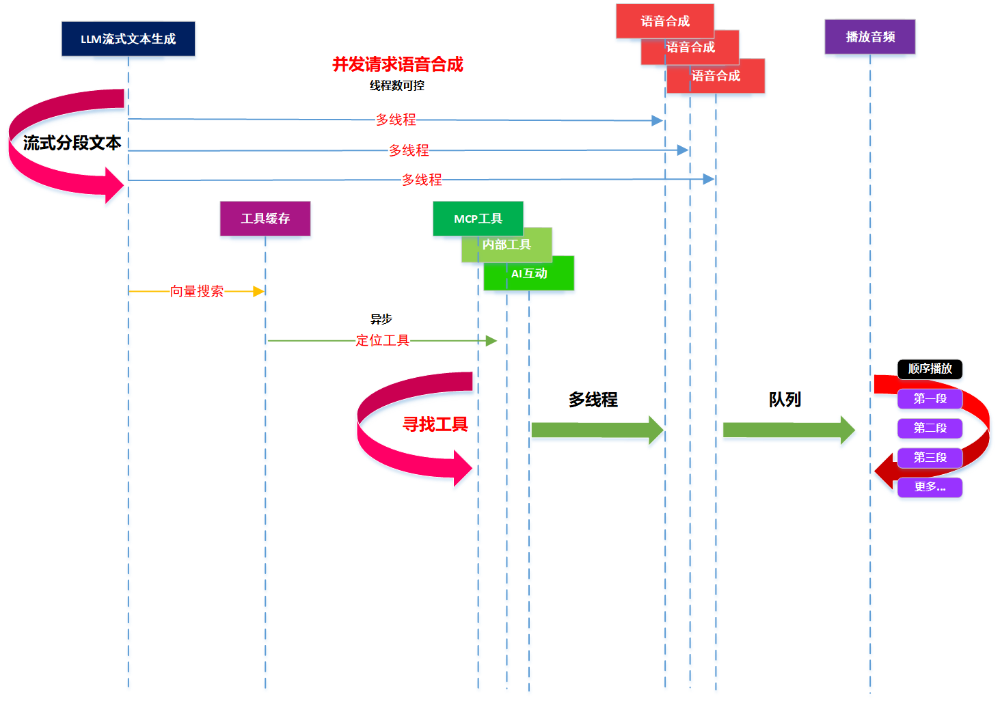
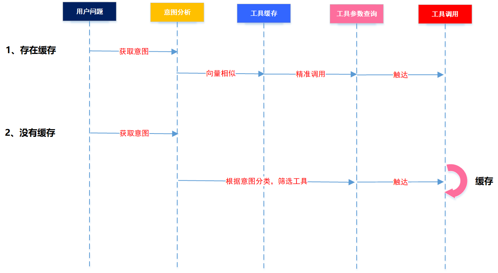
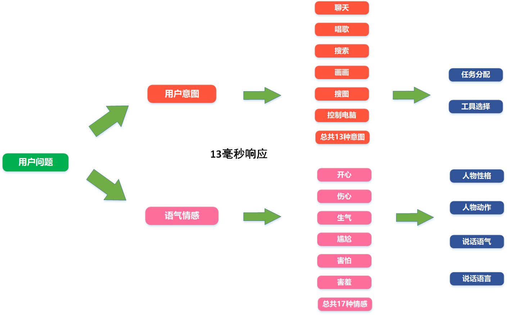
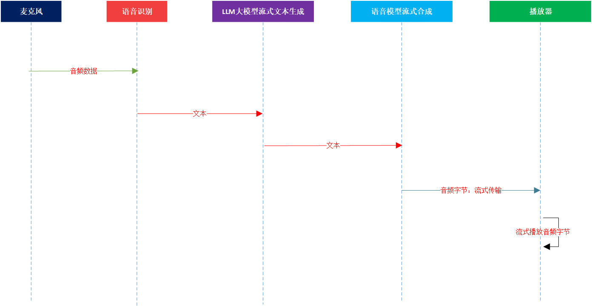

## AI吟美资料
- **AI名称：** 吟美
- **开发者：** Winlone
- **B站频道：**程序猿的退休生活 [点击进入](https://space.bilibili.com/46130941)
- **直播间：** [点击进入](http://live.bilibili.com/3033646)
- **Ai吟美教程汇集：** [点击进入](https://www.bilibili.com/opus/1015233825290059779)
- **技术Q群：** 27831318
- **粉丝福利群：** 264534845
- **版本：** 2.4.0
- **视频演示：** [点击观看](https://www.bilibili.com/video/BV17mfZBkEMR)
- **开源地址：** [下载](https://github.com/worm128/AI-YinMei)

## 项目下载
- **吟美整合包下载地址：**  
百度网盘群：请在“百度网盘->消息” 添加群号   
百度网盘群号1：930109408（满）  
百度网盘群号2：939447713（满）   
百度网盘群号3：945900295（满）   
百度网盘群号4：969208563  
百度网盘群号5：975062976  
百度网盘群号6：975962307  
- **夸克：**   
夸克群1：1231405830   
夸克群2：428937868   
- **吟美核心【版本迭代】：**  
下载路径：人工智能 -> 吟美核心  
压缩包：AI-YinMei-v2.4.0.zip  
- **功能整合包下载：**  
下载路径：人工智能 -> yinmei-all  
压缩包：吟美桌宠2.0-yinmei-desktop-plus.zip、cosyvoice2语音合成：yinmei-cosyvoice、GPT-SoVITS语音合成：GPT-SoVITS-v2pro-yinmei.zip、bert-vits2语音合成：yinmei-Bert-VITS2-ui.zip、大模型工具：mcp.zip、鉴黄：public-NSFW-y-distinguish.zip、绘画：stable-diffusion-webui.zip、人物：VTube Studio人物Live2D软件.zip  

## 整合包内容
路径：人工智能->吟美核心，选择一个版本核心下载，一般是最新版本  

路径：人工智能->yinmei-all  

## 功能概览
- **聚合弹幕：** 聚合直播弹幕，支持B站开发平台、napcat[QQ机器人]、barragefly[抖音、虎牙、快手、斗鱼]、微信直播、桌宠、后台聊天对话等9大来源渠道弹幕聚合显示。
- **意图分析：** 10毫秒响应速度的意图分析，可以自主训练语料增加意图分类，当前为多头注意力机制，可以同时分析出意图分类+情感分类。
- **大模型工具：** 支持MCP工具、支持自己编写代码工具，工具包含：摄像头观察、定时巡视、视觉能力、搜图、打招呼操作、维基百科、TMDB电影评分网、浏览器操纵、计算器、查询用户积分、高级搜索、思维链、商品信息查询、股票工具、时区转换、随机数、烹饪指南、更换人物服装、人物移动和旋转、视频查找和播放、说话语音合成开关、说话速度调节、AI视频、AI唱歌、AI绘画、搜索工具等27个工具
- **抽奖：** 抽奖分为自主抽奖和主播抽奖，自主抽奖是用户自行输入“抽奖”弹幕进行实时抽奖，主播抽奖是主播控场情况下点击抽奖按钮对直播间所有在线用户进行抽奖。有抽奖礼品列表、抽奖记录等功能。
- **长期记忆：** 根据时间代词智能唤醒不同时间范围记忆。智能有选择性唤醒记忆，不会每次都唤醒记忆影响主流程速度。可以设置数量、相似度等。
- **短期记忆：** 记录在mongodb数据库的大模型上下文记忆，所有聊天记录是全量持久化。
- **积分：** 每个用户的聊天、点赞、送礼、注册都会增加积分。唱歌、画画、视频播放、切歌、抽奖会扣除积分。有积分配置方案
- **扩散思维：** 使用图关系数据库neo4j进行词语的关系构建，可以把q群数据导出进行思维关系训练，分析好的图谱会在neo4j展示。
- **聊天：** 支持所有openai规范的云服务厂商和本地服务，LLM大模型支持率100%覆盖完毕。LLM已做流式，高性能对话。
- **语音：** 支持cosyvoice2、bert-vits2、gpt-sovits全系列、edge-tts，其中openai规范TTS支持市面上80%的TTS云厂商。cosyvoice2是本人魔改微调过语气和情感，做了vllm加速，比市面语音合成要强，速度要快。语音已做流式，高性能TTS。
- **视觉：** 支持openai规范的数据模型，支持绝大部分云厂商的视觉模型
- **摄像头：** 支持多位摄像头监控分析
- **电脑控制：** 支持电脑根据屏幕分析进行自主控制键盘和鼠标
- **直播UI插件：** 支持18个辅助直播的UI插件
- **知识库：** 当前使用fastgpt知识库能力进行知识管理和加载
- **唱歌：** 可以翻唱任何语种的歌曲，学习一首歌时间大概在150秒~200秒左右，唱歌模型可以自主训练音色。
- **绘画：** 支持到civitai.com下载任意绘画模型进行绘制
- **搜图：** 使用百度搜索进行搜图
- **搜索：** 使用搜索聚合平台searxng进行搜索，里面包含了谷歌、bing、duckduckgo、wikipedia、startpage、brave等搜索引擎，需要魔法上网。
- **人物：** 支持自研的吟美桌宠和Vtube Studio【可到steam或者本产品的网盘下载】，其中吟美桌宠自带麦克风功能，有强大去噪能力、VAD能力和AEC能力，叠加声纹系统，实时对话不会误触。
- **表情：** 有表情方案可以控制人物表情，支持人物表情+声效+视频的播放，支持循环播放次数和随机播放，关键字触发表情。
- **视频：** 可以播放本地一个文件夹内任意视频，支持子文件夹存放视频。支持B站视频拉取播放。
- **NSFW：** 支持图片鉴黄，可以过滤弹幕非法字符，AI回复非法字符，绘图非法提示词
- **其他：** 支持闲时任务、支持进入房间欢迎词、支持智能安装docker服务、支持服务器监控、支持数据统计

## 指令说明
**1. 基础指令：**  
1.1 加入"\" 例如 "\我在直播间聊天"，这样ai不会对用户内容进行回复

**2. 唱歌功能：**  
2.1 输入“唱歌+歌曲名称”，吟美会根据你输入的歌曲名称进行学习唱歌。当然，你可以输入类似“吟美给我推荐一首最好听的动漫歌曲”这些开放性的话题，让吟美给你智能选择歌曲进行演唱。
2.2 切歌请输入“切歌”指令，会跳过当前歌曲，直接唱下一首歌曲
2.3 输入“停止学歌”，吟美会终止当前学歌进程，进入下一首歌曲学习

**3. 绘画功能：**  
3.1 输入“画画+图画标题”，吟美会根据你输入的绘画提示词进行实时绘画。
3.2 当然，你可以输入类似“吟美给我画一幅最丑的小龟蛋”这些开放性的话题，让吟美给你智能输出绘画提示词进行画画。

**4. 视频播放功能：**  
4.1 输入“视频+舞蹈名称”，舞蹈如下：
视频文件需要在本地配置
书记舞、科目三、女团舞、社会摇
呱呱舞、马保国、二次元、涩涩
蔡徐坤、江南 style、Chipi、吟美
直接输入“视频”两个字是随机跳舞
4.2 停止跳舞请输入“停止视频”

**5. 表情功能：**  
输入“表情+名称”, “表情+随机” 是随机表情，表情自己猜，例如，“哭、笑、吐舌头”之类

**6. 场景切换功能：**  
6.1 输入“切换+场景名称”： 粉色房间、神社、海岸花坊、花房、清晨房间
6.2 系统智能判定时间进行早晚场景切换

**7. 换装功能：**  
输入“换装+衣服名称”：便衣、爱的翅膀、青春猫娘、眼镜猫娘

**8. 搜图功能：**  
输入“搜图+关键字”

**9. 搜索资讯功能：**  
输入“搜索+关键字”

## 技术架构

