## 一、启动方式：
**yinmei-analysis：**  
双击启动“yinmei-analysis-api.exe”或者“start.bat”  

## 二、扩散思维
### 1、安装neo4j图数据库
要基于window系统安装的docker系统进行安装  
```json
docker run -d --name=yinmei-neo4j --publish=7474:7474 --publish=7687:7687 `
-v /j/ai/ai-code/yinmei-neo4j/data:/data -v /j/ai/ai-code/yinmei-neo4j/logs:/logs `
-v /j/ai/ai-code/yinmei-neo4j/import:/var/lib/neo4j/import -v /j/ai/ai-code/yinmei-neo4j/plugins:/plugins `
-v /j/ai/ai-code/yinmei-neo4j/metrics:/metrics -v /j/ai/ai-code/yinmei-neo4j/conf:/var/lib/neo4j/conf `
neo4j
```
7687端口：是外部链接数据库的端口  
7474端口：用于提供基于Web的图形用户界面（Browser Interface），即 Neo4j Browser  
/data：数据库目录，路径要改成自己的物理路径：“/j/ai/ai-code/yinmei-neo4j/data”  
/import：数据导入导出目录，路径要改成自己的物理路径：“/j/ai/ai-code/yinmei-neo4j/import”  
/plugins：插件目录，路径要改成自己的物理路径：“/j/ai/ai-code/yinmei-neo4j/plugins”  
/conf：项目配置，路径要改成自己的物理路径：“/j/ai/ai-code/yinmei-neo4j/conf”  
容器启动后  
  
后台登录：  
地址：http://localhost:7474/browser/  
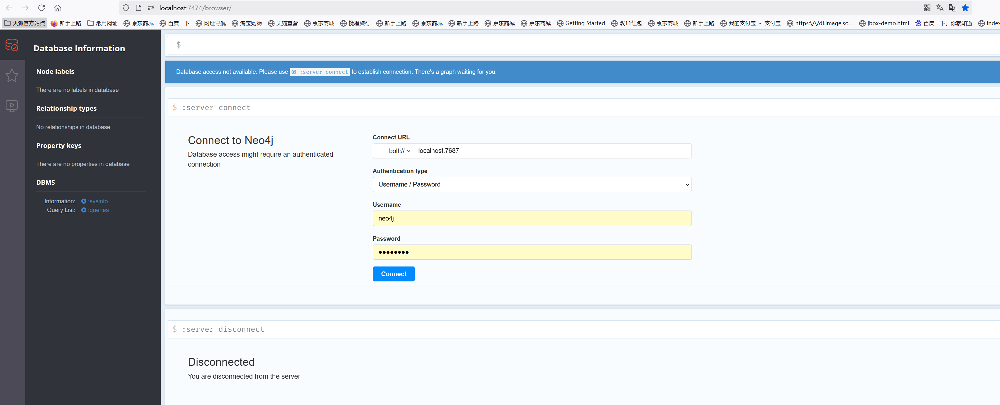  
数据库名称默认是neo4j，当然可以自定义，这里不推荐乱操作  
  

### 2、吟美分析模块配置neo4j链接
#### 2.1 启动应用：yinmei-analysis
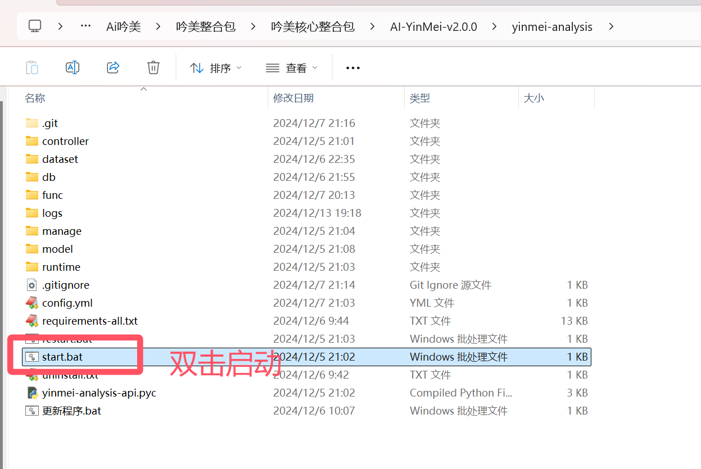  
地址：http://127.0.0.1:9001/  
  
#### 2.2 在吟美后台
  
neo4j地址：bolt://localhost:7687  #这里注意bolt是二进制协议，这个性能最好，推荐  
neo4j数据库名称：neo4j  
用户名和密码：默认账号neo4j，密码neo4j  

### 3、词库导入
#### 3.1 语料准备
旧版qq下载地址：https://im.qq.com/pcqq/index.shtml  
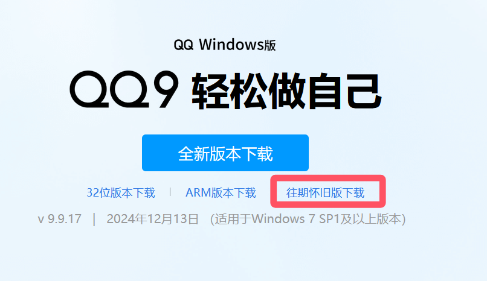  
语料导出  
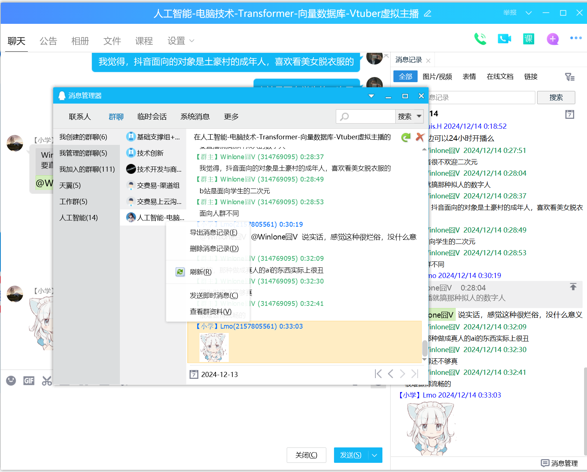  

#### 3.2 语料清洗
清洗QQ数据集：  
使用软件Notepad++  
  
打开所有需要清洗的txt文件  
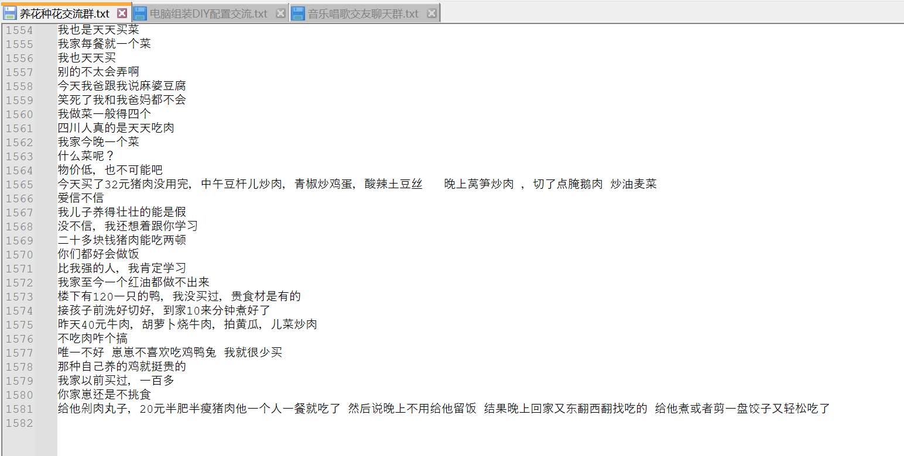  
点击查找替换，进行替换  
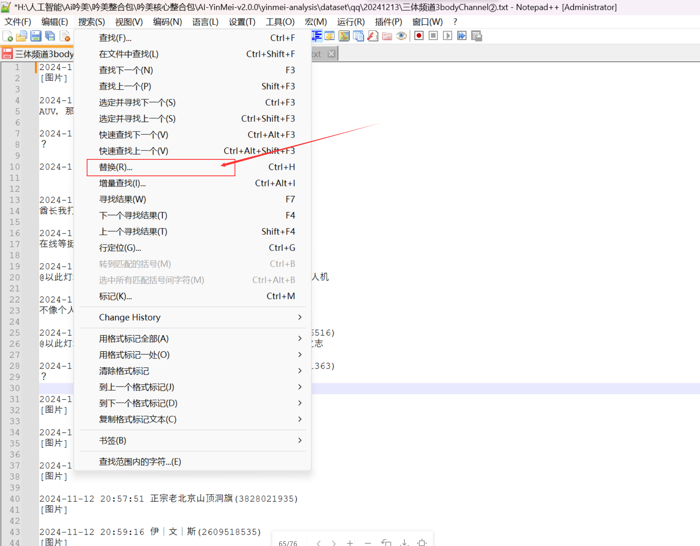  
这样选择对应目标来替换所有打开的txt文件  
  

**正则清洗：**  
```regexp
^2024-.*$
^2025-.*$
\[.+\]
\[表情\]
\[图片\]
\[\]   //替换无用的[]
^[?|.|。|？|,|，|…|！|!|@]+\s*$    //替换一行里面只有标点符号
^.*暂不支持该消息类型，请用手机QQ查看.*$
^.*新版手机QQ.*$
^.*已经是群成员.*$
^.*QQ版本低需升级.*$
^.*加入本群.*$
^.*撤回了一条.*$
^.*欢迎.*加入.*本群$
^早$
@(\S)+\s    //匹配@用户名，使用notepad
@(\S.* )+   //补充替换用户名，慎用，可能会匹配到后面的中文，使用notepad
^[0-9]$   //单行数字
.*核.*元/.年    //阿里云广告
^\n\r   //换行替换为空
^\n   //换行替换为空   
^\r  //回车替换为空
http[s]?://(?:[a-zA-Z]|[0-9]|[$-_@.&+]|[!*(),]|(?:%[0-9a-fA-F][0-9a-fA-F]))+   //识别url连接，使用notepad
```

全部文件进行保存  
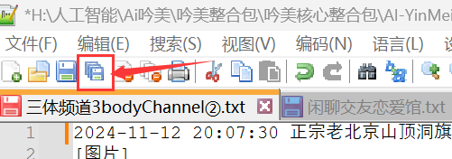  

#### 3.3 配置大模型
走的是OpenAi规范的接口，我这里示例走的是本地one api接口  
令牌：  
  
服务地址：http://192.168.2.58:9997/v1/   #这个是你one api的部署地址的接口，通常修改你的ip和端口就行，openai规范后面都是带v1路径  
模型名称：Qwen2.5-14B-Instruct-GPTQ-Int8  

#### 3.4 把以上参数配置进去大模型：
  

#### 3.5 打开关系图库：
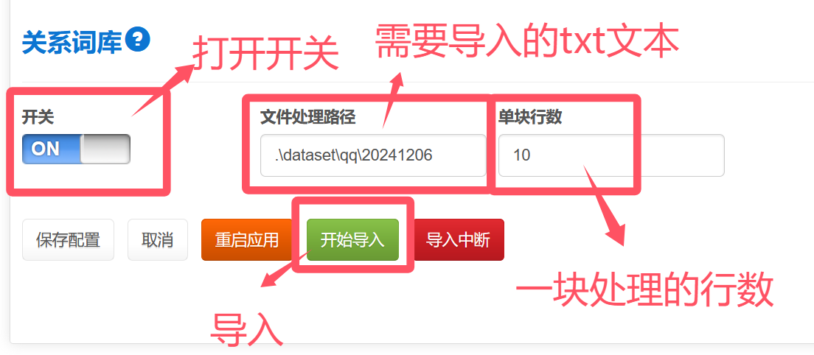  

**文件处理路径：**  
可以放入多个文件，支持全量文件一起按顺序执行  
  

**单块行数：**  
设置为10，表示10块一块文本进行LLM的关系词汇抽取  
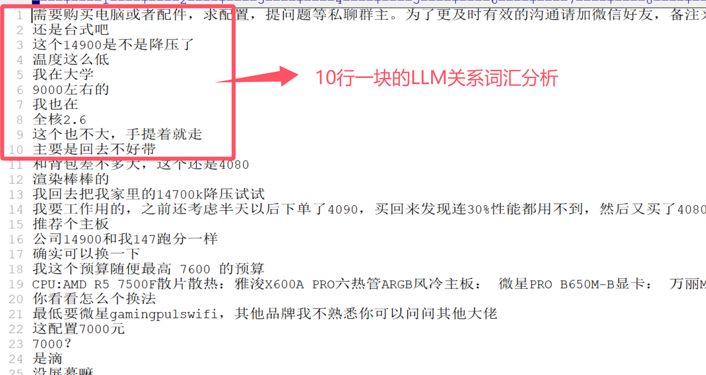  

**然后点击导入按钮：**    
  
  

**可以中断导入：**  
  
  

### 4、词库查询
吟美核心配置关联关系词库  
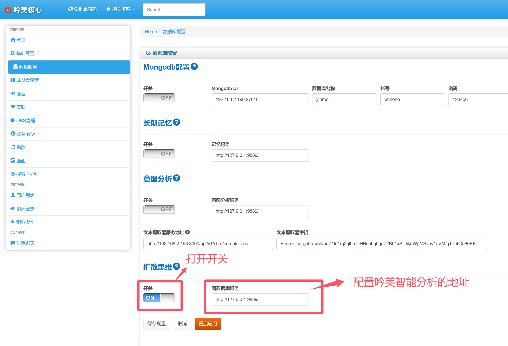  
用户聊天问有什么笑话的时候，吟美抽取词库得到“地狱笑话”的语料  
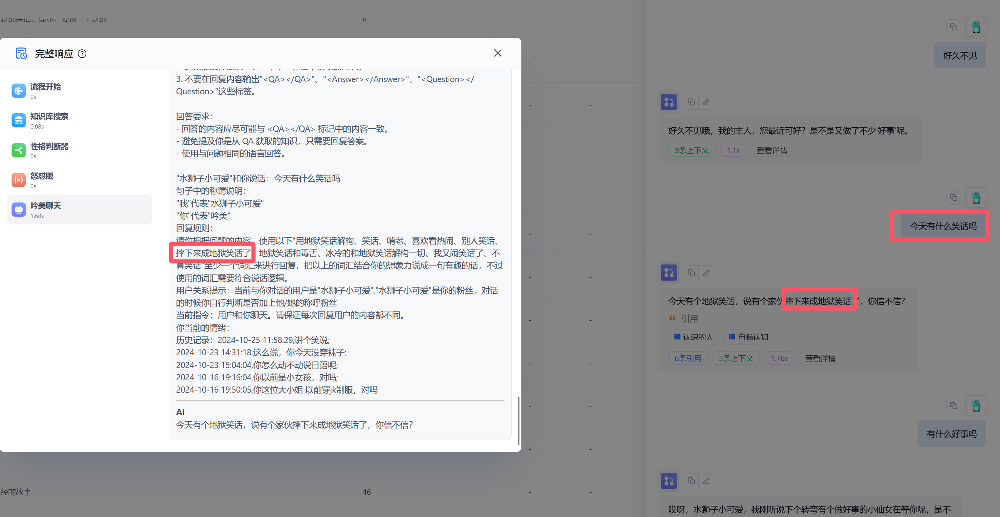  

### 5、neo4j命令语法
查询25行数据  
```sql
MATCH (n) RETURN n LIMIT 25
```

模糊搜索节点  
```sql
MATCH (a)-[r]->(b)
WHERE a.name =~ '.*年.*'
RETURN r,startNode(r) AS start_node, endNode(r) AS end_node
```
```sql
MATCH (a)-[r]->(b)
WHERE a.name =~ '.*来.*' or b.name =~ '.*来.*'
RETURN r,startNode(r) AS start_node, endNode(r) AS end_node
```

删除所有数据  
```sql
MATCH (n)
DETACH DELETE n
```