## 快速启动
**下载包：**  
下载路径：在"吟美核心"文件夹  
应用包：AI-YinMei-v2.2.0.zip  
**启动方式：**
双击启动“start.bat"或者"yinmei-core-api.exe"  


> 启动成功：管理后台地址

  
**访问地址：** http://127.0.0.1:9000  

## 快速配置
> 配置好以下两个配置，就可以马上进行聊天了  

1、[配置聊天](#_2、通用Ai聊天)  
2、[配置语音](#二、语音合成)  
3、[进行对话](#_23-聊天对话)  

## 吟美秘钥
### 1、获取秘钥
此商品包含吟美核心+吟美分析模块秘钥，吟美秘钥获取方式【以下秘钥有效期均为1个月】  
方式一、[购买月卡](https://mall.bilibili.com/neul-next/detailuniversal/detail.html?isMerchant=1&page=detailuniversal_detail&saleType=10&itemsId=12738795&loadingShow=1&noTitleBar=1&msource=merchant_share) | [购买年卡](https://mall.bilibili.com/neul-next/detailuniversal/detail.html?isMerchant=1&page=detailuniversal_detail&saleType=10&itemsId=12988851&loadingShow=1&noTitleBar=1&msource=merchant_share)    
方式二、在吟美直播间进行抽奖获取，每当吟美直播时候，输入“抽奖”即可以参与秘钥抽奖，每次抽奖需要消耗500积分，送礼物0.1元【1电池】可以获取100积分，点赞聊天都可以获取1点积分  
遇到秘钥不能用的提示，请进行秘钥购买或者直播间秘钥抽奖。【秘钥抽奖概率：8%，大概12次抽中1次，12次费用大概6元，如果你不想花费时间抽奖，请直接购买吟美秘钥】    
  
注意：购买本商品链接后，请联系 B站：程序猿的退休生活或者QQ：314769095 获取秘钥，需要提供你在首页的机器码进行秘钥生成  
  

### 2、配置秘钥
在每个项目的根目录的config.yml配置文件，找到在最后的valid_val值，替换即可。  
  
也可以在项目后台界面的首页替换秘钥  
  


## 付费插件
### 1、聊天+情感提示效果
聊天+情感提示效果：[下载](https://mall.bilibili.com/neul-next/detailuniversal/detail.html?isMerchant=1&page=detailuniversal_detail&saleType=10&itemsId=12476099&loadingShow=1&noTitleBar=1&msource=merchant_share)  
  
OBS配置两个浏览器插件decision.html和emotion.html  
  

### 2、AI吟美2.2.0语气参考音频
语气参考音频：[下载](https://mall.bilibili.com/neul-next/detailuniversal/detail.html?isMerchant=1&page=detailuniversal_detail&saleType=10&itemsId=12444567&loadingShow=1&noTitleBar=1&msource=merchant_share)  
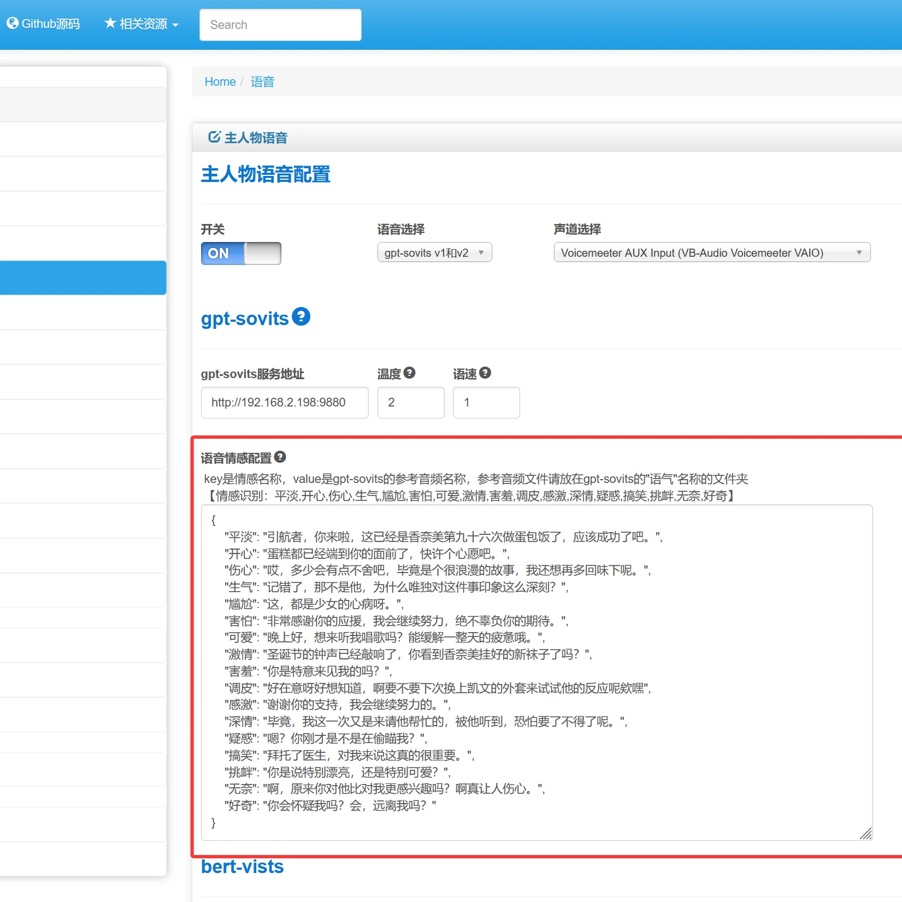  
  
  
默认参考音频配置：  
```json
{
    "平淡": "引航者，你来啦，这已经是香奈美第九十六次做蛋包饭了，应该成功了吧。",
    "开心": "蛋糕都已经端到你的面前了，快许个心愿吧。",
    "伤心": "哎，多少会有点不舍吧，毕竟是个很浪漫的故事，我还想再多回味下呢。",
    "生气": "记错了，那不是他，为什么唯独对这件事印象这么深刻？",
    "尴尬": "这，都是少女的心病呀。",
    "害怕": "非常感谢你的应援，我会继续努力，绝不辜负你的期待。",
    "可爱": "晚上好，想来听我唱歌吗？能缓解一整天的疲惫哦。",
    "激情": "圣诞节的钟声已经敲响了，你看到香奈美挂好的新袜子了吗？",
    "害羞": "你是特意来见我的吗？",
    "调皮": "好在意呀好想知道，啊要不要下次换上凯文的外套来试试他的反应呢欸嘿",
    "感激": "谢谢你的支持，我会继续努力的。",
    "深情": "毕竟，我这一次又是来请他帮忙的，被他听到，恐怕要了不得了呢。",
    "疑惑": "嗯？你刚才是不是在偷瞄我？",
    "搞笑": "拜托了医生，对我来说这真的很重要。",
    "挑衅": "你是说特别漂亮，还是特别可爱？",
    "无奈": "啊，原来你对他比对我更感兴趣吗？啊真让人伤心。",
    "好奇": "你会怀疑我吗？会，远离我吗？"
}
```

### 3、聊天回复框
新款-聊天回复框：[下载](https://mall.bilibili.com/neul-next/detailuniversal/detail.html?isMerchant=1&page=detailuniversal_detail&saleType=10&itemsId=12476544&loadingShow=1&noTitleBar=1&msource=merchant_share)  
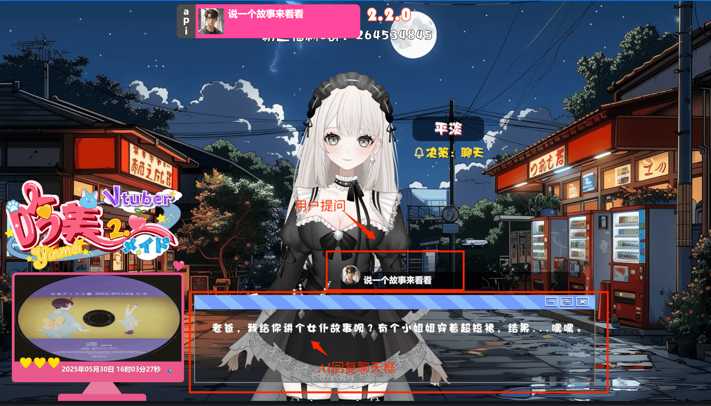  


### 4、吟美爆粗和温柔提示词
吟美爆粗和温柔如何设置：[下载](https://mall.bilibili.com/neul-next/detailuniversal/detail.html?isMerchant=1&page=detailuniversal_detail&saleType=10&itemsId=12477860&loadingShow=1&noTitleBar=1&msource=merchant_share)  
  

## 一、聊天配置
### 1、Ai名称
> 启动吟美核心AI-YinMei-v2.0.0的start.bat，首先要给你的Ai起个名称，然后在对话里面，你问她名字，她会称呼自己是这个名字


!> 记得点击"保存配置"按钮，然后点击"刷新配置"按钮才会生效。

  
<br>

### 2、通用Ai聊天
#### 2.1 类型选择
> 在LLM大模型，可以选择通用聊天，此功能适配所有OpenAi规范的接口


**服务地址：**  
以阿里百炼为例：https://help.aliyun.com/zh/model-studio/developer-reference/use-qwen-by-calling-api


**密钥：**  
以阿里百炼为例：https://bailian.console.aliyun.com/?apiKey=1#/api-key

  

**模型名称：**  
看文本生成的模型【阿里百炼为例】：  
https://help.aliyun.com/zh/model-studio/getting-started/models  

**LLM配置参数：**  
  

**历史记录：**  
Ai聊天的上下文长度，通常一问一答为1个历史记录  

**max_tokens integer （可选）**  
允许模型生成的最大Token数。  
默认值和最大值都是模型的最大输出长度。关于各模型的最大输出长度，请参见模型列表。  
max_tokens参数适用于需要限制字数（如生成摘要、关键词）、控制成本或减少响应时间的场景。  

**top_p float （可选）**  
核采样的概率阈值，用于控制模型生成文本的多样性。  
top_p越高，生成的文本更多样。反之，生成的文本更确定。  
取值范围：（0,1.0]  
由于temperature与top_p均可以控制生成文本的多样性，因此建议您只设置其中一个值。  

**temperature float （可选）**  
采样温度，用于控制模型生成文本的多样性。  
temperature越高，生成的文本更多样，反之，生成的文本更确定。  
取值范围： [0, 2)  
<br>

#### 2.2 支持的平台
> 看到支持OpenAi规范接口的平台，包括云平台的阿里百炼、智谱清言，还有本地服务 OneApi、Xinference等接口  

##### 1、阿里百炼：  
阿里百炼包含的102个文本生成模型,[查看模型列表](https://bailian.console.aliyun.com/?spm=5176.29619931.J_SEsSjsNv72yRuRFS2VknO.2.74cd405fRO0JGF&tab=doc#/doc/?type=model&url=2840914)    
https://www.aliyun.com/product/bailian
  

##### 2、智谱的模型：  
GLM4、GLM4.5、GLM4.6等模型,[查看模型列表](https://open.bigmodel.cn/pricing)    
https://open.bigmodel.cn/ 
  


##### 3、本地服务 
**本地OneApi**  
项目地址：https://github.com/songquanpeng/one-api  
OneApi中转场跳板对接：本地或者云服务  
接口：http://IP:13000/v1/chat/completions  
容器安装：  
```dockerfile
docker run --name one-api -d --restart always -p 13000:3000 -e TZ=Asia/Shanghai -v /j/ai/ai-code/one-api:/data justsong/one-api
```
<br>

**本地Xinference**  
接口：http://IP:9997/v1/chat/completions  
容器安装：  
```dockerfile
docker run --name xinference -d --restart always -p 9997:9997 -e XINFERENCE_HOME=/data -v /j/ai/ai-code/xinference/:/data --shm-size 20g --gpus all xprobe/xinference:v0.12.3 xinference-local -H 0.0.0.0
```
```dockerfile
docker run --name xinference121 -d -p 9998:9997 -e XINFERENCE_HOME=/data -v /D/docker/xinference121:/data --shm-size 20g --gpus all xprobe/xinference:v1.2.1 xinference-local -H 0.0.0.0
```
<br>

**本地ollama**  
接口：http://IP:9997/v1/chat/completions  
容器安装：  
```dockerfile
docker run -d -v ollama:/root/.ollama -p 11434:11434 --name ollama ollama/ollama
```
<br>

##### 4、更多云服务：  
【智谱清言】  
https://open.bigmodel.cn/  
测试秘钥：Bearer xxx  
请求接口：https://open.bigmodel.cn/api/paas/v4/chat/completions  
模型：glm-4-flashx  
【阿里百炼】  
https://www.aliyun.com/product/bailian  
测试秘钥：Bearer xxx  
请求接口：https://dashscope.aliyuncs.com/compatible-mode/v1/chat/completions  
模型：qwen2.5-72b-instruct  
模型列表：https://help.aliyun.com/zh/model-studio/getting-started/models?spm=a2c4g.11186623.help-menu-2400256.d_0_2.5a06b0a8eYXY9K  
【腾讯混元】  
https://console.cloud.tencent.com  
请求接口：https://api.hunyuan.cloud.tencent.com/v1/chat/completions  
openai 秘钥：Bearer xxx  
模型：hunyuan-turbo  
【火山引擎】  
https://www.volcengine.com/
【百度云】  
https://cloud.baidu.com/  
请求接口：https://qianfan.baidubce.com/v2/chat/completions  
openai 秘钥：Bearer xxx  
模型列表：https://cloud.baidu.com/doc/WENXINWORKSHOP/s/Fm2vrveyu  
【deepseek】  
https://platform.deepseek.com/  
【硅基流动】  
https://www.siliconflow.cn/  


#### 2.3 万能扩展参数
##### 1、搜索参数  
在不同的LLM模型平台开启搜索能力，以阿里百炼、智谱清言为例  
在吟美核心的【接口请求参数扩展】加入搜索配置  
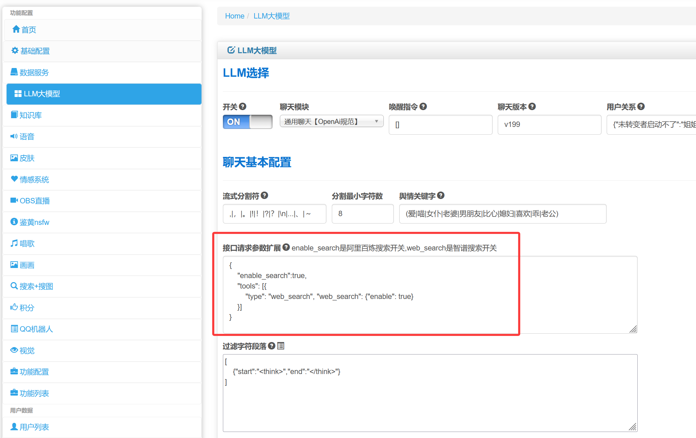  
```json
{
    "enable_search":true,
    "tools": [{
        "type": "web_search", "web_search": {"enable": true}
    }]
}
```

**阿里百炼搜索：**  
https://bailian.console.aliyun.com/?accounttraceid=ce194831be774d6a91188482feb46b54xrie#/model-market/detail/qwen-plus-latest  
  

**glm搜索：**  
https://www.bigmodel.cn/dev/howuse/websearch  
  
<br>

##### 2、深度思考  
**智谱清言：**  
文档：https://docs.bigmodel.cn/cn/guide/start/concept-param#thinking  
```json
{
    "thinking": {
          "type": "disabled"
    }
}
```

#### 2.4 聊天对话
  

### 3、Fastgpt配置
#### 3.1 注册账号
**国际版：**https://tryfastgpt.ai/  
**国内版：**https://fastgpt.cn/  
以上两个链接均可以使用，国际和国内账户不互通，新注册用户有100积分免费使用  
以下是我推广链接，拜托可以使用我链接注册一个，让我赚取一下积分  
**推广链接：**https://cloud.fastgpt.in/?hiId=66a6e08d37c6b5e286e375e7  

#### 3.2 导入fastgpt工作流  
下载网盘的fastgpt工作流配置  
  

新建一个空白工作流  
 

起个名称，选择空白工作流  
 

左上角导入配置：  
 

上传文件  
 

选择配置  
 

导入工作流成功：  
 

知识库需要重新选择：导入配置的知识库默认缺失，需要你重新选择你自己的知识库  
 

手动选择，选择一个自己的知识库  
 

选择知识库 
 

选择后的界面  


如果没有知识库引用，可以自行删除这个知识库配置  
删除后，流程线条会丢失，<font color="red">记得手动把线条链接好</font>  
 

这里吟美包含了两个性格，可以参考我的格式，自行填写自己的性格特征  
 

右侧模型是基本设定  
1、选择自己的聊天模型   2、人物通用的设定都在这里配置  3、历史记录：这就是Ai的短期记忆，一般3~6比较适合  
 

#### 3.3 新建fastgpt云服务地址和秘钥  
选择发布渠道，API访问，新建一个秘钥  
 

填写一个名称  
 

保管好自己的秘钥  
 

把秘钥回填到吟美核心  
密码：fastgpt-t21ZxdTJ2FxfRpXB3kbEwQRcDwffewaZR4kHBco66dutDyScSCAVJ  
记得秘钥靠头有一个Bearer，不能覆盖了，所以真实秘钥是：  
Bearer fastgpt-t21ZxdTJ2FxfRpXB3kbEwQRcDwffewaZR4kHBco66dutDyScSCAVJ  
 

fastgpt地址配置：  
云服务的api地址：https://api.fastgpt.in/api  
 

配置到吟美核心的地址：http://192.168.2.198:3000/api/v1/chat/completions  
注意：这里云服务是短的https://api.fastgpt.in/api，原则上只需要替换 域名+端口就可以，后面那些小尾巴不要少了“/v1/chat/completions”  
 

记得要保存配置  
 

## 二、语音合成
### 1、微软edge-tts配置
语音配置开关打开，选择语音是微软edge-tts，这个不需要额外部署项目，可以直接使用
  

### 2、cosyvoice2配置
<span style="color:red">注意：cosyvoice只支持2模型，1代我已经T掉</span>  
#### 2.1、下载软件
##### 1、Docker版本：  
**说明：** Docker版本支持vllm加速，是合成速度最快的版本  
**容器地址：** https://hub.docker.com/r/worm128/yinmei-cosyvoice  
**运行命令：**  
**镜像：**worm128/yinmei-cosyvoice:latest  
**Window docker cmd执行：**  
```cmd
docker run -d ^
  --name yinmei-cosyvoice ^
  --gpus all ^
  -p 50001:50001 ^
  -p 50000:50000 ^
  -e MODEL_DIR=pretrained_models/CosyVoice2-0.5B ^
  -e PORT=50001 ^
  -e WEBPORT=50000 ^
  -e LIMIT_COUNT=5 ^
  -e MODE=3 ^
  worm128/yinmei-cosyvoice:latest
```

##### 2、Window版本：  
**说明：** Window版本不支持vllm，我安装的是cuda12.6，其他版本cuda自己测试是否兼容  
**百度网盘：** [下载](https://pan.baidu.com/s/1z8W_iZFvstmL2AR9i_cx5Q?pwd=i4mp)&nbsp;&nbsp;&nbsp;提取码: i4mp  
**夸克：** [下载](https://pan.quark.cn/s/e19caa11c9d8)&nbsp;&nbsp;&nbsp;提取码：DejZ  

### 3、gpt-sovits配置
<span style="color:red">注意：gpt-sovits【支持全系列1~4、pro、pro plus】</span>  
#### 3.1、下载软件
- **如果你想语音更加生动，可以选择gpt-sovits的产品**  
- <font color="red" style="font-weight:bold">整合包我已经放在网盘，GPT-SoVITS-v2.zip是GPT-SoVITS的2.0版本：</font>  
**吟美整合包下载地址：**  
百度网盘群：请在“百度网盘->消息” 添加群号   
百度网盘群号1：930109408（满）  
百度网盘群号2：939447713（满）   
百度网盘群号3：945900295   
百度网盘群号4：969208563  
**夸克：**   
夸克群1：1231405830   
夸克群2：428937868  
  
**gpt-sovits pro plus最新包:**  
<font color="red">GPT-SoVITS-v2pro-yinmei下载: 请在"yinmei-all"下载"GPT-SoVITS-v2pro-yinmei"的压缩包，解压即可使用</font>  
  
  
Pro Plus语音模型已经内置，内置有十几个提供选择，自己参考“音频启动.txt”启动方式    
  


#### 3.2、语音配置
**配置语音：**  
  

温度和语速只对版本2.0生效  
  

打开GPT-SoVITS-v2，双击api.bat就可以启动  
  

#### 3.3、启动软件
**配置IP：**  
打开记事本编辑api.bat文件  
如果你语音是部署在局域网上其他机器，请配置那台机器的IP  
如果你的语音和吟美核心是同一台机器，则是默认配置127.0.0.1  
端口是默认9880，如果你有端口冲突，请配置其他端口  
  

**全量合成：双击api.bat启动软件：**  
**流式合成：双击api-stream.bat启动软件：**  
  

**启动成功界面：**  
启动成功会显示你当前配置好的ip地址  
  

#### 3.4、音频模型选择
**GPT-SOVITS2的音频模型下载：**  
https://pan.baidu.com/s/14WUDbWnBn7GPQYVREkWMug?pwd=1145  
**<font color="red">特别鸣谢：</font>**  
感谢B站“白菜工厂1145号员工”的GPT-SOVITS整合包分享和模型分享  
感谢B站“花儿不哭”的GPT-SOVITS的技术研发  
  

**模型的使用：**  
把CKPT后缀文件放在GPT_weights_v2，把pth后缀文件放在SoVITS_weights_v2  
  

**启动脚本：**  
-s参数：使用对应pth模型  
-g参数：使用对应ckpt模型  
-dr参数：参考音频文件路径  
-dt参数：参考音频文本内容  
-a "192.168.2.57"：记得改成自己的ip路径  
-p：这个是改端口的，如果有服务端口冲突，请修改这个  
```bash
chcp 65001
runtime\python.exe api.py -s "./SoVITS_weights_v2/虎克_e10_s320.pth" -g "./GPT_weights_v2/虎克-e10.ckpt" -dr "./参考音频/虎克/激动-鼹鼠党，出动！勇敢鼹鼠向前冲！.wav"  -dt "激动-鼹鼠党，出动！勇敢鼹鼠向前冲！" -cp ",.，。!！?？" -dl "auto" -d cuda -a "192.168.2.57" -p 9881 -fp
pause
```

#### 3.5、助手音频配置
这里触发助手说话的音频，你可以和上面配置的一样，也可以在多开一个不同发音的gpt-sovits服务出来  
助手的语音：然后我们在唱歌回复、绘画回复、跳舞回复、进入房间欢迎词、积分播报等一些说话上，引用这个助手语音  
助手需要启动多一个gpt-sovits服务，音频端口和主人物端口分开即可，然后服务IP和端口配置这个新音频地址  
  

### 4、语音声道
#### 4.1、直接输出扬声器
语音新增声道选择，默认输出到 扬声器，这里会被【桌宠的live2D_audio_device参数】音频捕获或者【VTS设置口型】音频捕获，从而实现口型匹配  
  
#### 4.2、输出虚拟通道B2
如果你在吟美核心配置语音主人物的输出通道是Voicemeeter的B2虚拟通道  
  
#### 4.3、虚拟通道分配逻辑
主人物对应虚拟通道2、助手对应虚拟通道3，分开通道互不影响不同人物的口型      
  
#### 4.4、虚拟通道需要监听声音
声道如果选择扬声器，可以直接在你的音箱听到声音，如果输出的是Voicemeeter的虚拟通道则不能听到声音，则需要如下配置才能在扬声器监听到虚拟通道的声音  
  


### 5、情感语气
#### 5.1、语气配置方案  
配置参考音频，一个情感名称对应一个参考音频文件名  
  
> 例如： "开心": "蛋糕都已经端到你的面前了，快许个心愿吧。"  

遇到"开心"情感，则使用参考音频"蛋糕都已经端到你的面前了，快许个心愿吧。.WAV"  
<br>

#### 5.2、参考音频配置
需要在gpt-sovits的"语气"文件夹加入音频文件"蛋糕都已经端到你的面前了，快许个心愿吧。.WAV"  
需要参考音频，请在这里下载：[下载](https://mall.bilibili.com/neul-next/detailuniversal/detail.html?isMerchant=1&page=detailuniversal_detail&saleType=10&itemsId=12444567&loadingShow=1&noTitleBar=1&msource=merchant_share)
  
  
  

## 三、人物  
### 1、VTube Studio
#### 1.1、人物参数配置
**皮肤教程：**  
https://www.bilibili.com/video/BV1nV4y1X7yJ/  

VST官方人物参数说明：https://github.com/DenchiSoft/VTubeStudio/wiki/VTS-Model-Settings  
VST手部参数：https://www.bilibili.com/video/BV1CW4y1A77p  
相关动作文档：https://www.bilibili.com/read/cv18777039/  

#### 1.2、人物口型
##### 1、虚拟声卡安装：
**虚拟声卡驱动（Virtual Audio Cable）4.66 官方版**  
https://www.pcsoft.com.cn/soft/123115.html  
  

**Voicemeeter虚拟声卡：**  
https://vb-audio.com/Voicemeeter/banana.htm  
  

##### 2、虚拟声道配置：
教程：https://www.bilibili.com/video/BV1BPfVY9Epz  
观看：34:44  
  

1、虚拟声道划分：  
唱歌伴奏：第一个虚拟输出声道  
唱歌人声：第二个虚拟输出声道  
聊天说话：第二个虚拟输出声道  
助手聊天：第三个虚拟输出声道  
说明：使用第二虚拟声道，是为了live2D人物要做口型匹配，为了其他声音不影响人物口型，这个第二声道只用于人物声音，其他伴奏、音乐、或者主人对话音频都不占用这个第二声道  
  

2、voicemeeter必须设置MME的扬声器，不然Vtube Studio不能选择虚拟麦克风  
  

3、voicemeeter选择Aux输出到B2通道  
  

4、VTS选择OUT B2  
  

5、VTS记得设置口型动作使用声音和声频来变化  
  

#### 1.3、人物动作联动
视频：https://www.bilibili.com/video/BV1PMq9YZEWS  
观看：29:20  
  

### 2、吟美桌宠
[桌宠配置](yinmei-desktop-plus?id=_2-desktop-pet-configuration)  


## 四、直播配置  
### 1、弹幕
申请开通B站开放平台配置  
  
申请开通B站开放平台后，在个人资料找到秘钥  
  
把数据填写到这里来，  
access_key_id：B站开放平台KeyId  
access_key_secred：B站开放平台密钥  
关联直播间：B站直播房间号  
  
点击头像，url的id就是“直播用户UID”  
  
  
新建项目->直播工具，获取直播应用id  
  
项目ID，填入吟美核心2.0的“B站开放平台应用id”  
  
最后，需要保存配置并且重启应用才会生效  


### 2、直播间发起聊天  
**发起聊天文本：**fuck you  
  
后台捕抓到Ai回复和弹幕  
  
新款-聊天回复框：[下载](https://mall.bilibili.com/neul-next/detailuniversal/detail.html?isMerchant=1&page=detailuniversal_detail&saleType=10&itemsId=12476544&loadingShow=1&noTitleBar=1&msource=merchant_share)  
  
BliveChat项目，右侧弹幕区配置：  
项目地址：https://github.com/xfgryujk/blivechat  
  

**启动docker容器：**  
**访问地址：**http://localhost:12450  
```dockerfile
docker run --name blivechat  -d -p 12450:12450 -v blivechat-data:/mnt/data xfgryujk/blivechat:v1.9.3
```  

而且，B站主播身份码要配置正确  
  
访问地址：http://localhost:12450，进去配置一下身份码  
  
容器启动完成后，会自动关联BliveChat项目  

### 3、OBS软件联动
**WS服务联动：**  
  
**ws配置：**  
  
**导入配置**  
  

**切换场景：**  
"当用户输入“切换+场景名称”： 粉色房间、神社、海岸花坊、花房、清晨房间。系统会根据时间智能判定早晚场景的切换，早上、黄昏和晚上的场景会有所变化哦。  
配置房间名和背景音乐：  
  
白天效果  
  
夜晚效果
  

### 4、Vtube Studio皮肤联动
#### 4.1 注册表情
  
**确认注册**  
  
**程序自动回写秘钥**  
  
**保存配置，重启应用就会生效**  
  
**链接状态**  
  

#### 4.2 配置vtube studio的必要表情
**表情方式：**  
表情名称：开心、哭、捂嘴、生气、尴尬、认同、汗颜、晕、可爱、摸摸头  
表情名称要和vtuber studio表情命名的一致  
  
**挂件方式：**摸摸头是挂件方式  
  

**换装效果：**  
"当用户输入“换装+衣服名称”可以进行服装更换，便衣、爱的翅膀、青春猫娘、眼镜猫娘  
**配置内容：**  
  

### 5、吟美声道设置
#### 5.1、语音声道
语音新增声道选择，默认输出到 扬声器，这里会被【桌宠的live2D_audio_device参数】音频捕获或者【VTS设置口型】音频捕获，从而实现口型匹配  
  
#### 5.2、唱歌声道
  

## 五、数据库
### 1、直播效果
https://www.bilibili.com/video/BV1r3rgY6ER6/  
> 这里创建了mongodb后，会支持聊天记录、用户注册、用户积分等功能  

### 2、安装步骤
#### 2.1、数据库
选择mongodb 6.0.16  
```dockerfile
docker pull mongo:6.0.16
```

#### 2.2、运行容器
```dockerfile
docker run -itd --name yinmei-data -p 27018:27017 -e MONGO_INITDB_ROOT_USERNAME=winlone -e MONGO_INITDB_ROOT_PASSWORD=123456 -v /j/ai/ai-code/yinmei-data/:/data/db mongo:6.0.16 --auth
```

### 3、聊天记录
> 这里在调用llm时候，短期记忆会在这里抽取记忆  

  

> 而长期记忆，会调用吟美智能分析模块做向量化查询。所以短期记忆和长期记忆是不同的方式调用。

  

> 聊天记录  

  

### 4、用户注册
> 依赖B站的开放平台，需要用户进入B站直播间，才会产生用户信息注册  

以下是用户列表  
  

### 5、积分功能
> 当用户查询自己的积分请输入“我的积分”，查看积分排行榜输入“排行榜”，聊天、点赞、送礼物可以增加积分，如果唱歌、画画、跳舞会扣除一定积分。新用户注册基础积分是50。  

**聊天、点赞、送礼物可以增加积分：**  
  
**唱歌、绘画、跳舞消耗积分**  
  
**输入“排行榜”关键字，可以查询积分排行；输入“我的积分”，查看自己的积分**  
  

**用户积分流水：**  
  


## 六、情感系统
### 1、感情识别
> 情感作用：通过用户不同的问题，变化ai的情感，可以在说话语气、语音语调、人物性格、说话语种等地方变化  

> 情感类型：平淡,开心,伤心,生气,尴尬,害怕,可爱,激情,害羞,调皮,感激,深情,疑惑,搞笑,挑衅,无奈,好奇  

!> 通过吟美分析模块：yinmei-analysis，分析用户的问题得出的情感  

?> 问题：我点的音乐哪去了？   分析的情感为：疑惑  
  

**用户文本弹框+情感弹框+决策弹框**  
效果插件：[下载](https://mall.bilibili.com/neul-next/detailuniversal/detail.html?isMerchant=1&page=detailuniversal_detail&saleType=10&itemsId=12476099&loadingShow=1&noTitleBar=1&msource=merchant_share)  

### 2、性格配置
**性格配置的作用：**根据情感变化，变化人物的性格特征，性格可以自定义多个。  
配置方案的key值，例如，“女仆版”是对应项目提示词配置。  
吟美爆粗和温柔如何设置：[下载](https://mall.bilibili.com/neul-next/detailuniversal/detail.html?isMerchant=1&page=detailuniversal_detail&saleType=10&itemsId=12477860&loadingShow=1&noTitleBar=1&msource=merchant_share)   
**性格配置所在位置：**人物性格[🌟]: /prompt/character/  
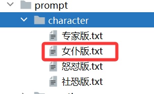  
```json
"怒怼版": ["生气"]
```
当然你可以配置多个情感同时属于同一个配置方案  
```json
"怒怼版": ["生气","尴尬","调皮","搞笑"]
```
PS：这里需要注意，如果多种情绪同时触发了多种性格，吟美会随机抽取一种情绪去抽取对应的性格提示词  
  
> 修改完提示词后，可以点击按钮 刷新人物提示词，可以无感知实时更新提示词  

> 例如，一开始配置的吟美是怒怼提示词，说什么话语都是非常爆粗生气的言语，替换了温柔版提示词后，点击刷新人物提示词，吟美瞬间变成温柔可爱小猫咪形象。  

### 3、表情触发
#### 3.1、摇摆动作
**效果：**人物会在说话和唱歌时候，身体的动作进行摇摆  
**动作录制：**自行录制人物动作，**查看视频教程：**https://www.bilibili.com/video/BV1aT421X7tF/  
生成动作后，请在vts配置表情名称  
  
key名称就是vts的表情名称，endwait是这个动作运行的时间，时间到了会自动结束动作  
  

#### 3.2、表情触发
**key值是表情名称，value值是AI关键字回复文本**  
  
  
**表情关联配置方案的名称“开心”，是VTS的表情名称**  
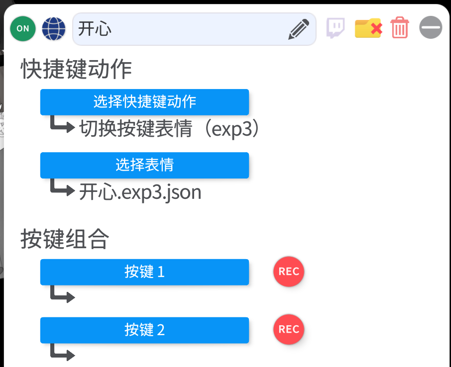  
  
**key表示的吟美回复关键字，donum是执行表情多少次，timesleep是等待下一次执行的表情时间【秒】**  
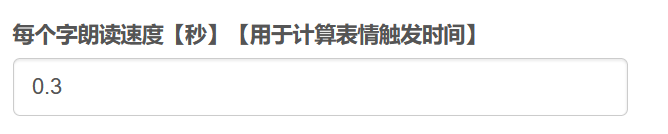  

> 设置了每一个字的计算时间0.3秒，用作触发表情的时间计算间隔，自行根据人物说话语速调配

**配置举例：**
```json
“"开心": {"key":["不错","开心","呵","嘻","画","搜","有趣"],"donum":1,"timesleep":0}"  
```
**用户提问：**吟美你好可爱啊  
**吟美回答：**真的吗，我好<font style="color:red; font-weight:bold;">开心</font>啊，<font style="color:red; font-weight:bold;">呵呵</font>哒  
那么我们看到关键字“开心”和“呵”是会触发开心表情的，看到每字朗读速度配置是0.3，开心事在第6个字符开始，那么就是0.3\*6=1.8秒触发开心表情，然后“呵”是在11个字开始，那么就是0.3\*11 = 3.3秒触发表情  

#### 3.3、语言变化
  

!> 根据关键字+情感变化，变化语种

**语言选择：**配置为自动适配，才会根据情感自动变化语种，设置为无，则语言只会是llm输出的语言  
**语种包含：**英语：en，日文：jp，韩文：kor，粤语：yue，国语：zh  
> checktype:可以选择检测"question"、"answer"、"emotion"三种类型，question是用户问题，answer是ai回复，emotion是ai情感；  
> pattern: 支持正则规则匹配；  
> percent是触发机率，值越大越容易触发，值范围：0~100  

## 七、QQ机器人
### 1、napcat配置
  
当选择了QQ机器人后，需要你安装一个napcat软件进行QQ信息的采集  
**napcat安装：**https://github.com/NapNeko/NapCatQQ/releases  
请选择最新版进行安装  
  
**napcat教程：**https://napneko.github.io/  
  
配置一个websocket服务器，端口配置30002，token自行定义  
  
配置后需要再吟美核心的napcat websocket配置联动  
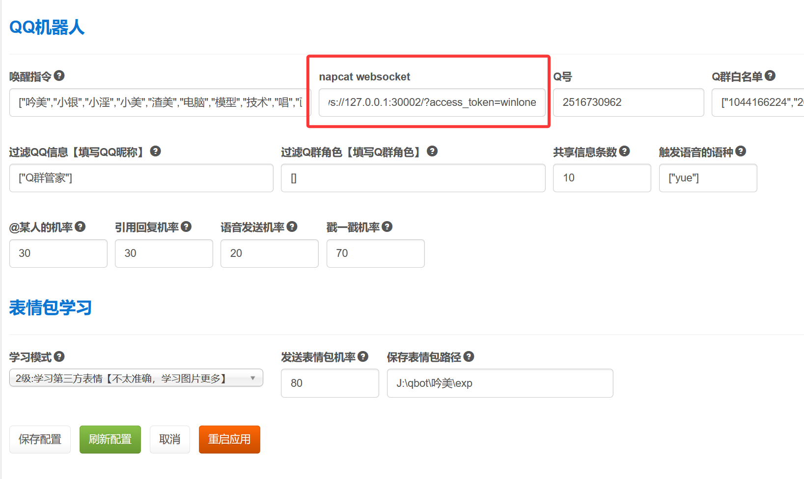  

### 2、唤醒指令
```json
["吟美","小银","小淫","小美","渣美","电脑","模型","技术","唱","画画","绘画","搜","查","表姐","表情"]
```
当Q群遇到吟美、画画、技术等以上配置的唤醒指令，都会唤醒吟美进行对话。或者你在q群直接@吟美，或者直接引用回复吟美，都会触发吟美的对话  
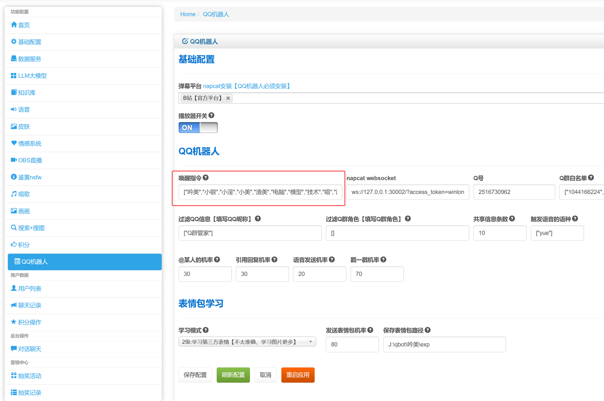  

### 3、QQ名单配置
  
Q号是你当前AI的qq号码  
**Q群白名单：**虽然你qq加了又几十个Q群，但是如果你没把Q群配置到白名单，吟美是不会监听qq信息的  

### 4、其他配置
  
**过滤QQ信息：**以防你加入q群后，会触发和Q群管家这样的机器人死循环聊天，特意设置过滤这些QQ机器人的信息  
**过滤Q群角色：**可以根据Q群的用户角色，例如，admin:管理员；member：普通用户；owner：群主  
**共享信息条数：**监听Q群共享信息的条数，可以联动Q群聊天上下文进行联动，就是多用户混合的聊天信息  
**触发语音的语种：**触发发送QQ语音的语种，当配置为yue，则是遇到说粤语时候必定发送语音，语种包含：英语：en，日文：jp，韩文：kor，粤语：yue，国语：zh  

### 5、机率配置
  
机率值范围：0~100  
@某人的机率：  
  
引用回复机率：   
  
语音发送机率：  
  
戳一戳机率：  
  

### 6、表情包学习


!> 1、重要注意：表情包学习和发送，需要开启吟美数据库服务  

  
<br><br>
2、学习模式三种，0是不学习，1是学习官方已经命名好的表情，2是用户自定义的一些表情，这个吟美会综合上下文关键字进行命名  
  
<br><br>
3、记得配置表情包保存路径：  
  

## 八、搜索
### 1、百度搜索
有可能会触发安全校验，注意异常捕获跳转的百度安全验证码，手动访问验证地址后再次复制浏览器的cookie即可  
**访问地址：**https://www.baidu.com/s?ie=utf-8&tn=baidu&wd=%E6%80%AA%E4%BA%BA  
浏览器F12，在消息头看到，注意要使用【复制值】按钮，以免cookie缺失  
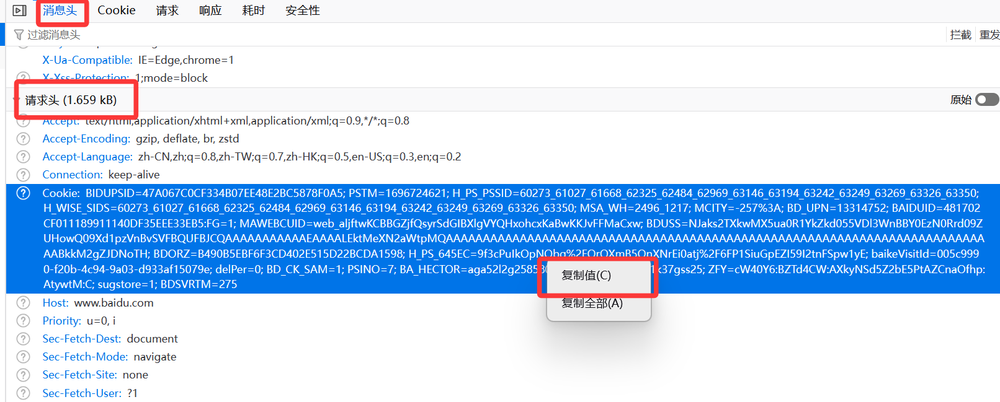  

### 2、searxng聚合搜索
#### 2.1、安装searxng服务
```dockerfile
docker run -d -p 10800:8080 ^
    -v "/j/ai/ai-code/searxng:/etc/searxng" ^
    -e "BASE_URL=http://localhost:8080/" ^
    -e "INSTANCE_NAME=winlone-searxng" ^
    --name "searxng" ^
    searxng/searxng
```
#### 2.2、配置searxng
找到settings.yml配置文件，在formats参数加入配置  
```json
formats:
    - html
    - json
```

#### 2.3、访问searxng
html服务：http://localhost:10800/  
json接口服务：http://localhost:10800/search?format=json&q=doro  
PS：需要json接口服务成功访问才能使用搜索服务  

### 3、duckduckgo搜索
duckduckgo搜索国内需要魔法上网,ip和端口请根据实际情况配置  
配置代理：  
```json
{"http": "socks5://127.0.0.1:10806", "https": "socks5://127.0.0.1:10806"}
```

## 九、智化功能  
### 1、mcp服务
#### 1.1 使用mcp服务必要软件  
**安装UVX工具**  
方法 1: PowerShell  
```bash
$env:HTTP_PROXY = "http://127.0.0.1:10806"
$env:HTTPS_PROXY = "http://127.0.0.1:10806"
powershell -ExecutionPolicy ByPass -c "irm https://astral.sh/uv/install.ps1 | iex"  
```
方法 2: winget  
```bash
winget install --id=astral-sh.uv -e  
```
重要：对于 winget，安装完成后请重启命令行 / IDE  

**安装NPX工具**  
需要安装nodejs，自带npm包管理器  
下载：https://nodejs.org/zh-cn/download  

#### 1.2 配置mcp工具  
**第一步、打开功能列表：**
  
**第二步、新增工具：**   

!> 进入功能列表菜单，右上角有新增按钮，点击新增  

**1、stdio方式**  
工具类型选择stdio，需要填写是执行命令和mcp名称，然后点击按钮生成配置  
方法名和function call调用函数会自动生成  
  
注意：stdio方式需要每次初始化工具，所以调用速度会比sse慢  
  
**2、sse方式**  
工具类型选择sse，然后sse地址要填上，因为sse要自己手动启动服务  
  
sse启动的一键包，可以使用我配置好的软件，下载后点击start.bat就可以直接使用  
  
进入任意一个mcp服务，然后双击startb.bat脚本就可以  
  
看到端口显示，就证明启动成功  
  

#### 1.3 mcp插件代码自定义
**安装依赖包：**   
npx安装：预安装一次bilibili-mcp依赖包，保证第一次启动npx bilibili-mcp不会卡住  
npx属于js代码  
```bash
npx bilibili-mcp
```  

uvx安装：预安装一次mcp-server-calculator依赖包，保证第一次启动uvx mcp-server-calculator不会卡住  
uvx属于python代码  
```bash
uvx mcp-server-calculator
```  

**方法定义的配置**  
可以在plugin文件夹下面新建一个py文件example.py，定义一个类名叫DefaultMCP  
那么你在新建插件时候，可以这样配置  
  

**以下是对应代码，start_info, func_param, process_info这三个值必传，具体说明看代码解释**  
```python
from func.log.default_log import DefaultLog
from func.tools.singleton_mode import singleton
from func.base.entity import ChatEntity
import asyncio, json
from mcp import ClientSession, StdioServerParameters
from mcp.client.stdio import stdio_client
from mcp.client.sse import sse_client
import json5

@singleton
class DefaultMCP:
    log = DefaultLog().getLogger()

    def __init__(self):
        pass

    def custom_do(self, start_info, func_param, process_info):
        '''
        自定义方法-可以是mcp，也可以是自己写的代码方法
        :param start_info:  command=启用mcp的命令、mcp_name=mcp名称、sseurl=sse地址、env=环境变量
        :param func_param: 返回llm选择工具内容：'function': {'name': 'mcp_howtocook_whatToEat', 'arguments': '{"peopleCount": 2}'}}]}
        :param process_info:   dict结构体：query是用户提问、chatEntity是用户信息
        :return: result=返回结果字符串或者dict都可以、is_stop=true：继续执行聊天  false：直接跳出，不执行下面聊天操作
        '''
        
        # 1、这里你可以自己写mcp连接
        # 2、你可以自定义自己代码，不一定是mcp
        return "", True
``` 

**mcp的stdio连接方式：**  
command：启动命令  
args：启动命令名称  
env：环境变量，可以塞入配置：{ "HTTP_PROXY": "http://127.0.0.1:10806", "HTTPS_PROXY": "http://127.0.0.1:10806" }  
```nodejs
server_params = StdioServerParameters(
                command="npx",
                args=["bilibili-mcp"],
                env=None,  # 可在此处设置环境变量
            )
```
stdio链接代码  
```json
server_params = StdioServerParameters(
    command=cmd,
    args=mcp_names,
    env=env
)

async with asyncio.timeout(20):  # 20 秒超时
    async with stdio_client(server_params) as (stdio, write):
        async with ClientSession(stdio, write) as session:
            await session.initialize()  # 初始化会话
            arguments = func_param["arguments"].replace('\n', '')
            json_args = json5.loads(arguments)
            func_name = func_param["name"]
            self.log.info(f"\033[44m\033[97m 准备请求stdio类型的mcp名称:{mcp_name},方法名:{func_name},参数:{json_args}\033[0m")
            result = await session.call_tool(func_name, json_args)
            return result
```
**mcp的sse连接方式：**  
bilibili-mcp配置： 
command：启动命令  
args：启动命令名称  
env：环境变量，可以塞入配置：{ "HTTP_PROXY": "http://127.0.0.1:10806", "HTTPS_PROXY": "http://127.0.0.1:10806" }  
```nodejs
server_params = StdioServerParameters(
                command="npx",
                args=["bilibili-mcp"],
                env=None,  # 可在此处设置环境变量
            )
```
sse链接代码  
```json
async with asyncio.timeout(20):  # 20 秒超时
    async with sse_client(start_info["sseurl"]) as streams:
        async with ClientSession(*streams) as session:
            await session.initialize()
            arguments = func_param["arguments"].replace('\n', '')
            json_args = json5.loads(arguments)
            func_name = func_param["name"]
            self.log.info(f"\033[44m\033[97m 准备请求sse类型的mcp名称:{mcp_name},方法名:{func_name},参数:{json_args}\033[0m")
            result = await session.call_tool(func_name, json_args)
            return result
```

#### 1.4 导入mcp插件  
说明：吟美的MCP功能配置列表，是没有配置任何MCP的，需要你们自行配置，如果需要配置好现成的MCP服务，请进行知识付费  
**MCP购买地址：** [购买下载 ](https://mall.bilibili.com/neul-next/detailuniversal/detail.html?isMerchant=1&page=detailuniversal_detail&saleType=10&itemsId=12731981&loadingShow=1&noTitleBar=1&msource=merchant_share)  
  
**购买的文件包含：**
- 每一个插件里面多有一个*.bat的脚本启动，当前只配置了在window系统下启动  
- 双击*.bat脚本就能直接启动，每一个插件会监听一个接口，插件启动端口和sql配置文件已经配置好，不需要变动  
- 请把yinmei.func_call_list.json导入到吟美mongodb数据库  
PS：不会导入请联系B站：程序猿的退休生活  
- mcp文件夹：导入后总共有20个插件  
  
  
- 代理访问和密钥：  
mcp-server-tmdb：需要密钥和代理访问，网站地址：https://www.themoviedb.org/  
mcp-se-wikipedia：需要代理访问，网站地址：https://zh.wikipedia.org/    
tavily：需要密钥，网站地址：https://www.tavily.com/  

### 2、寻找新MCP  
**推荐几个MCP服务网站**  
https://mcp.so/  
https://mcp.aibase.cn/  
https://cloud.tencent.com/developer/mcp  
然后大家可以在上面寻找自己的MCP服务  
举例，例如找一个烹饪的MCP，[进入详情页](https://mcp.so/server/howtocook-mcp/worryzyy) 
  
你会看到右侧有安装这个MCP的脚本 
```bash
npx -y howtocook-mcp
```
这个脚本就是安装烹饪这个MCP服务的  
然后我们来到吟美后台的功能列表，点击新增，按下图步骤新建  
  
最后一步：点击生成配置的按钮，就会自动生成调用函数的方法名  


### 3、MCP效果展示  
- **如果你是灵笼的角色4068，你会如何抉择？**    
工具：产生思维链+搜索工具+TMDB电影信息查询  
  
- **转圈圈10个**  
工具：人物移动工具
  
- **最近几年最好听的爱情连续剧主题曲有哪些**  
工具：搜索工具 &nbsp;&nbsp;&nbsp;&nbsp; **说明：**这里会调用搜索工具进行搜索歌曲  
  

### 4、MCP对应OBS插件  
1、工具调用提示  
插件路径：ai-yinmei/html/tools.html  
  
2、B站视频MCP  
插件路径：ai-yinmei/vip/video.html  
  

## 十、抽奖服务
### 1、抽奖功能获取  
<font color="red">提示：请联系B站"程序猿的退休生活"获取功能解封 或者 联系QQ：314769095</font>  
### 2、自动化抽奖  
#### 2.1、抽奖效果  
作用：让抽奖在无人守值情况下也能进行，实现24小时抽奖活动  
  
#### 2.2、如何抽奖  
在B站输入"抽奖"或者"抽奖10"，就可以发起抽奖，抽奖10是连抽10次，限制最多是10次，超过次数当10次处理  
#### 2.3、后台配置界面  
一、请打开自动抽奖开关  
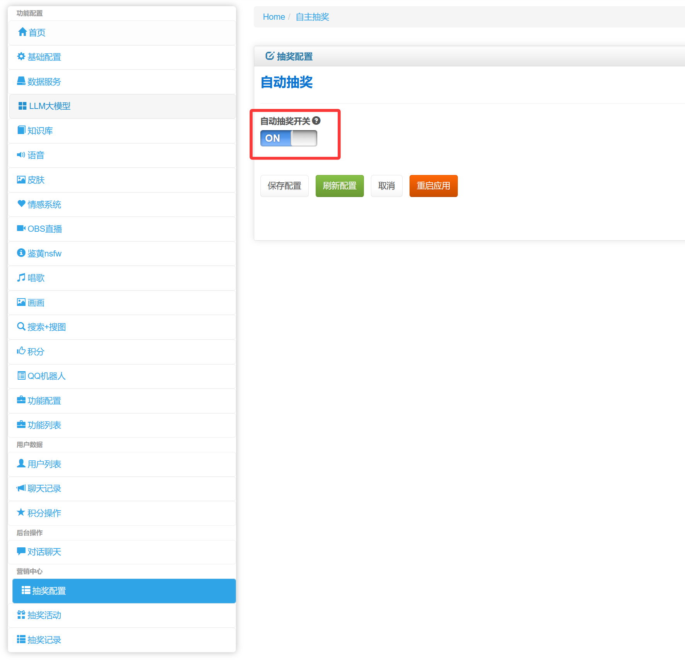  

二、配置奖品  
请在数据库导入礼品，暂时没有做界面配置  
使用抽奖整合包的“yinmei.prize_info.json”文件，导入到吟美数据库的prize_info表  
  
1、prizename: 奖品名称  
2、action: 中奖操作方式，礼品|积分|B站私信|无，礼品是直接记录中奖内容没有任何其他操作、积分是中奖后直接给用户发放积分、B站私信是中奖后直接给用户B站发送私信【可以自定义私信内容】、不需要任何操作请填写“无”，例如为中奖
3、value: 奖品内容，如果是积分则需要设置一个积分奖励数字【可以正数或者负数，负数是扣减积分】，如果是B站私信则需要配置一段需要发私信的内容文本【支持换行符\n】  
4、prizeimg: 奖品图片  
5、status: 奖品状态，打开|关闭，设置了关闭后，此奖品不会进入抽奖范围  
6、num: 奖品数量，填写数字，奖品数量会自动扣减，扣减到0之后不会进行抽奖  
7、submitTime: 奖品发布时间  
8、range: 中奖概率，填写小数点，0.2代表20%，0.02代表2%    
9、prizetype: 中奖类型，唯一|多次，唯一就是每个用户只会中奖一次，抽中后此奖品不会再次重复抽奖，适合一次性抽奖奖品  
  
如果奖品设置了私信发送，需要设置B站的登录信息才能发送成功  
SESSDATA、bili_jct、buvid3、DedeUserID主要这几个参数  
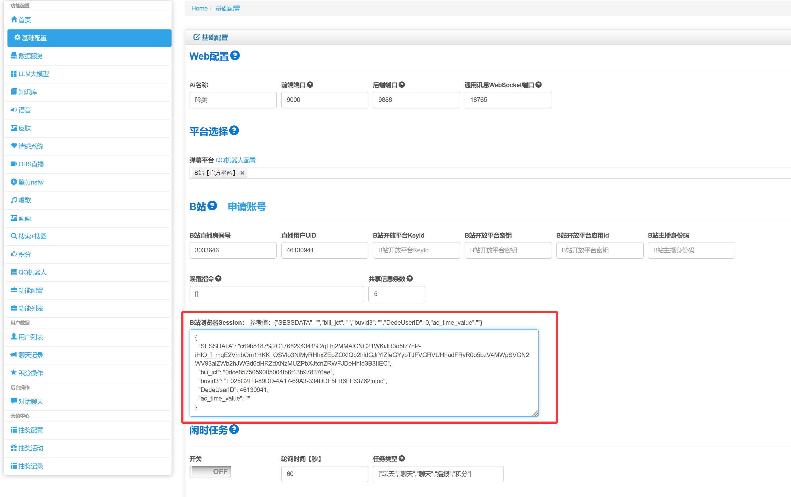  
  
三、用户在弹幕输入“抽奖”  
连抽输入“抽奖10”  
  
  
四、中奖名单查询  
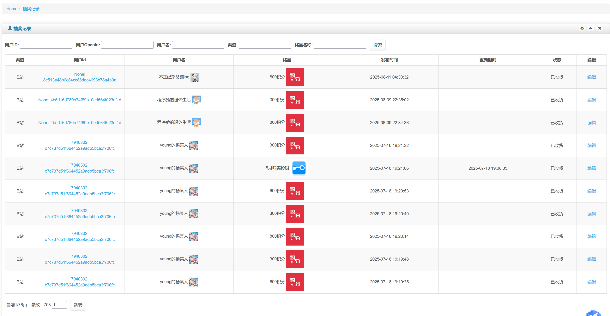  

#### 2.4、OBS配置  
新建一个浏览器插件，放入自主抽奖插件：self-prize/prize.html  
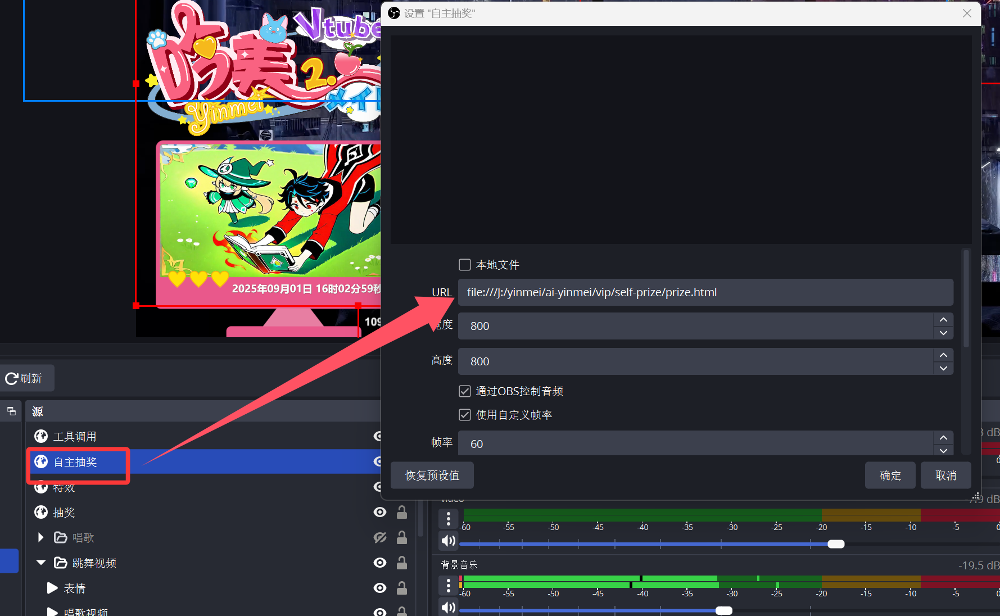  

### 3、主播控制抽奖 
#### 3.1、抽奖效果  
作用：此抽奖功能由主播自主控制抽奖流程，可以配合后台管理的“关闭AI托管”来使用人工控场  
    
  
#### 3.2、后台配置界面  
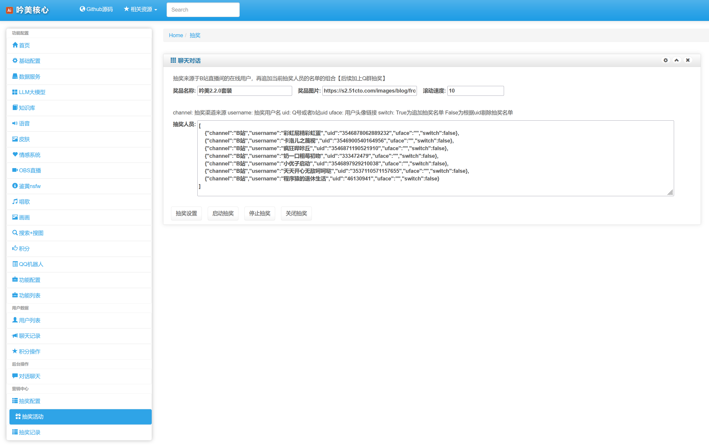
1、抽奖规则：  
中奖范围是B站在直播间内所有用户列表+后台管理的抽奖人员名单  
2、奖品名称：  
抽奖的奖品标题名称  
3、奖品图片：  
放一个图片链接或者本地图片路径  
4、滚动速度：  
填写数字，这个是抽奖轮盘转动速度，数值越大，转速越快  
5、人员配置：  
channel: 抽奖渠道来源，username: 抽奖用户名，uid: Q号或者b站uid，uface: 用户头像链接，switch: True为追加抽奖名单 | False为根据uid剔除抽奖名单  
  
#### 3.3、操作说明  
a.配置好上述参数后，你就可以点击“抽奖设置”，然后再OBS界面就会看到相关奖品图片和轮盘已经生成  
b.点击“启动抽奖”，轮盘会开始转圈  
c.点击“停止抽奖”，轮盘会慢慢停止，然后抽中一名用户，用户范围是【B站在直播间内所有用户列表+后台管理的抽奖人员名单】，机率都是每个用户平均分，例如10个用户，每个用户中奖机率就是十分一  
d.点击“关闭抽奖”，在OBS界面的轮盘就会消失显示  

#### 3.4、OBS配置  
新建一个浏览器插件，放入自主抽奖插件：prize/prize.html  
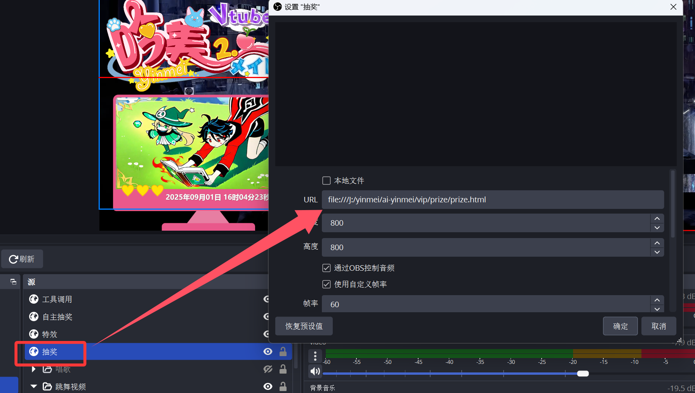  

