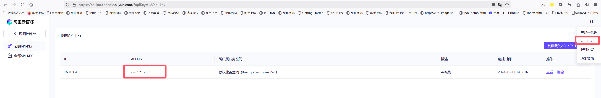
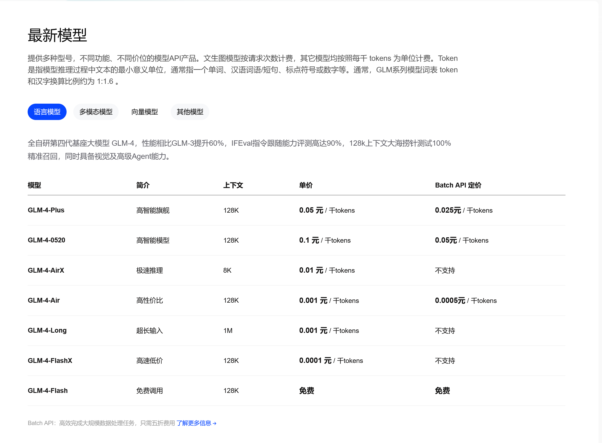
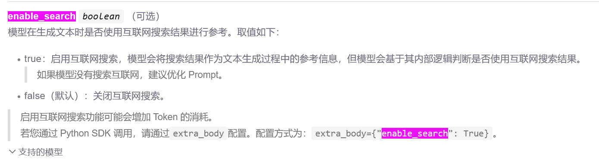
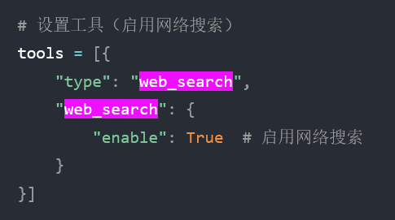

## 快速启动
> 双击strat.bat 或者 yinmei-core-api.exe，即可启动吟美核心服务


> 启动成功：管理后台地址

  

## 一、聊天配置
### 1、Ai名称
> 启动吟美核心AI-YinMei-v2.0.0的start.bat，首先要给你的Ai起个名称，然后在对话里面，你问她名字，她会称呼自己是这个名字


!> 记得点击"保存配置"按钮，然后点击"刷新配置"按钮才会生效。

  
<br>

### 2、通用Ai聊天
#### 2.1 类型选择
> 在LLM大模型，可以选择通用聊天，此功能适配所有OpenAi规范的接口


**服务地址：**  
以阿里百炼为例：https://help.aliyun.com/zh/model-studio/developer-reference/use-qwen-by-calling-api


**密钥：**  
以阿里百炼为例：https://bailian.console.aliyun.com/?apiKey=1#/api-key



**模型名称：**  
看文本生成的模型【阿里百炼为例】：  
https://help.aliyun.com/zh/model-studio/getting-started/models  

**历史记录：**  
Ai聊天的上下文长度，通常一问一答为1个历史记录  

**max_tokens integer （可选）**  
允许模型生成的最大Token数。  
默认值和最大值都是模型的最大输出长度。关于各模型的最大输出长度，请参见模型列表。  
max_tokens参数适用于需要限制字数（如生成摘要、关键词）、控制成本或减少响应时间的场景。  

**top_p float （可选） **  
核采样的概率阈值，用于控制模型生成文本的多样性。  
top_p越高，生成的文本更多样。反之，生成的文本更确定。  
取值范围：（0,1.0]  
由于temperature与top_p均可以控制生成文本的多样性，因此建议您只设置其中一个值。  

**temperature float （可选）**  
采样温度，用于控制模型生成文本的多样性。  
temperature越高，生成的文本更多样，反之，生成的文本更确定。  
取值范围： [0, 2)  
<br>

#### 2.2 支持的平台
> 看到支持OpenAi规范接口的平台，包括云平台的阿里百炼、智谱清言，还有本地服务 OneApi、Xinference等接口  

##### 1、阿里百炼：  
https://www.aliyun.com/product/bailian  
阿里百炼包含的102个文本生成模型  
  

##### 2、智谱的模型：GLM4等  
https://open.bigmodel.cn/  
  

##### 3、搜索参数  
```json
{
    "enable_search":true,
    "tools": [{
        "type": "web_search", "web_search": {"enable": true}
    }]
}
```
**阿里百炼搜索：**  
https://bailian.console.aliyun.com/?accounttraceid=ce194831be774d6a91188482feb46b54xrie#/model-market/detail/qwen-plus-latest  
  

**glm搜索：**  
https://www.bigmodel.cn/dev/howuse/websearch  
  
<br>

##### 4、本地服务 
**本地OneApi**  
项目地址：https://github.com/songquanpeng/one-api  
OneApi中转场跳板对接：本地或者云服务  
接口：http://IP:13000/v1/chat/completions  
容器安装：  
```dockerfile
docker run --name one-api -d --restart always -p 13000:3000 -e TZ=Asia/Shanghai -v /j/ai/ai-code/one-api:/data justsong/one-api
```
<br>

**本地Xinference**  
接口：http://IP:9997/v1/chat/completions  
容器安装：  
```dockerfile
docker run --name xinference -d --restart always -p 9997:9997 -e XINFERENCE_HOME=/data -v /j/ai/ai-code/xinference/:/data --shm-size 20g --gpus all xprobe/xinference:v0.12.3 xinference-local -H 0.0.0.0
```
```dockerfile
docker run --name xinference121 -d -p 9998:9997 -e XINFERENCE_HOME=/data -v /D/docker/xinference121:/data --shm-size 20g --gpus all xprobe/xinference:v1.2.1 xinference-local -H 0.0.0.0
```
<br>

##### 5、更多云服务：  
智谱清言：  
https://open.bigmodel.cn/  
测试秘钥：Bearer xxx  
请求接口：https://open.bigmodel.cn/api/paas/v4/chat/completions  
模型：glm-4-flashx  
阿里百炼  
https://www.aliyun.com/product/bailian  
测试秘钥：Bearer xxx  
请求接口：https://dashscope.aliyuncs.com/compatible-mode/v1/chat/completions  
模型：qwen2.5-72b-instruct  
模型列表：https://help.aliyun.com/zh/model-studio/getting-started/models?spm=a2c4g.11186623.help-menu-2400256.d_0_2.5a06b0a8eYXY9K  
腾讯混元  
https://console.cloud.tencent.com  
请求接口：https://api.hunyuan.cloud.tencent.com/v1/chat/completions  
openai 秘钥：Bearer xxx  
模型：hunyuan-turbo  
百度云：  
https://cloud.baidu.com/  
请求接口：https://qianfan.baidubce.com/v2/chat/completions  
openai 秘钥：Bearer xxx  
模型列表：https://cloud.baidu.com/doc/WENXINWORKSHOP/s/Fm2vrveyu  

### 3、Fastgpt配置
#### 3.1 注册账号
**国际版：**https://tryfastgpt.ai/  
**国内版：**https://fastgpt.cn/  
以上两个链接均可以使用，国际和国内账户不互通，新注册用户有100积分免费使用  
以下是我推广链接，拜托可以使用我链接注册一个，让我赚取一下积分  
**推广链接：**https://cloud.fastgpt.in/?hiId=66a6e08d37c6b5e286e375e7  