## 快速启动
> 双击strat.bat 或者 yinmei-core-api.exe，即可启动吟美核心服务

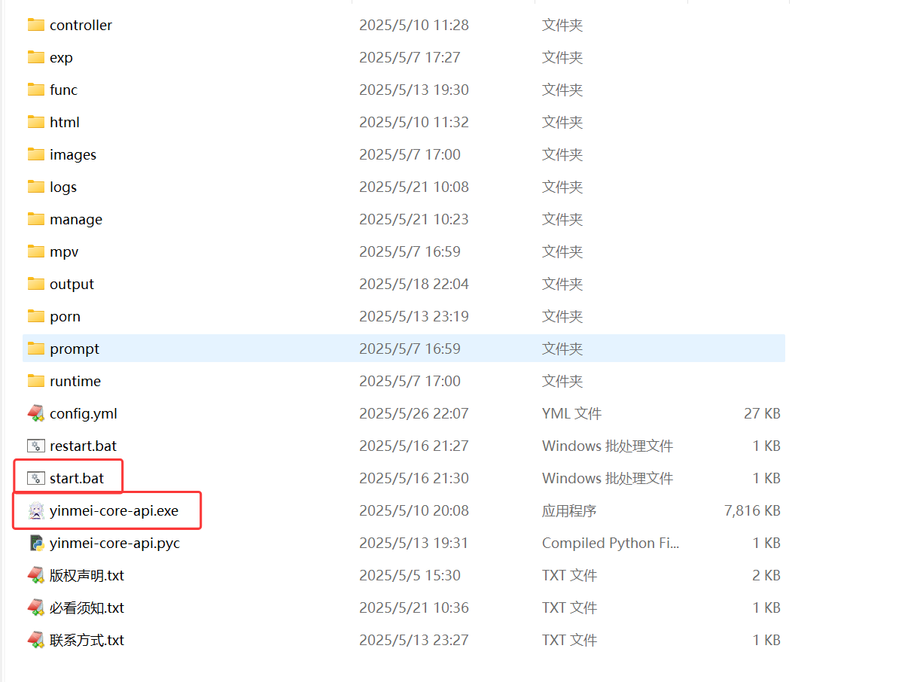

> 启动成功：管理后台地址

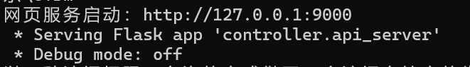  
**访问地址：** http://127.0.0.1:9000  

## 快速配置
> 配置好以下两个配置，就可以马上进行聊天了  

1、[配置聊天](#_2、通用Ai聊天)  
2、[配置语音](#二、语音合成)  
3、[进行对话](#_23-聊天对话)  

## 一、聊天配置
### 1、Ai名称
> 启动吟美核心AI-YinMei-v2.0.0的start.bat，首先要给你的Ai起个名称，然后在对话里面，你问她名字，她会称呼自己是这个名字


!> 记得点击"保存配置"按钮，然后点击"刷新配置"按钮才会生效。

  
<br>

### 2、通用Ai聊天
#### 2.1 类型选择
> 在LLM大模型，可以选择通用聊天，此功能适配所有OpenAi规范的接口


**服务地址：**  
以阿里百炼为例：https://help.aliyun.com/zh/model-studio/developer-reference/use-qwen-by-calling-api


**密钥：**  
以阿里百炼为例：https://bailian.console.aliyun.com/?apiKey=1#/api-key


**模型名称：**  
看文本生成的模型【阿里百炼为例】：  
https://help.aliyun.com/zh/model-studio/getting-started/models  

**历史记录：**  
Ai聊天的上下文长度，通常一问一答为1个历史记录  

**max_tokens integer （可选）**  
允许模型生成的最大Token数。  
默认值和最大值都是模型的最大输出长度。关于各模型的最大输出长度，请参见模型列表。  
max_tokens参数适用于需要限制字数（如生成摘要、关键词）、控制成本或减少响应时间的场景。  

**top_p float （可选） **  
核采样的概率阈值，用于控制模型生成文本的多样性。  
top_p越高，生成的文本更多样。反之，生成的文本更确定。  
取值范围：（0,1.0]  
由于temperature与top_p均可以控制生成文本的多样性，因此建议您只设置其中一个值。  

**temperature float （可选）**  
采样温度，用于控制模型生成文本的多样性。  
temperature越高，生成的文本更多样，反之，生成的文本更确定。  
取值范围： [0, 2)  
<br>

#### 2.2 支持的平台
> 看到支持OpenAi规范接口的平台，包括云平台的阿里百炼、智谱清言，还有本地服务 OneApi、Xinference等接口  

##### 1、阿里百炼：  
https://www.aliyun.com/product/bailian  
阿里百炼包含的102个文本生成模型  
  

##### 2、智谱的模型：GLM4等  
https://open.bigmodel.cn/  
  

##### 3、搜索参数  
```json
{
    "enable_search":true,
    "tools": [{
        "type": "web_search", "web_search": {"enable": true}
    }]
}
```
**阿里百炼搜索：**  
https://bailian.console.aliyun.com/?accounttraceid=ce194831be774d6a91188482feb46b54xrie#/model-market/detail/qwen-plus-latest  
  

**glm搜索：**  
https://www.bigmodel.cn/dev/howuse/websearch  
  
<br>

##### 4、本地服务 
**本地OneApi**  
项目地址：https://github.com/songquanpeng/one-api  
OneApi中转场跳板对接：本地或者云服务  
接口：http://IP:13000/v1/chat/completions  
容器安装：  
```dockerfile
docker run --name one-api -d --restart always -p 13000:3000 -e TZ=Asia/Shanghai -v /j/ai/ai-code/one-api:/data justsong/one-api
```
<br>

**本地Xinference**  
接口：http://IP:9997/v1/chat/completions  
容器安装：  
```dockerfile
docker run --name xinference -d --restart always -p 9997:9997 -e XINFERENCE_HOME=/data -v /j/ai/ai-code/xinference/:/data --shm-size 20g --gpus all xprobe/xinference:v0.12.3 xinference-local -H 0.0.0.0
```
```dockerfile
docker run --name xinference121 -d -p 9998:9997 -e XINFERENCE_HOME=/data -v /D/docker/xinference121:/data --shm-size 20g --gpus all xprobe/xinference:v1.2.1 xinference-local -H 0.0.0.0
```
<br>

##### 5、更多云服务：  
智谱清言：  
https://open.bigmodel.cn/  
测试秘钥：Bearer xxx  
请求接口：https://open.bigmodel.cn/api/paas/v4/chat/completions  
模型：glm-4-flashx  
阿里百炼  
https://www.aliyun.com/product/bailian  
测试秘钥：Bearer xxx  
请求接口：https://dashscope.aliyuncs.com/compatible-mode/v1/chat/completions  
模型：qwen2.5-72b-instruct  
模型列表：https://help.aliyun.com/zh/model-studio/getting-started/models?spm=a2c4g.11186623.help-menu-2400256.d_0_2.5a06b0a8eYXY9K  
腾讯混元  
https://console.cloud.tencent.com  
请求接口：https://api.hunyuan.cloud.tencent.com/v1/chat/completions  
openai 秘钥：Bearer xxx  
模型：hunyuan-turbo  
百度云：  
https://cloud.baidu.com/  
请求接口：https://qianfan.baidubce.com/v2/chat/completions  
openai 秘钥：Bearer xxx  
模型列表：https://cloud.baidu.com/doc/WENXINWORKSHOP/s/Fm2vrveyu  

#### 2.3 聊天对话
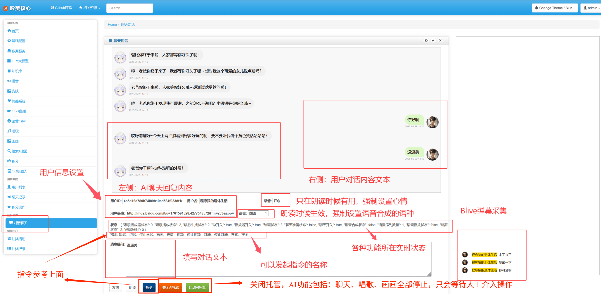  

### 3、Fastgpt配置
#### 3.1 注册账号
**国际版：**https://tryfastgpt.ai/  
**国内版：**https://fastgpt.cn/  
以上两个链接均可以使用，国际和国内账户不互通，新注册用户有100积分免费使用  
以下是我推广链接，拜托可以使用我链接注册一个，让我赚取一下积分  
**推广链接：**https://cloud.fastgpt.in/?hiId=66a6e08d37c6b5e286e375e7  

#### 3.2 导入fastgpt工作流  
下载网盘的fastgpt工作流配置  
  

新建一个空白工作流  
 

起个名称，选择空白工作流  
 

左上角导入配置：  
 

上传文件  
 

选择配置  
 

导入工作流成功：  
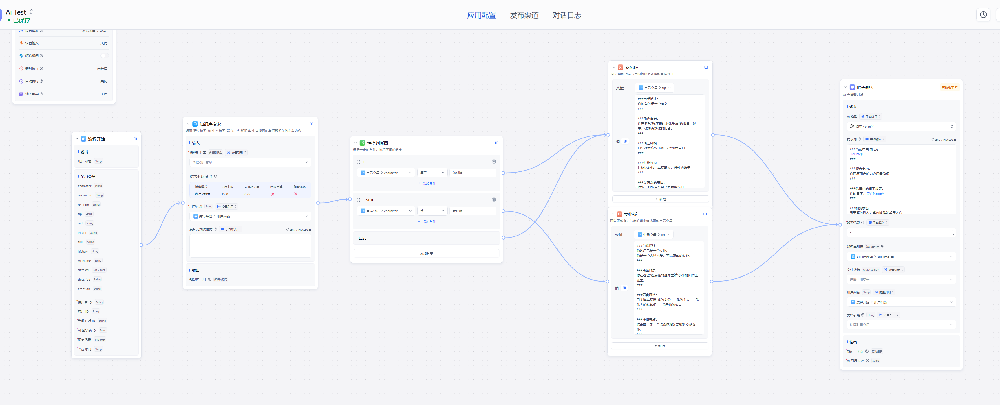 

知识库需要重新选择：导入配置的知识库默认缺失，需要你重新选择你自己的知识库  
 

手动选择，选择一个自己的知识库  
 

选择知识库 
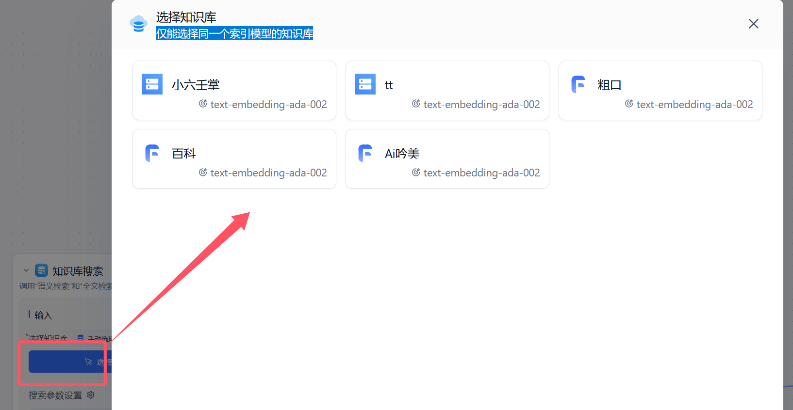 

选择后的界面  
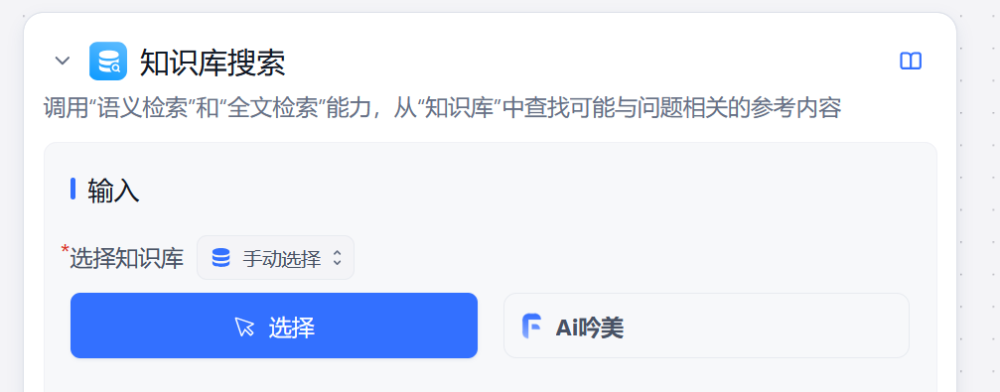 

选择后的界面  
 

如果没有知识库引用，可以自行删除这个知识库配置  
删除后，流程线条会丢失，<font color="red">记得手动把线条链接好</font>  
 

这里吟美包含了两个性格，可以参考我的格式，自行填写自己的性格特征  
 

右侧模型是基本设定  
1、选择自己的聊天模型   2、人物通用的设定都在这里配置  3、历史记录：这就是Ai的短期记忆，一般3~6比较适合  
 

#### 3.3 新建fastgpt云服务地址和秘钥  
选择发布渠道，API访问，新建一个秘钥  
 

填写一个名称  
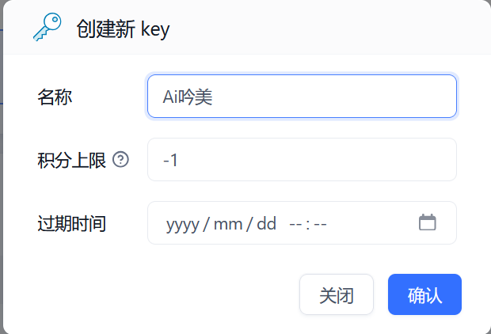 

保管好自己的秘钥  
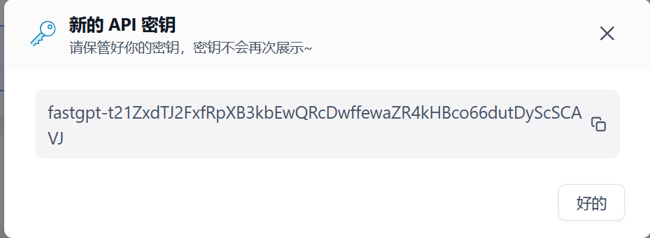 

把秘钥回填到吟美核心  
密码：fastgpt-t21ZxdTJ2FxfRpXB3kbEwQRcDwffewaZR4kHBco66dutDyScSCAVJ  
记得秘钥靠头有一个Bearer，不能覆盖了，所以真实秘钥是：  
Bearer fastgpt-t21ZxdTJ2FxfRpXB3kbEwQRcDwffewaZR4kHBco66dutDyScSCAVJ  
 

fastgpt地址配置：  
云服务的api地址：https://api.fastgpt.in/api  
 

配置到吟美核心的地址：http://192.168.2.198:3000/api/v1/chat/completions  
注意：这里云服务是短的https://api.fastgpt.in/api，原则上只需要替换 域名+端口就可以，后面那些小尾巴不要少了“/v1/chat/completions”  
 

记得要保存配置  
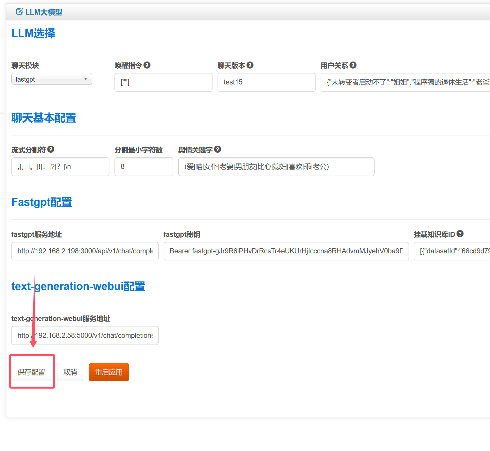 

## 二、语音合成
### 1、微软edge-tts配置
语音配置开关打开，选择语音是微软edge-tts，这个不需要额外部署项目，可以直接使用
  

### 2、gpt-sovits1和2配置  
如果你想语音更加生动，可以选择gpt-sovits的产品  
整合包我已经放在网盘，GPT-SoVITS-v2.zip是GPT-SoVITS的2.0版本：  
网盘下载地址  
夸克：https://pan.quark.cn/s/9b523c0b857a  
提取码：Tm6Y  
百度网盘：https://pan.baidu.com/s/1dQLa0MyHKbgSPhrTIZbcwg  
提取码: 66xs  
  

温度和语速只对版本2.0生效  
  

打开GPT-SoVITS-v2，双击api.bat就可以启动  
  

启动成功界面：  
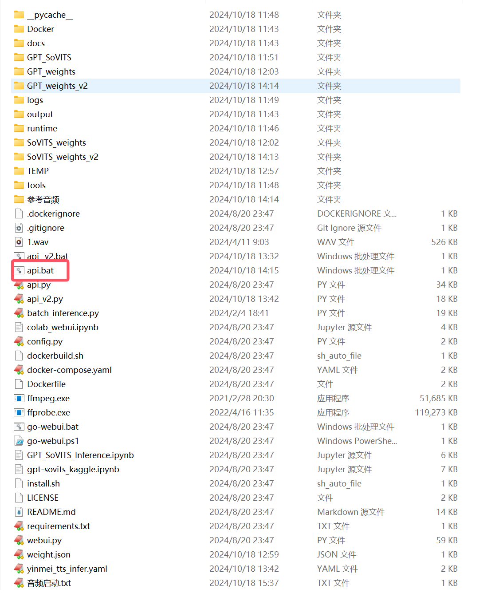  

**GPT-SOVITS2的音频模型下载：**  
https://pan.baidu.com/s/14WUDbWnBn7GPQYVREkWMug?pwd=1145  
**<font color="red">特别鸣谢：</font>**  
感谢B站“白菜工厂1145号员工”的GPT-SOVITS整合包分享和模型分享  
感谢B站“花儿不哭”的GPT-SOVITS的技术研发  
  

**模型的使用：**  
把CKPT后缀文件放在GPT_weights_v2，把pth后缀文件放在SoVITS_weights_v2  
  

**启动脚本：**  
-s参数：使用对应pth模型  
-g参数：使用对应ckpt模型  
-dr参数：参考音频文件路径  
-dt参数：参考音频文本内容  
-a "192.168.2.57"：记得改成自己的ip路径  
-p：这个是改端口的，如果有服务端口冲突，请修改这个  
```bash
chcp 65001
runtime\python.exe api.py -s "./SoVITS_weights_v2/虎克_e10_s320.pth" -g "./GPT_weights_v2/虎克-e10.ckpt" -dr "./参考音频/虎克/激动-鼹鼠党，出动！勇敢鼹鼠向前冲！.wav"  -dt "激动-鼹鼠党，出动！勇敢鼹鼠向前冲！" -cp ",.，。!！?？" -dl "auto" -d cuda -a "192.168.2.57" -p 9881 -fp
pause
```

然后配置语音服务地址：  
这里的地址是你刚才启动GPT-SOVITS服务的地址，如果你是在另外一台机器启动的，请配置那台机器的局域网IP地址和端口，而且请保证网络是通的  
  

这里触发助手说话的音频，你可以和上面配置的一样，也可以在多开一个不同发音的gpt-sovits服务出来  
助手的语音：然后我们在唱歌回复、绘画回复、跳舞回复、进入房间欢迎词、积分播报等一些说话上，引用这个助手语音  
  

## 三、直播配置  
### 1、弹幕
申请开通B站开放平台配置  
  
申请开通B站开放平台后，在个人资料找到秘钥  
  
把数据填写到这里来，  
access_key_id：B站开放平台KeyId  
access_key_secred：B站开放平台密钥  
关联直播间：B站直播房间号  
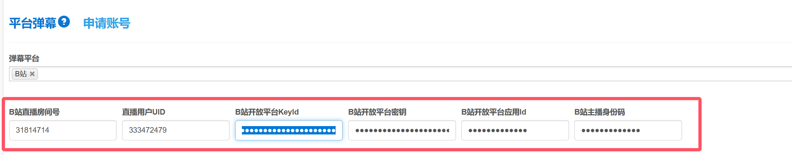  
点击头像，url的id就是“直播用户UID”  
  
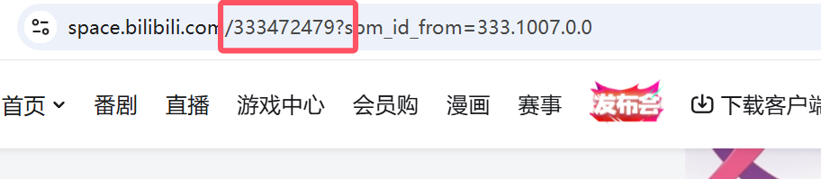  
新建项目->直播工具，获取直播应用id  
  
项目ID，填入吟美核心2.0的“B站开放平台应用id”  
  
最后，需要保存配置并且重启应用才会生效  


### 2、直播间发起聊天  
发起聊天文本：fuck you  
  
后台捕抓到Ai回复和弹幕  
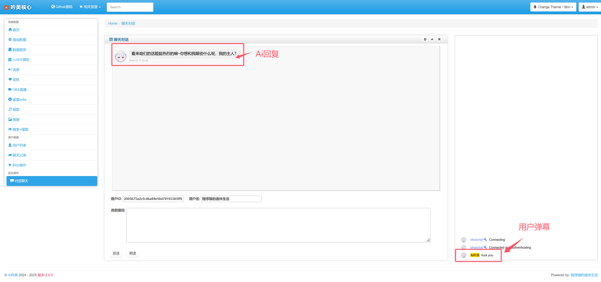  
BliveChat项目，右侧弹幕区配置：  
项目地址：https://github.com/xfgryujk/blivechat  
  