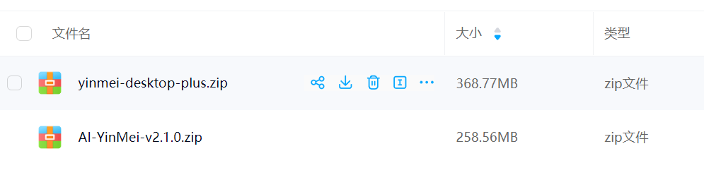
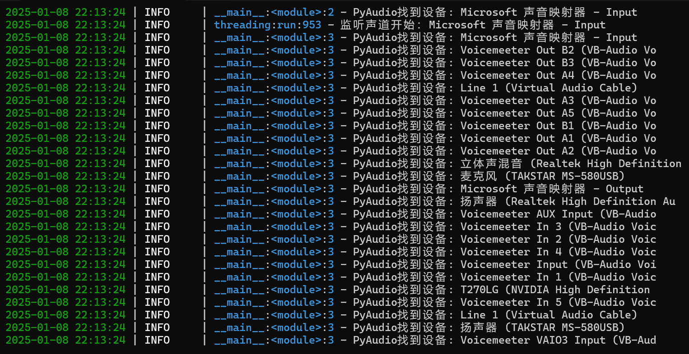
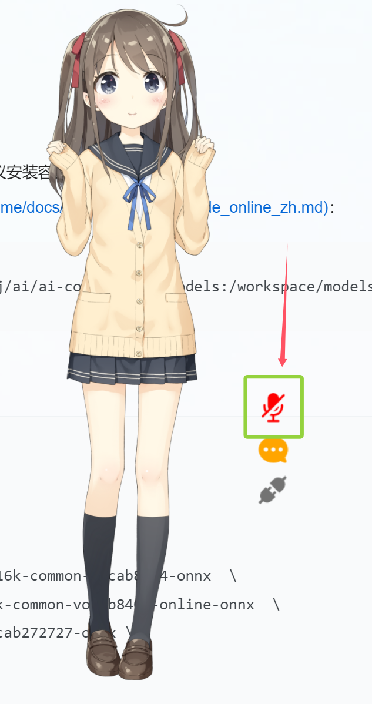

## 一、启动方式
### 1、下载包
下载路径：在[网盘](/link?id=项目下载)的yinmei-all文件夹  
应用包：yinmei-desktop-plus.zip  
  

### 2、安装cuda
**当前版本：**
```cmd
英伟达：cuda 12.4
当前项目：pytorch 2.4.0+cu124
```
**兼容说明：**当前安装版本只支持cuda12.4,如果是50系显卡需要高版本cuda请自己卸载pytorch进行安装  
cuda开发包下载【版本12.4】：https://developer.nvidia.com/cuda-12-4-1-download-archive  
cuda历史版本：https://developer.nvidia.com/cuda-toolkit-archive  
**重装pytorch：**  
请自己选择安装的pytorch是cu128、cu124、cu126，具体[查看](https://pytorch.org/get-started/locally/)  
在项目根目录打开cmd执行如下命令：  
```cmd
卸载
.\runtime\python.exe -m pip uninstall torch torchvision torchaudio

安装对应cuda12.8
.\runtime\python.exe -m pip install torch torchvision torchaudio --index-url https://download.pytorch.org/whl/cu128
```

驱动版本【nvidia驱动程序】：nvidia-smi -l 1  
CUDA程序【cudatoolkit开发包】：nvcc -V  

### 3、启动方式
桌宠启动：启动桌宠.bat  或者 yinmei-desktop-plus.exe  
可以查看音频设置：双击“查询音频设备.bat”  


## 二、桌宠配置
【配置config.yml】  
**口型匹配：**live2D_audio_device参数，默认是输出到 扬声器 (Realtek High Definition，请自行配置  
**麦克风：**mic_audio_device参数，默认输出到 Voicemeeter Out B3，请自行配置  
**关于音频配置：**双击查询音频设备.bat可以查询到声道设备列表  
  
**live2D人物选择：**model_path参数，自行更换人物模型路径："./Resources/v3/Hiyori/Hiyori.model3.json"  
**人物动作：**我只配置了v2版本Epsilon和v3版本Hiyori，其他人物还没配置动作和表情关联，可以自己配置，参考Epsilon和Hiyori加上name参数，注意大小写  

## 三、语音对话
开启语音按钮：语音依赖funasr语音识别系统  
  
**需要安装funasr服务端系统才可以使用**  
### **方法一、开箱即用【推荐】：**  
[容器详情页](https://hub.docker.com/r/worm128/funasr-yinmei),以下示例基于 Windows Docker Desktop，映射到物理盘 J:\ai\ai-code\funasr\models
```cmd
docker run -p 10095:10095 --name funasr -it --privileged=true ^
  -v /j/ai/ai-code/funasr/models:/workspace/models ^
  worm128/funasr-yinmei
```

### **方法二、官方安装：**  
需要根据[阿里 funasr](https://github.com/alibaba-damo-academy/FunASR/)进行配置, 建议安装容器，  
参考[服务器部署文档](https://github.com/alibaba-damo-academy/FunASR/blob/main/runtime/docs/SDK_advanced_guide_online_zh.md)：
```dockerfile
docker run -p 10095:10095 --name funasr -it --privileged=true -v /j/ai/ai-code/funasr/models:/workspace/models registry.cn-hangzhou.aliyuncs.com/funasr_repo/funasr:funasr-runtime-sdk-online-cpu-0.1.12
```

**启动FunASR服务: **  
[需要进入funasr容器内部执行]  
进入容器执行以下命令：  
```bash
cd FunASR/runtime
nohup bash run_server_2pass.sh \
  --download-model-dir /workspace/models \
  --vad-dir damo/speech_fsmn_vad_zh-cn-16k-common-onnx \
  --model-dir damo/speech_paraformer-large-vad-punc_asr_nat-zh-cn-16k-common-vocab8404-onnx  \
  --online-model-dir damo/speech_paraformer-large_asr_nat-zh-cn-16k-common-vocab8404-online-onnx  \
  --punc-dir damo/punc_ct-transformer_zh-cn-common-vad_realtime-vocab272727-onnx \
  --lm-dir damo/speech_ngram_lm_zh-cn-ai-wesp-fst \
  --itn-dir thuduj12/fst_itn_zh \
  --certfile 0 \
  --hotword /workspace/models/hotwords.txt > log.txt 2>&1 &
  
# 如果您想关闭ssl，增加参数：--certfile 0
# 如果您想使用时间戳或者nn热词模型进行部署，请设置--model-dir为对应模型：
#   damo/speech_paraformer-large-vad-punc_asr_nat-zh-cn-16k-common-vocab8404-onnx（时间戳）
#   damo/speech_paraformer-large-contextual_asr_nat-zh-cn-16k-common-vocab8404-onnx（nn热词）
# 如果您想在服务端加载热词，请在宿主机文件./funasr-runtime-resources/models/hotwords.txt配置热词（docker映射地址为/workspace/models/hotwords.txt）:
#   每行一个热词，格式(热词 权重)：阿里巴巴 20（注：热词理论上无限制，但为了兼顾性能和效果，建议热词长度不超过10，个数不超过1k，权重1~100）
```

## 四、声道选择
  

## 五、桌宠表情
### 1、以V3版本Live2D
**Hiyori举例：**  
在人物Hiyori.model3.json里面配置动作+表情  
1、动作：  
所在节点：FileReferences -> Motions -> TapBody  
动作名称定义在Name参数【注意大小写，N大写】，动作名称是触发的字符名称  
```json
{
    "Name": "认同",
    "File": "motions/Hiyori_m02.motion3.json",
    "FadeInTime": 0.5,
    "FadeOutTime": 0.5,
    "Sound": "",
    "Text": ""
}
```

2、表情：
所在节点：FileReferences -> Expressions  
动作名称定义在Name参数【注意大小写，N大写】，表情名称是触发的字符名称  
```json
{
    "Name": "静止",
    "File": "expressions/静止.exp3.json"
}
```

当遇到表情名称为"放下麦克风"时候，可以设置释放表情  
remove=true打开开关后，removeName="唱歌"是释放"唱歌"的表情  
```json
{
  "Name": "放下麦克风",
  "File": "expressions/放下麦克风.exp3.json",
  "remove": true,
  "removeName": "唱歌"
}
```

### 2、V2版本Live2D
**Epsilon举例：**
在人物Epsilon.model.json里面配置动作+表情  
1、动作：  
所在节点：motions -> tap_body  
动作名称定义在name参数【注意大小写，n小写】，动作名称是触发的字符名称  
```json
{
 "name": "开心",
    "file":"motions/Epsilon_m_04.mtn"
}
```

2、表情：  
所在节点：expressions  
动作名称定义在name参数【注意大小写，n小写】，表情名称是触发的字符名称  
```json
{
    "name": "静止",
    "file": "expressions/静止.exp3.json"
}
```