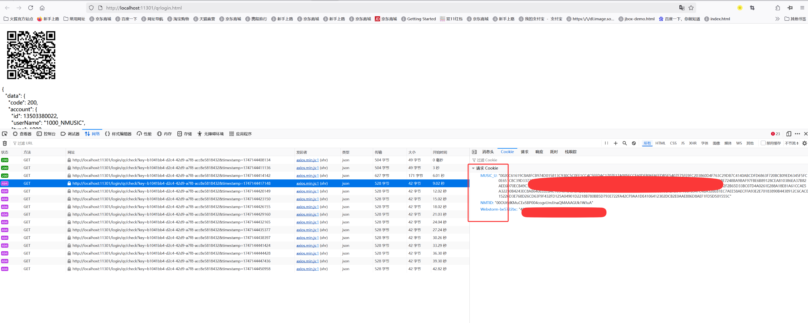
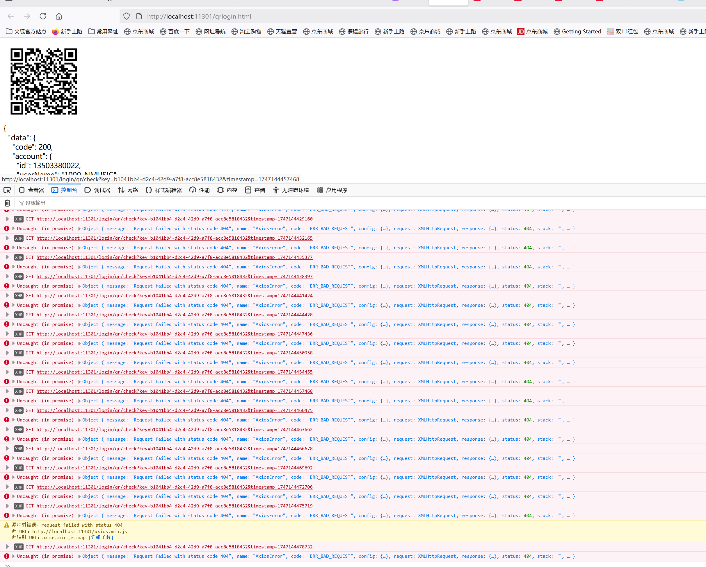
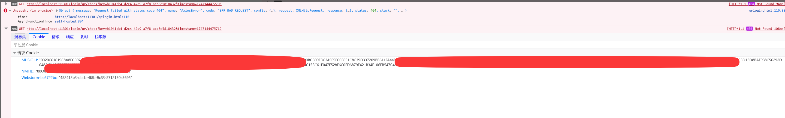

## 1、启动方式：
### 1.1 下载包：
下载路径：需要在[吟美直播间](http://live.bilibili.com/3033646)上舰后，问程序猿的退休生活【QQ：314769095】获取  
### 1.2、yinmei-NeteaseCloudMusicApi：  
作用：网易音乐渠道    
双击启动 “start.bat”   
### 1.3、yinmei-music：  
作用：吟美唱歌  
双击启动“yinmei-music-api.exe”或者“start.bat”

## 2、登录配置：
唱歌扫码后，可能回调qr/check接口获取不了cookie的，请查看浏览器自行把MUSIC_U和NMTID两个值复制到yinmei-music项目的根目录的netease.txt文件  
netease.txt内容格式：缺少NMTID参数，更换机器秘钥不可用  
```json
{"MUSIC_U": "xxx", "NMTID": "xxxxx"}
```
扫码登录地址：http://localhost:11301/login/qrlogin.html  
  
  
  

## 3、歌曲目录：
input_path: H:\yinmei-music\input  #原始歌曲下载路径  
save_path: H:\yinmei-music\output  #歌曲翻唱输出路径  