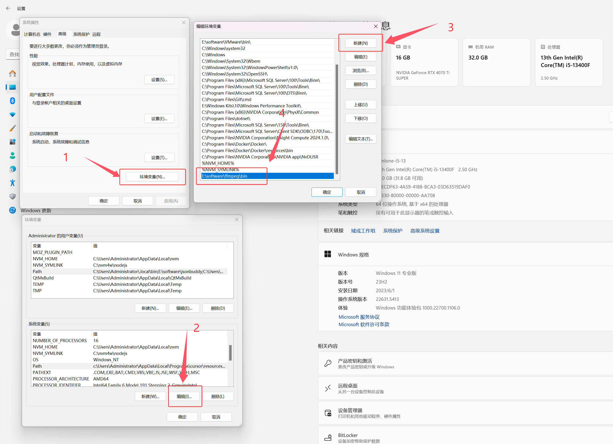

## 一、启动方式
### 1 下载包
下载路径：需要在[吟美直播间](http://live.bilibili.com/3033646)上舰后，问程序猿的退休生活【QQ：314769095】获取  

### 2、安装cuda
**当前版本：**
```cmd
英伟达：cuda 12.4
当前项目：pytorch 2.4.0+cu124
```
**兼容说明：**当前安装版本只支持cuda12.4,如果是50系显卡需要高版本cuda请自己卸载pytorch进行安装  
cuda开发包下载【版本12.4】：https://developer.nvidia.com/cuda-12-4-1-download-archive  
cuda历史版本：https://developer.nvidia.com/cuda-toolkit-archive  
**重装pytorch：**  
请自己选择安装的pytorch是cu128、cu124、cu126，具体[查看](https://pytorch.org/get-started/locally/)  
在项目根目录打开cmd执行如下命令：  
```cmd
卸载
.\runtime\python.exe -m pip uninstall torch torchvision torchaudio

安装对应cuda12.8
.\runtime\python.exe -m pip install torch torchvision torchaudio --index-url https://download.pytorch.org/whl/cu128
```

驱动版本【nvidia驱动程序】：nvidia-smi -l 1  
CUDA程序【cudatoolkit开发包】：nvcc -V  

### 3、yinmei-NeteaseCloudMusicApi
作用：网易音乐渠道    
双击启动 “start.bat”   

### 4、yinmei-music
作用：吟美唱歌  
双击启动“yinmei-music-api.exe”或者“start.bat”  


## 二、登录配置
唱歌扫码后，可能回调qr/check接口获取不了cookie的，请查看浏览器自行把MUSIC_U和NMTID两个值复制到yinmei-music项目的根目录的netease.txt文件  
netease.txt内容格式：缺少NMTID参数，更换机器秘钥不可用  
```json
{"MUSIC_U": "xxx", "NMTID": "xxxxx"}
```
扫码登录地址：http://localhost:11301/login/qrlogin.html  
  
扫码登录成功，会在yinmei-music项目根目录生成一个netease.txt文件  

## 三、歌曲目录
input_path: H:\yinmei-music\input  #原始歌曲下载路径  
save_path: H:\yinmei-music\output  #歌曲翻唱输出路径  

## 四、FFmpeg解码器配置
注意：如果没有FFmpeg解码器，将会不能识别mp3音频文件  
下载方式：
[官网下载](https://ffmpeg.org/download.html#build-windows)  
唱歌网盘下载：  
  
FFmpeg加入环境变量：
  
  
查看FFmpeg是否生效：  
```cmd
ffmpeg -version
```
